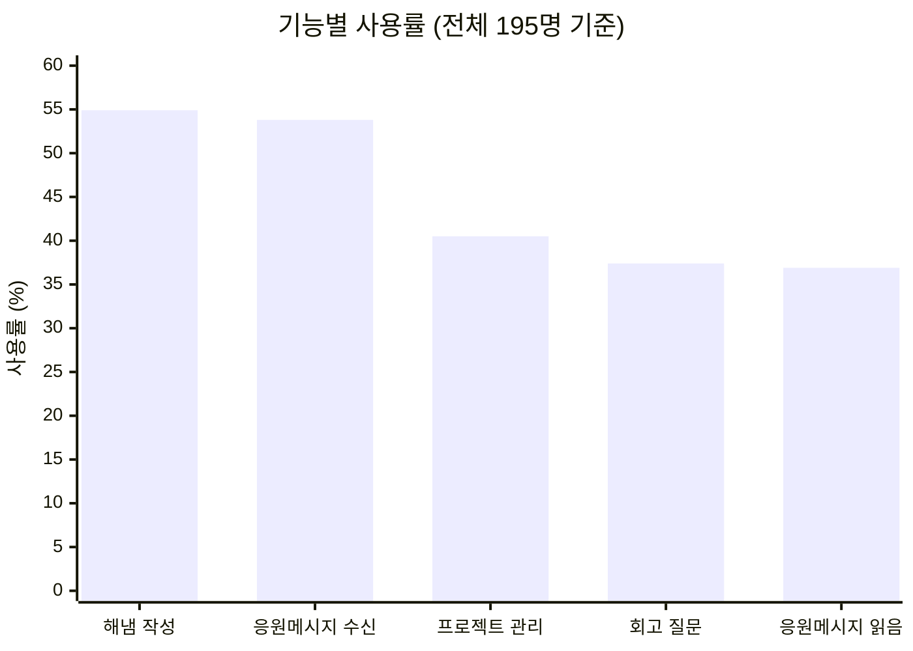
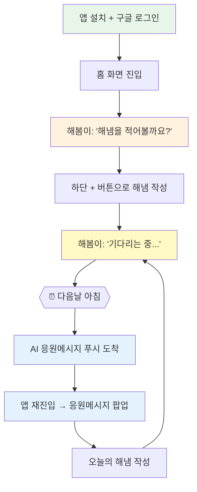
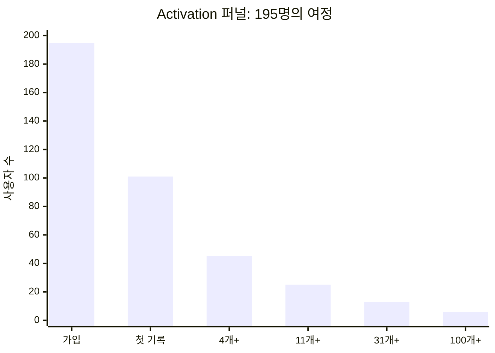
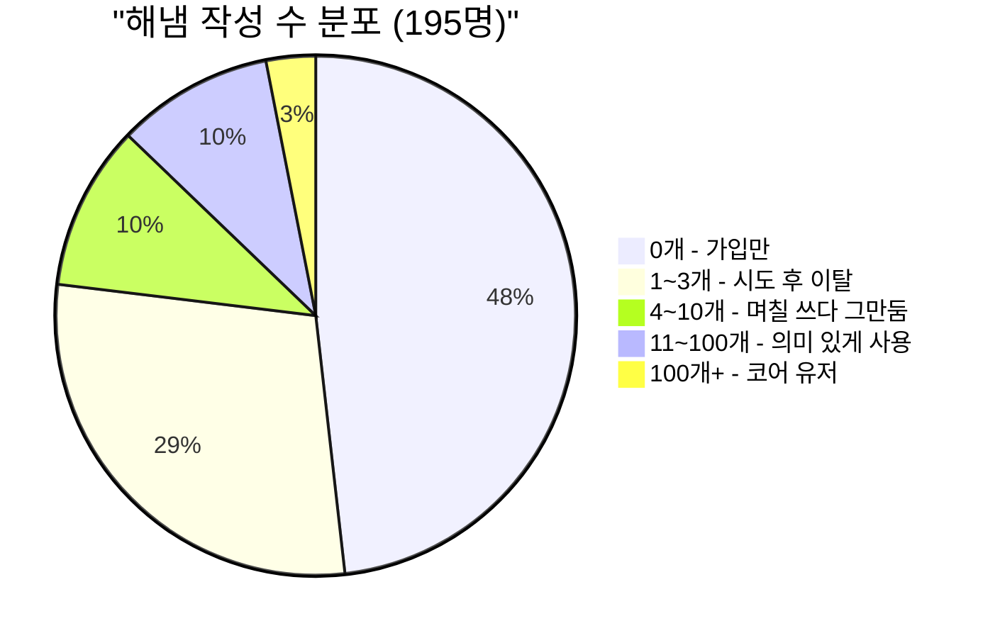
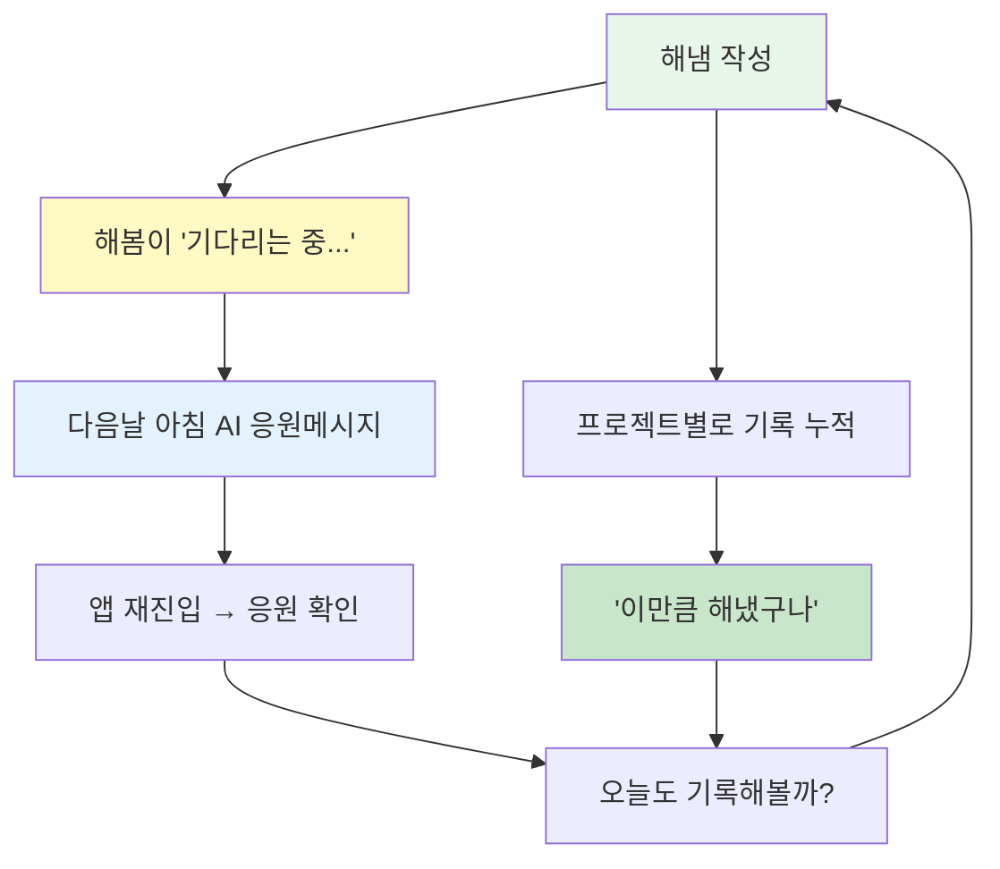

# 2주차: 사용자 플로우 역추적 — "이 기능은 왜 존재하는가?"

## 분석 대상

- **서비스**: 해냄 (사이드 프로젝트)
- **서비스 유형**: B2C 앱 (회고/프로젝트 관리)
- **핵심 가치**: 하루를 정리하고 다음날을 힘차게 시작할 수 있는 응원 한마디
- **타겟 사용자**: 하루를 돌아보고 싶은 모든 사람
- **유입 경로**: 앱스토어 검색
- **분석 관점**: 직접 만든 서비스라서, 설계 의도와 실제 사용 사이의 차이를 중심으로 봤다

## 주요 기능과 실제 사용률



| 기능               | 사용자 수 | 사용률 |
| ------------------ | --------- | ------ |
| 해냄 작성          | 107명     | 54.9%  |
| AI 응원메시지 수신 | 105명     | 53.8%  |
| AI 응원메시지 읽음 | 72명      | 36.9%  |
| 프로젝트 관리      | 79명      | 40.5%  |
| 회고 질문 답변     | 73명      | 37.4%  |

회고 질문이 "잘 안 쓰인다"고 느꼈는데, 데이터를 보니 프로젝트(40.5%)와 큰 차이가 없고 응원메시지 읽음률(36.9%)보다 오히려 높다. 감각과 데이터가 다르다.

---

## 사용자 플로우

분석 기능: **해냄 작성 → AI 응원메시지** (핵심 루프)



---

## 화면 구조

```
┌─────────────────────────┐
│ 헤더                     │
├─────────────────────────┤
│ 일  월  화  수  목  금  토  │  ← 일주일 날짜
├─────────────────────────┤
│ 🐻 해봄이 메시지           │  ← "적어볼까요?" / "기다리는 중" / 응원메시지
├─────────────────────────┤
│ 📝 회고 질문               │
│ ├ 해냄 1                  │  ← 해냄 쓰면 아래에 쌓임
│ ├ 해냄 2                  │
│ └ 해냄 3                  │
├─────────────────────────┤
│ 해냄  │ 프로젝트 │ 설정     │  ← 탭바
└─────────────────────────┘
```

해봄이 메시지는 상태에 따라 바뀐다: 해냄을 안 쓴 상태면 "적어볼까요?", 쓰면 "기다리는 중...", 다음날 되면 응원메시지로 변경. 다음날 앱에 들어오면 응원메시지가 팝업으로 뜬다.

---

## 내부 데이터로 본 사용자 퍼널

직접 만든 앱이라 내부 DB 데이터를 볼 수 있다. 195명 전체를 기반으로 분석했다.

### 두 번의 절벽



가입에서 첫 기록까지 48%가 빠지고(절벽 1), 첫 기록에서 4개 이상까지 또 55%가 빠진다(절벽 2).



절반 가까이(48%)가 한 번도 안 써보고, 써본 사람 중에서도 55%가 3개 이하에서 떠난다.

### 첫 기록까지 걸린 시간

| 시간       | 사용자 수 | 비율 (기록한 101명 중) |
| ---------- | --------- | ---------------------- |
| 1시간 이내 | 74명      | 73%                    |
| 1~24시간   | 12명      | 12%                    |
| 1~7일      | 8명       | 8%                     |
| 7일 이후   | 7명       | 7%                     |

기록하는 사람은 가입 직후 바로 시작한다. 온보딩이 느린 게 아니라, 가입 후 아예 시도를 안 하는 94명이 문제다.

### 현황

| 지표          | 수치      |
| ------------- | --------- |
| 총 가입자     | 195명     |
| 총 해냄       | 2,734개   |
| 총 응원메시지 | 685개     |
| 총 회고 답변  | 226개     |
| WAU / MAU     | 0명 / 0명 |

WAU/MAU가 모두 0이다. 코어 유저 포함해서 현재 아무도 앱을 쓰고 있지 않다. 단기 복귀율(63.3%)은 괜찮았지만, 장기 리텐션에는 실패했다.

---

## AARRR 분석

| 단계            | 행동                               | 감정/생각                              | 불편한 점                                           | 왜 이렇게 만들었나                                       |
| --------------- | ---------------------------------- | -------------------------------------- | --------------------------------------------------- | -------------------------------------------------------- |
| **Acquisition** | 앱스토어에서 "회고" 검색 후 설치   | 디자인 깔끔하고 캐릭터 귀여워서 깔아봄 | 없음                                                | 기능이 많지 않으니 첫인상에서 승부해야 함                |
| **Activation**  | 구글 로그인 → 해봄이 "적어볼까요?" | "귀엽네, 눌러볼까?"                    | 해냄이 뭔지 설명 부족                               | 튜토리얼 대신 캐릭터 말풍선 하나로 진입 허들을 낮추려 함 |
| **Activation**  | + 버튼으로 첫 기록                 | "단순하네"                             | (초기) 기록 후 피드백 없음 → "기다리는 중"으로 해결 | 매일 반복할 수 있는 수준의 마찰로 설계                   |
| **Retention**   | 다음날 아침 응원메시지 도착        | "귀엽네" 응원받는 느낌                 | 안 쓴 날은 응원이 안 옴 → 루프 끊김                 | 단순 알림이 아니라 전날 내용 기반 응원이라 개인화된 보상 |
| **Retention**   | 프로젝트별로 묶어서 확인           | "프로젝트별로 볼 수 있어 좋다"         | 통계/분석 없음. 성장 실감 장치 없음                 | 기록에 맥락을 부여. 하지만 "꾸준함"을 보여주는 건 없음   |
| **Revenue**     | -                                  | -                                      | 수익 모델 없음                                      | 수익화보다 리텐션 검증이 우선                            |
| **Referral**    | -                                  | 깔끔해서 보여주고 싶긴 함              | 공유/초대 기능 없음                                 | 아직 Referral 장치 자체가 없음                           |

---

## 이 기능은 왜 존재하는가?

> 해냄은 "기록 도구"가 아니라 "감성적 동기부여 루프"다.

해냄 작성 자체는 단순한 메모다. 이 기록이 해봄이의 응원으로 돌아오면서, "기록 → 보상 → 재방문" 루프가 만들어진다.



### 설계 요소별 역할

| 설계 요소      | 작동 원리                                      | 기여                       |
| -------------- | ---------------------------------------------- | -------------------------- |
| 구글 로그인    | 1탭 진입                                       | 가입 마찰 제거             |
| 해봄이 온보딩  | 캐릭터가 말 걸어 첫 행동 유도                  | Activation 허들 낮춤       |
| + 버튼 하나    | 최소 인풋으로 기록 완료                        | 매일 반복 가능한 마찰 수준 |
| "기다리는 중"  | 기록 직후 피드백 + 다음날 기대감               | 이탈 구간 해소             |
| AI 응원메시지  | 전날 기록 기반 개인화                          | Retention 트리거           |
| 응원 팝업      | 앱 열면 바로 보이는 보상                       | 재방문 시 즉각 보상        |
| 프로젝트 묶기  | 기록에 맥락 부여                               | 기록의 의미 강화           |
| 회고 질문 위치 | 해냄 쓰면 회고가 밀려 내려가며 자연스럽게 노출 | 기록 후 회고가 눈에 들어옴 |

### 만든 사람으로서

"AI 응원메시지"라는 차별점에 집중했지만, 초기 버전에서는 기록 직후의 공백을 간과했다. 써보니까 해냄 쓰고 → 다음날 아침까지 아무 반응 없이 기다려야 하는 게 생각보다 허전했다. "해봄이 기다리는 중"을 추가해서 이 구간을 메웠지만, 아직 풀어야 할 문제가 남아있다.

---

## 발견한 페인포인트 (3주차 검증 대상)

### 1. 가입 후 절반이 한 번도 안 쓴다

- 195명 중 94명(48%)이 가입만 하고 기록 0개
- 기록한 사람의 73%는 1시간 이내에 첫 기록. 온보딩 속도 문제는 아님
- 가설: 캐릭터 온보딩이 "귀엽다"는 느낌은 주지만, "지금 당장 써야겠다"는 행동까지 이어지지 않는다

### 2. 1~3개 쓰고 이탈하는 구간이 가장 크다

- 기록한 101명 중 56명(55%)이 1~3개만 쓰고 이탈
- 응원메시지는 전날 기록이 있어야 생성 → 습관이 안 잡히면 루프가 안 돌아감
- 가설: 초기 3일 안에 가치를 체감시키지 못하면 이탈한다

### 3. 기록을 돌아볼 수 있는 장치가 없다

- 코어 유저 6명도 결국 WAU/MAU = 0. 전원 이탈
- 경쟁 앱들은 연속 기록일, 달성률, 요약 기능을 제공
- 가설: 기록이 쌓여도 "성장하고 있다"는 실감이 없으면 코어 유저조차 떠난다

### 4. (수정) 회고 질문은 생각보다 쓰이고 있다

- 사용률 37.4%. 프로젝트(40.5%)와 비슷하고, 응원메시지 읽음률(36.9%)보다 높음
- "잘 안 쓰인다"는 내 감각을 데이터가 반박
- 가설 수정: 회고 자체의 문제라기보다, 회고를 쓰는 사용자와 안 쓰는 사용자의 리텐션 차이를 확인해야 한다
