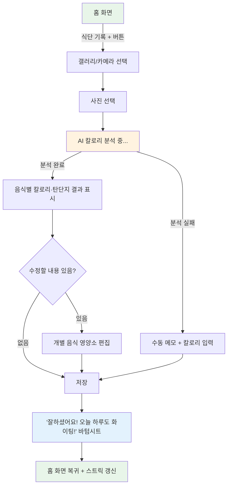
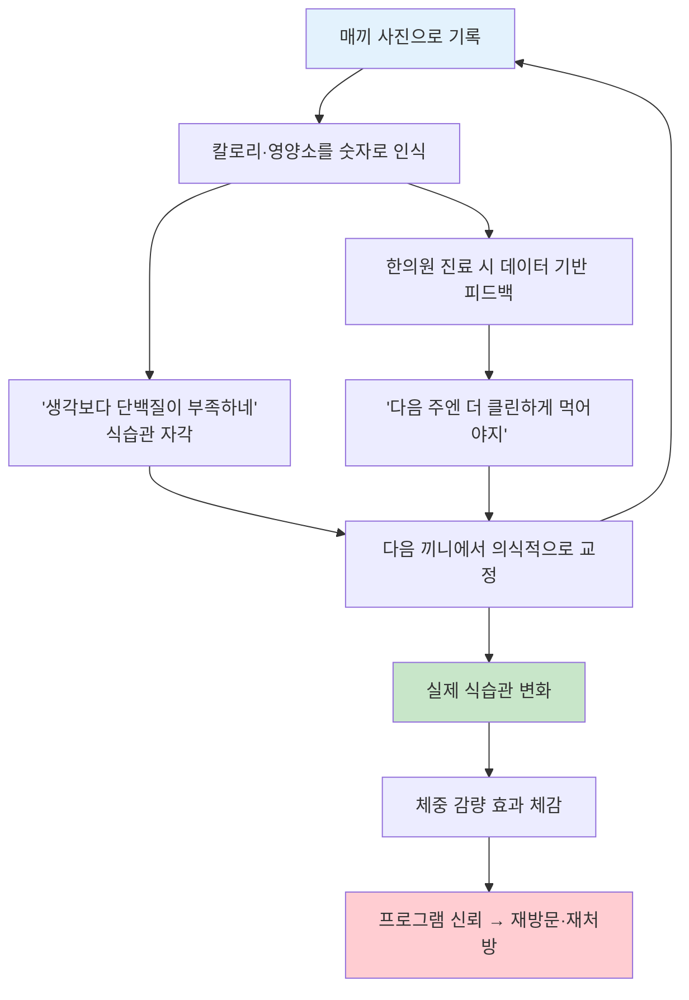

# 린다이어트 — 식단 기록 기능 사용자 플로우 역추적

> 2주차 미션: "이 기능은 왜 존재하는가?"
> 분석 대상: **린다이어트** 앱의 **식단 기록** 기능

---

## 서비스 소개

**린다이어트**는 한약 기반 체중감량 프로그램을 제공하는 앱이다. 한의원에서 처방받은 한약을 복용하면서, 앱으로 식단/체중/복약을 기록하고 관리받는 구조다. 곽튜브, 혜리 등 연예인 마케팅으로 인지도를 높여왔다.

핵심 기능은 **식단 기록**, 체중 기록, 복약 기록이며, 이 세 가지가 "오늘의 미션"이라는 하나의 시스템으로 묶여 있다. 이번 분석에서는 그중 가장 핵심인 **식단 기록**을 집중적으로 살펴본다.

---

## 사용자 플로우 다이어그램

---

## AARRR 단계별 분석

| 단계                   | 내가 한 행동                                                                                      | 내가 느낀 감정/생각                                                                                                                         | 불편했던 점                                                                                          | 이 단계를 왜 만들었을까? (추측)                                                                                                                                                 |
| -------------------- | -------------------------------------------------------------------------------------------- | ----------------------------------------------------------------------------------------------------------------------------------- | ----------------------------------------------------------------------------------------------- | ------------------------------------------------------------------------------------------------------------------------------------------------------------------- |
| **Acquisition** (획득) | 앱스토어에서 "린다이어트" 검색 후 설치. 곽튜브, 혜리 등 연예인 광고를 통해 서비스 존재를 인지                                      | 연예인 마케팅이 신뢰감을 줬음. "연예인도 하는 다이어트"라는 인식이 자연스럽게 생김                                                                                     | 특별히 불편하지 않았음                                                                                    | 한약 다이어트라는 생소한 카테고리의 진입 장벽을 낮추기 위해 연예인 신뢰도를 활용하는 전략. 일반 다이어트 앱과 달리 "한의원 처방"이라는 허들이 있기 때문에, 인지도 확보가 더 중요할 것으로 보임                                                      |
| **Activation** (활성화) | 앱 진입 후 홈 화면에서 가장 먼저 눈에 들어오는 식단 기록 `+` 버튼을 누름                                                 | 가장 손이 먼저 가는 위치에 버튼이 있어서 "뭘 해야 하지?"라는 고민 없이 자연스럽게 기록을 시작하게 됨                                                                         | -                                                                                               | 홈 화면의 가장 접근성 높은 위치에 기록 버튼을 배치해서 **첫 기록까지의 마찰을 최소화**하는 설계. 다이어트 앱에서 "첫 기록"이 Aha Moment이므로, 여기까지의 경로를 최대한 짧게 만든 것으로 보임                                                |
| **Activation** (활성화) | `+` 버튼을 누르면 바로 갤러리가 뜸. 사진을 선택하면 AI가 음식을 분석해서 칼로리, 탄수화물, 단백질, 지방 정보를 자동으로 채워줌                 | 사진 한 장만 올리면 영양소가 자동으로 나오는 게 신기했음. 직접 검색하고 입력해야 하는 다른 앱들보다 훨씬 간편함                                                                    | **AI 분석 시간이 생각보다 오래 걸림.** 로딩 화면에서 그냥 기다려야 해서 약간 지루함. 백그라운드에서 처리하거나, 기다리는 동안 뭔가 볼 수 있으면 좋겠다고 생각함 | AI 자동 분석으로 **기록의 마찰을 극단적으로 낮추는 전략**. 칼로리 계산은 대부분의 사람이 귀찮아하는 작업인데, 사진 한 장으로 해결되면 기록 빈도가 올라갈 것. 다른 칼로리 기록 앱과의 핵심 차별점이기도 함(근데 요즘엔 좀 많아졌을지도?)                           |
| **Activation** (활성화) | AI가 분석한 결과를 확인하고, 필요하면 개별 음식의 영양소를 수정한 뒤 저장                                                  | 전체 플로우가 군더더기 없이 깔끔했음. 예상하지 못한 팝업이나 이벤트가 없어서 기록에만 집중할 수 있었음                                                                          | -                                                                                               | **기록 행위 자체에 집중**시키는 미니멀한 설계. 기록 중간에 광고나 추천이 끼어들면 이탈할 수 있는데, 린다이어트는 기록 플로우를 방해하지 않음. 기록 완료율을 높이기 위한 의도적인 선택으로 보임                                                     |
| **Activation** (활성화) | 저장하면 "잘하셨어요! 오늘 하루도 화이팅!" 바텀시트가 뜸                                                            | 작은 칭찬이지만 기분이 좋았음. "기록한 나 잘했다"는 보상감이 생김                                                                                              | -                                                                                               | 기록 완료 직후의 칭찬은 "기록 = 좋은 일"이라는 연결을 만들어서 다음 기록 동기를 높임. 다이어트는 유저가 심리적으로 위축되어있는 경우가 많은데, 이를 타개할 수 있는 방법으로 보여짐.                                                           |
| **Retention** (유지)   | 프로그램 시작과 함께 30일 스트릭 미션이 시작됨. 매일 식단/체중/복약을 기록하면 스트릭이 쌓이고, 30일 달성 시 커피 쿠폰을 받음                  | 솔직히 커피 쿠폰이 대단한 보상은 아닌데, **한번 기록을 시작하니 끊기가 아까워서** 계속하게 됨. "이미 15일이나 했는데 여기서 멈추면 아깝잖아"라는 심리가 강하게 작용                                   | -                                                                                               | **손실 회피(Loss Aversion) + 매몰 비용 효과**를 활용한 설계. 보상 자체의 가치(커피 쿠폰)보다, "이미 쌓은 스트릭을 잃기 싫다"는 심리가 더 강력하게 작동함. 30일이라는 기간은 다이어트 프로그램 1개월과 딱 맞아떨어져서 **프로그램 완주율을 높이는 핵심 장치**로 보임 |
| **Retention** (유지)   | 식단을 기록하면 하루 총 단백질 섭취량이 자동 계산되어 표시됨                                                           | 내 생각보다 하루에 먹는 단백질량이 **상당히 낮다**는 걸 알게 됨. 별도로 의식하지 않으면 단백질을 채우기 어렵다는 걸 깨달음. 이 기능이 좋다고 느꼈고, **다른 사람에게도 알려주고 싶다**고 생각함                  | -                                                                                               | 단순한 "기록 저장"을 넘어서 **행동 변화를 유도하는 피드백 루프** 설계. 기록 → 현재 상태 인식 → 다음 식사에서 단백질 보충 → 다시 기록. 이 루프가 돌면 사용자는 앱을 잘 못떠나지 않을까.                                                    |
| **Retention** (유지)   | 식단, 체중, 복약 기록이 "오늘의 미션"이라는 하나의 시스템으로 묶여 있음                                                   | 식단만 기록하러 왔는데, 체중이랑 복약도 같이 하게 됨. 세 가지를 다 해야 "오늘 미션 완료"라는 느낌이 들어서 하나만 빼먹기 어려움                                                         | -                                                                                               | 식단 기록을 독립 기능으로 두지 않고 **미션 시스템에 묶어서** 앱 접속 시 여러 기록을 한꺼번에 하도록 유도하는 구조. 한 가지만 하러 들어와도 나머지까지 하게 되니 전체 기록률이 올라감.                                                         |
| **Revenue** (수익)     | 앱 자체에 유료 기능이나 결제 유도는 없음. 린다이어트는 한의원에 한약을 공급하고(B2B), 한의원이 환자를 유치하여(B2C) 앱으로 관리하는 **B2B2C 구조** | 앱에서 광고나 결제 압박이 없어서 쾌적함. 다른 다이어트 앱처럼 "프리미엄 기능 잠금" 같은 게 없으니 기록에만 집중할 수 있었음                                                            | -                                                                                               | 앱의 수익 모델이 구독료가 아니라 **한약 판매**이기 때문에, 앱은 "환자가 프로그램을 완주하도록 돕는 도구"의 역할에 충실함. 앱이 잘 작동할수록 → 환자가 프로그램을 잘 수행 → 효과를 봄 → 재방문/재처방 → 한약 매출 증가. 즉, **앱의 UX 자체가 매출과 직결**되는 구조     |
| **Revenue** (수익)     | 식단을 꾸준히 기록하는 사용자일수록 프로그램 효과를 체감하고, 다음 프로그램도 이어서 결제함                                          | 이 기록 베이스로 한의원에 방문 시 피드백이 이루어지기 때문에, 한의원 한번 방문하면 아. 기록 더 열심히 해야지. 라고 생각하게됨.                                                          | -                                                                                               | 식단 기록 자체가 **간접적 Revenue 드라이버**. 기록 빈도가 높은 사용자 = 프로그램에 진지한 사용자 = 재처방 가능성이 높은 사용자. 앱에서 직접 결제를 유도하지 않아도, 기록 습관이 자연스럽게 재구매로 이어지는 구조                                     |
| **Referral** (추천)    | 하루 단백질 섭취량 결과를 보고 "이거 다른 사람한테도 알려주고 싶다"고 느낌                                                  | 내가 평소에 단백질을 얼마나 적게 먹고 있었는지 수치로 보여주니까 충격적이었음. 이 "깨달음의 순간"을 주변 사람에게도 경험시켜주고 싶었음. 근데 약하다. 바텀시트로밖에 안올라옴. 이 데이터를 계속해서 보여주고, 푸시하는 기능이 약함. | 현재 앱에서 영양소 데이터를 외부로 공유하는 기능이 눈에 띄지 않음                                                           | 공유 욕구가 자연스럽게 생기는 **"놀라움의 순간(Surprise Moment)"** 이 존재함. 다만 현재는 이 순간을 공유로 연결하는 장치가 약해 보임. repov의 카드/티켓 공유처럼, 영양소 요약을 예쁜 카드로 만들어 공유할 수 있다면 Referral이 강화될 수 있을 것        |

---

## 이 기능은 왜 존재하는가?

### 핵심 결론

> **식단 기록은 "기록 도구"가 아니라 "식습관 교정 장치"다.**

처음에는 단순히 "오늘 뭘 먹었는지 남기는 기능"이라고 생각했다. 하지만 실제로 매일 기록하면서 느낀 건, **기록 자체가 내 식습관을 바꾸고 있었다**는 것이다.

### 실사용자로서 느낀 것

기록을 하기 전에는 내가 하루에 뭘 얼마나 먹는지 정확히 인식하지 못했다. 그런데 매끼 사진을 찍고, 칼로리와 영양소가 숫자로 보이기 시작하면서 변화가 생겼다.

- **배부르면 적게 먹게 됨** — 숫자로 보이니까 "이 정도면 됐다"는 판단이 가능해짐
- **단백질을 의식적으로 챙기게 됨** — 하루 단백질 잔량이 표시되니까, 다음 끼니에서 보충하려는 행동이 자연스럽게 나옴
- **한의원 진료와 연결됨** — 내가 기록한 데이터를 한의사가 보고 피드백을 줌. "다음 주엔 더 잘 먹어야지", "좀 더 클린하게 먹어야지"라는 생각을 하게 됨

즉, 식단 기록은 이런 루프를 만들어낸다:

### 왜 이게 중요한가?

대부분의 다이어트 앱은 **"기록을 남기는 것"** 자체를 목적으로 설계한다. 하지만 린다이어트의 식단 기록은 **"기록 → 인식 → 행동 교정 → 진료 피드백 → 더 나은 기록"** 이라는 선순환을 만들어서, 기록이 곧 치료 과정의 일부가 되도록 설계되어 있다.

이건 앱이 B2B2C 구조이기 때문에 가능한 설계다. 앱이 직접 돈을 벌 필요가 없으니 광고나 유료 잠금 없이 기록 경험에만 집중할 수 있고, 기록 데이터가 한의원 진료로 이어지면서 **기록의 가치가 앱 바깥에서 완성**된다.

| 설계 요소 | 작동 원리 | 기여하는 것 |
|-----------|-----------|------------|
| 홈 화면 최상단 `+` 버튼 | 첫 기록까지의 경로를 최소화 | 기록 시작의 마찰 제거 |
| AI 사진 분석 → 자동 칼로리 | 사진 한 장이면 끝 | 매일 기록 가능한 허들 낮춤 |
| "잘하셨어요!" 바텀시트 | 기록 완료의 긍정적 강화 | 기록 습관 형성 |
| 하루 단백질 잔량 표시 | 기록 → 인식 → 행동 변화 | **식습관 교정의 핵심 장치** |
| 30일 스트릭 + 커피 쿠폰 | 손실 회피 심리로 이탈 방지 | 프로그램 완주율 |
| 미션 시스템 번들링 | 식단 하나 하러 와서 체중·복약까지 기록 | 전체 관리 루틴 형성 |
| 한의원 진료 연동 | 기록 데이터 기반 피드백 | 기록의 가치가 앱 바깥에서 완성 |
| 앱에 유료 기능 없음 | 기록 경험에 방해 요소 제거 | 순수한 기록 경험 → 완주 → 재처방 |

### 아쉬운 점 / 개선 가능성

| 아쉬운 점 | 현재 상태 | 개선 아이디어 |
|-----------|-----------|-------------|
| AI 분석 대기 시간 | 로딩 오버레이만 표시, 그냥 기다려야 함 | 분석 중에 "오늘의 식단 팁"이나 어제 기록 요약을 보여주면 대기 시간이 덜 체감될 것. 또는 백그라운드 분석 후 푸시 알림으로 결과 전달 |
| 영양소 데이터의 지속적 노출 | 단백질 잔량이 바텀시트로만 잠깐 보임 | 홈 화면에서 항상 오늘의 영양소 현황을 볼 수 있으면 "교정 루프"가 더 강해질 것 |
| 영양소 데이터 공유 | 외부 공유 기능이 눈에 띄지 않음 | 하루/주간 영양소 요약을 예쁜 카드로 만들어 SNS 공유 가능하게 하면 Referral 강화 가능...하지 않을까? 근데 한의계 특성 상 앱 사용유저의 연령대가 높아 잘 쓰지 않을지도. 명확하게 떠오르진 않는다. |
