# Oh My Skin

## 서비스
- **Oh My Skin** (https://ohmy.skin) — 얼굴 사진을 바탕으로 피부 상태를 분석하고, 점수/등급/카테고리별 결과를 보여준 뒤 프리미엄 리포트와 추천으로 이어지는 **AI 피부 분석 서비스**

## 이 서비스가 하는 일
- 사용자의 셀카를 입력받아 피부 상태를 분석한다.
- 종합 점수와 등급, 카테고리별 결과를 보여준다.
- 더 자세한 결과와 루틴/성분/로드맵은 프리미엄으로 제공한다.
- 결과를 다른 사람에게 공유하면서 바이럴 유입도 기대할 수 있다.

## 핵심 기능
- **AI 피부 분석 결과 확인 및 프리미엄 전환 플로우**

## 한 줄 요약
**Acquisition은 양이 있지만 질이 약하고, Retention은 사실상 0이며, Revenue는 28일 22건 결제가 발생했다. 가장 건강한 채널은 Referral(세션 23분)이지만 규모가 19명에 불과하다.**

## 사용자 여정 퍼널

```
[1-1 콘텐츠 노출]  ──▶  [1-2 랜딩 진입]  ──71.6% 이탈──▶  [1-3 분석 시작 클릭]
 릴스 57좋아요            5,300 조회                          ???명
 에타 게시글

     ──▶  [2-1 로그인+플랜선택]  ──▶  [2-2 촬영+결과확인]  ──▶  [3. Retention]
            ???명                        ???명                    Day 1: 12명
                                              │                   Day 7: 0명
                                              ▼
                                     [4-1 업셀+결제]          [5. Referral]
                                      22건 결제                 19명 (1.5%)
                                      매출 6.4만원/월            관여도 최고
                                              │
                                              ▼
                                     [4-2 프리미엄 경험]
                                      리포트+제품+근거+비전뷰
```

---

## 1-1. 콘텐츠 노출/도달 — SNS·커뮤니티에서 사용자에게 닿기

### 화면

#### 인스타그램 (@ohmy.skin.official)

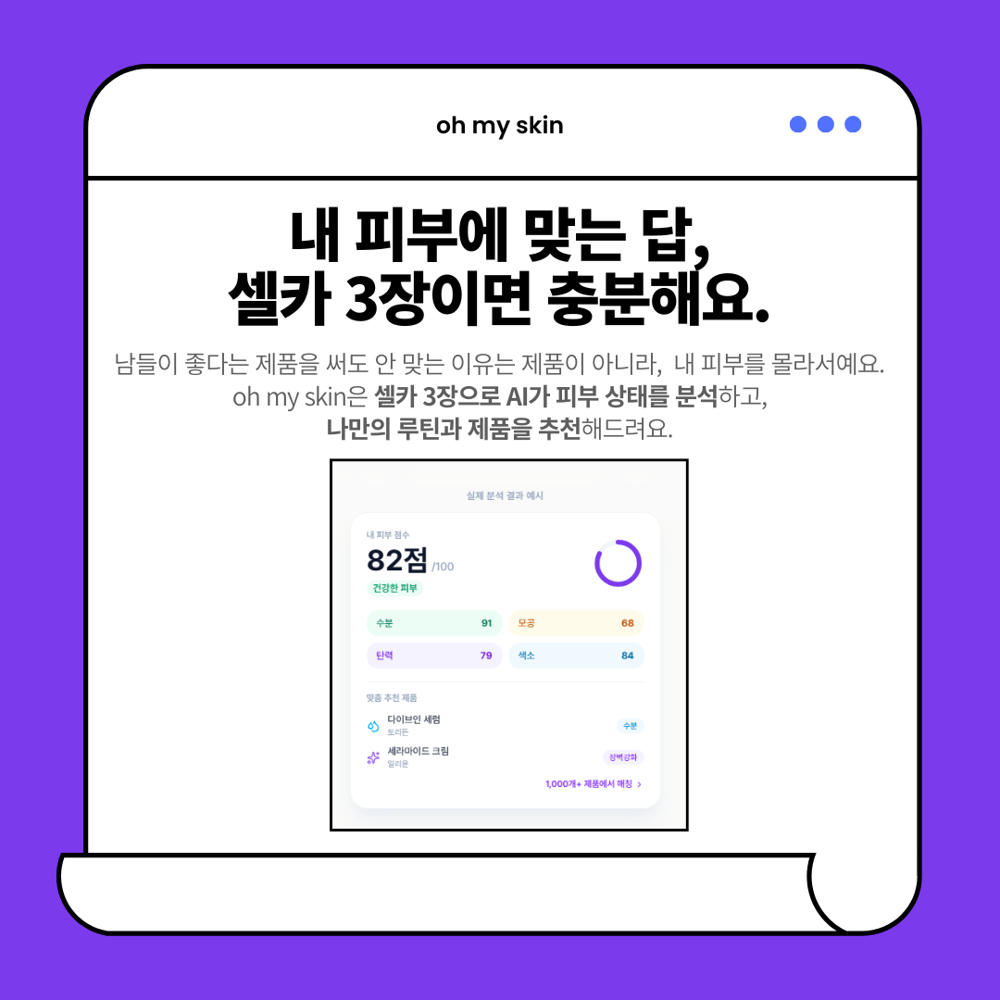
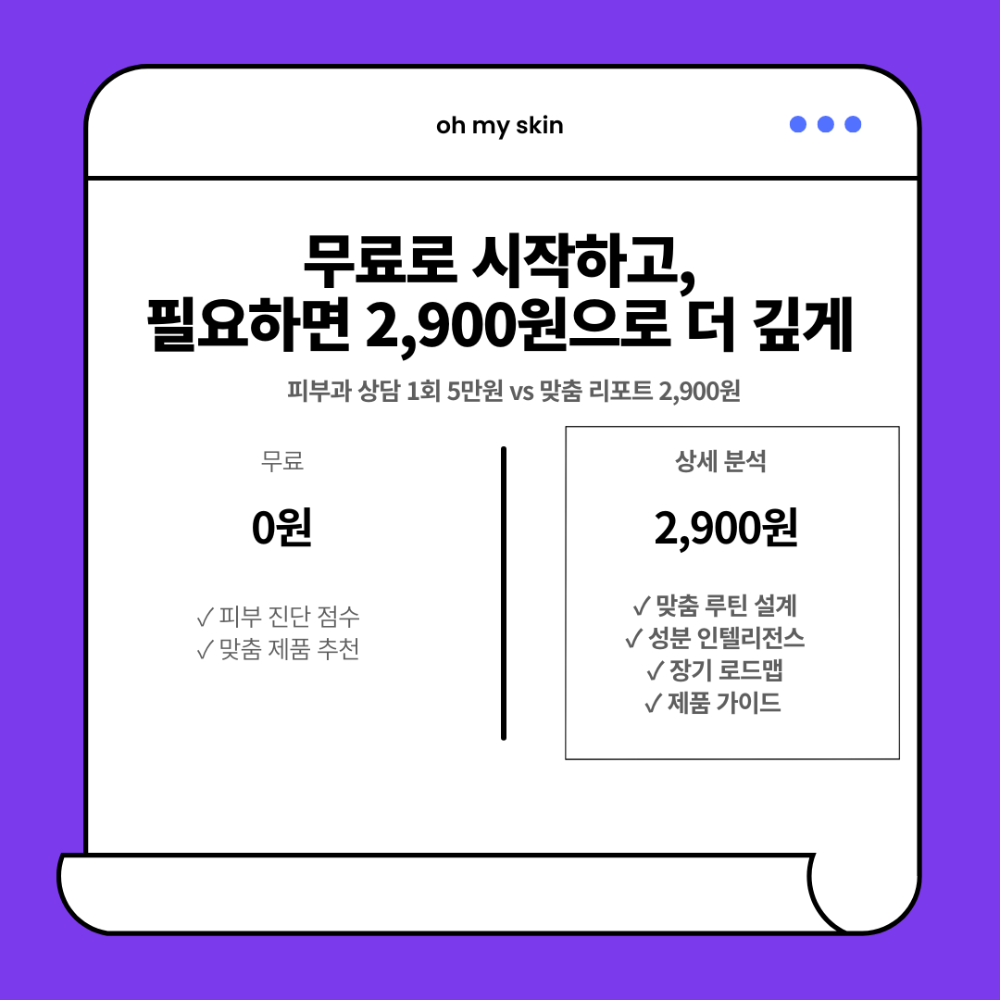
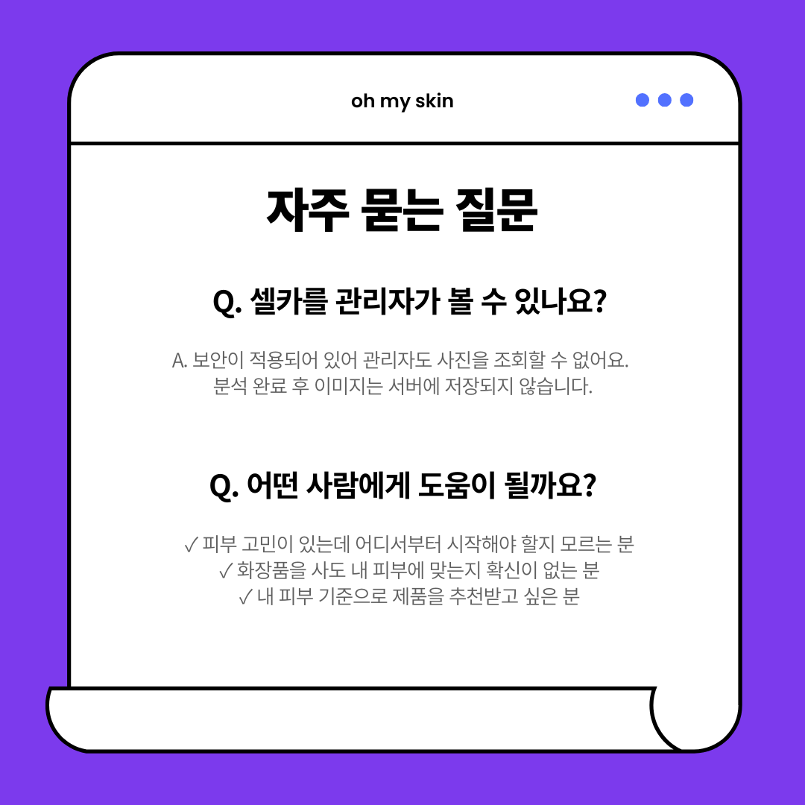

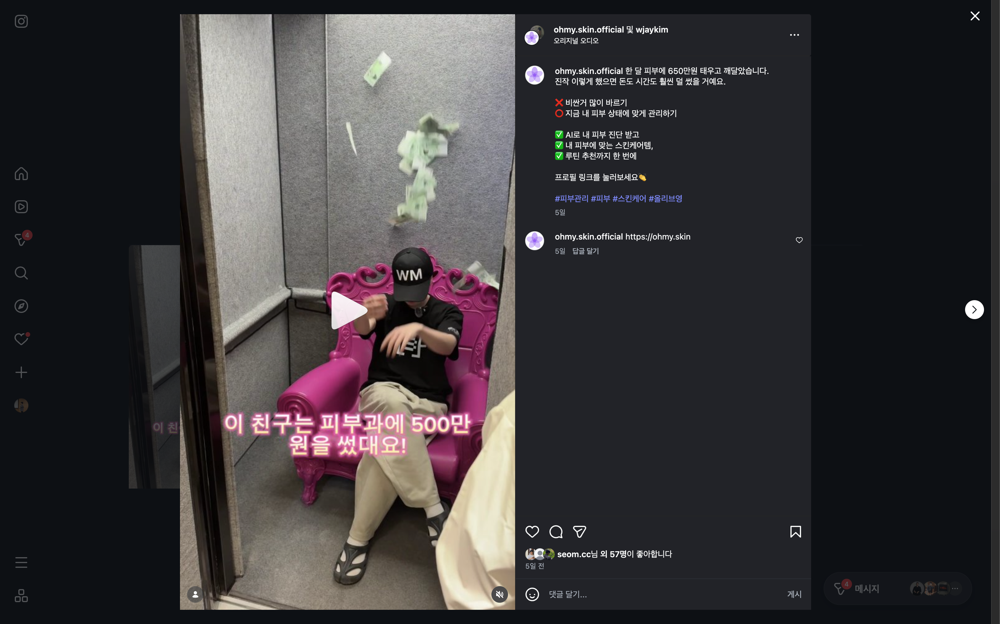

> 릴스 영상 원본: [ohmyskin-acq-insta-reel1.mp4](./images/ohmyskin-acq-insta-reel1.mp4) | [인스타 원본 링크](https://www.instagram.com/ohmy.skin.official/reel/DWW4HBwjykX/)

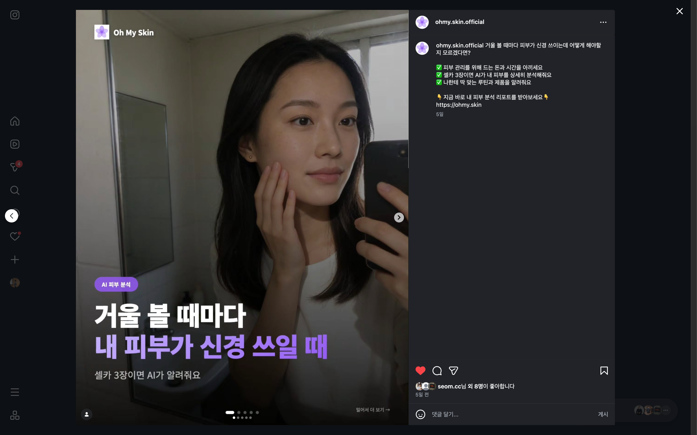

> [인스타 원본 링크](https://www.instagram.com/ohmy.skin.official/p/DWWyl_5iZAi/)

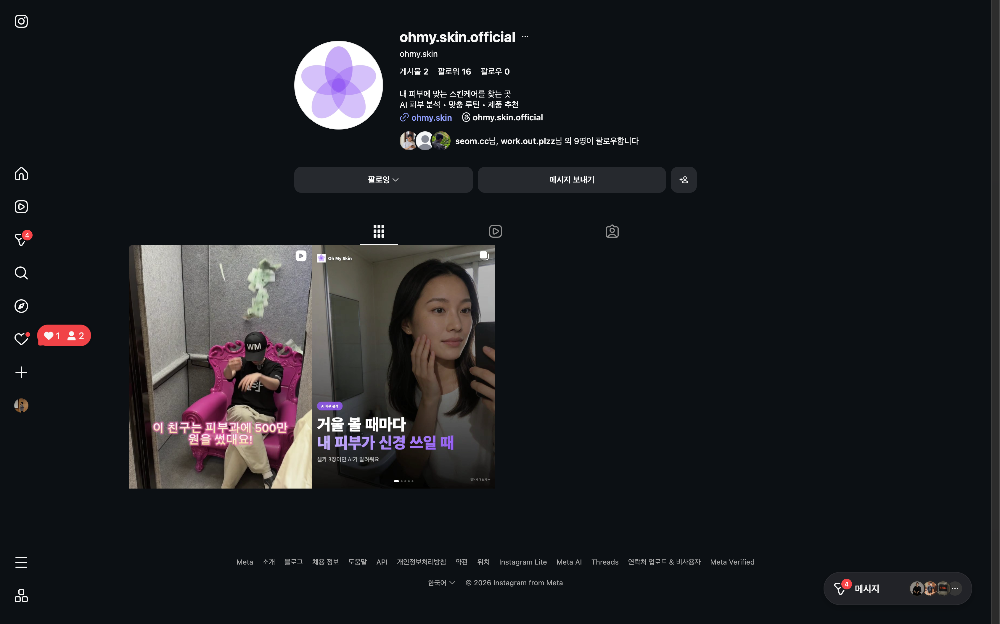

#### 에브리타임(에타) 홍보

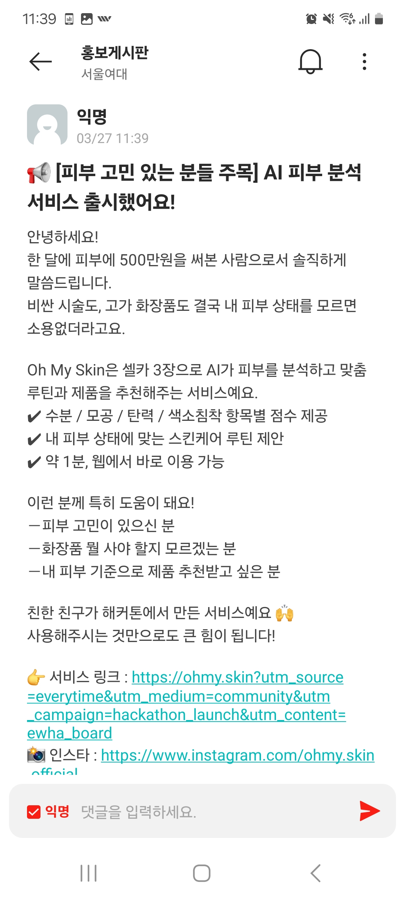

### 데이터

| 콘텐츠 | 형식 | 도달 지표 | 채널 특성 |
|--------|------|----------|----------|
| **인스타 릴스** "650만원 태우고 깨달았습니다" | 영상 | 좋아요 **57** (팔로워 16명 대비 3.5배) | 릴스 알고리즘으로 비팔로워 대규모 노출. thehackathonkr 태그로 해커톤 커뮤니티에도 도달. |
| **인스타 카드 슬라이드** "거울 볼 때마다" | 이미지 3장 | 좋아요 **8** | 릴스 대비 7배 낮은 참여. 기존 팔로워 위주 노출. |
| **인스타 카드** (서비스 소개/가격/FAQ) | 이미지 3장 | — | 서비스 설명용. 신규 도달보다 이해 보조 역할. |
| **에타 게시글** 서울여대 홍보게시판 | 텍스트 | — | UTM 추적 설계됨(`utm_source=everytime`). 대학생 타겟 톤. |

### 진단

- **릴스(57) vs 카드(8) = 7배 차이.** 영상 + 자극적 훅("650만원")이 압도적으로 효과적. 팔로워 16명인데 57 좋아요 = 알고리즘 노출이 핵심.
- **에타 게시글**은 텍스트 위주라 스크롤 중 눈에 띄기 어려움. 결과 스크린샷이나 Before/After가 있으면 전환율이 올라갈 수 있음.
- **"친한 친구가 해커톤에서 만든 서비스"**는 신뢰 장치지만, 동시에 "학생 프로젝트"로 인식될 위험.
- **결론: 콘텐츠 노출은 릴스 중심으로 감정적 훅(놀라움, 비교, 도발)을 앞에 배치하는 것이 효과적. 카드/텍스트는 보조 역할.**

---

## 1-2. 랜딩 진입 — 들어왔지만 71.6%가 바로 떠남

### 화면

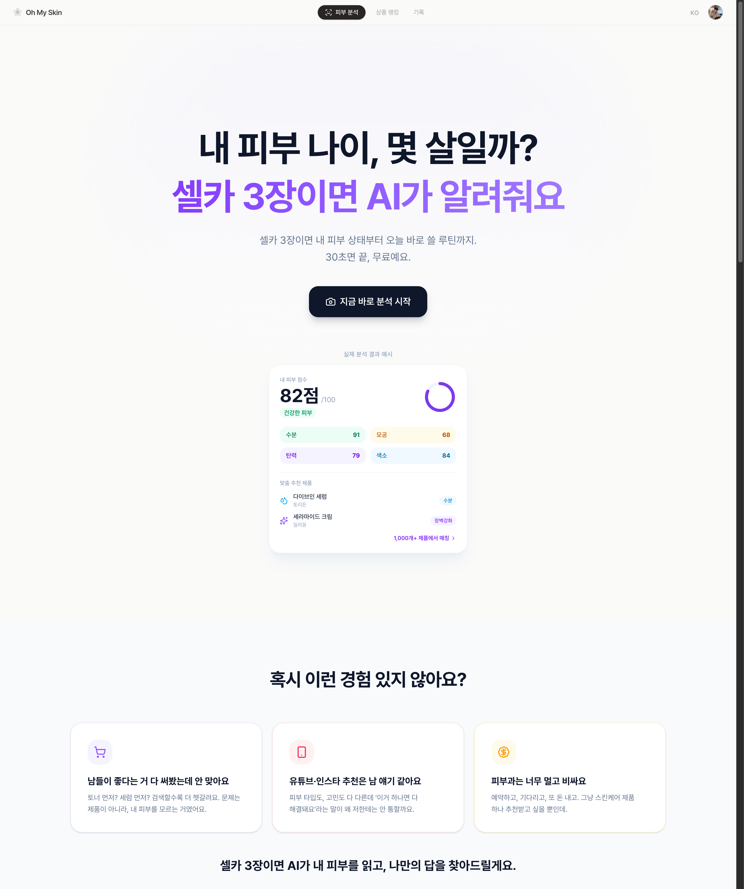

### 설계 의도

| 항목 | 내용 |
|------|------|
| **예상한 사용자 행동** | 랜딩에서 "내 피부 나이, 몇 살일까?" 훅 + 분석 결과 예시(82점)를 보고 "지금 무료로 분석하기" 클릭 |
| **느꼈으면 하는 감정** | "나도 해보고 싶다", "내 점수는 몇 점일까?" 호기심과 경쟁심 |
| **만든 이유** | 결과물 자체가 훅이 되게. 공유 가능한 점수 카드가 acquisition 장치가 되길 기대. 하단에 페인포인트 공감 섹션("혹시 이런 경험 있지 않아요?")도 배치. |

### 데이터

| 지표 | 수치 | 해석 |
|------|------|------|
| 랜딩 조회 (28일) | **5,300회** | 진입 자체는 충분 |
| 총 방문자 (7일) | **1,247명** | |
| 이탈률 | **71.6%** | 10명 중 7명이 랜딩에서 바로 떠남 |
| GA4 참여 세션수 | **0.76** | 1회 미만 = 스크롤/클릭 없이 이탈하는 사람이 많음 |
| 지역 | 한국 93%, 서울 58% | 거의 한국 서울 중심 |

| 채널 | 방문자 | 비중 | 이탈률 | 평균 세션 시간 | 사용자당 세션 |
|------|--------|------|--------|---------------|-------------|
| Direct | 1,093 | 85% | 78.1% | 2m 5s | 1.08 |
| External Referral | 119 | 9.5% | **41.1%** | **5m 13s** | **1.42** |
| Paid Social | 42 | 3% | 66.7% | 58s | 1 |
| Other Ads | 31 | 2.4% | **31.3%** | 1m 36s | 1.1 |
| Organic Social | 21 | 1.5% | 55% | 39s | 1 |
| Referral | 19 | 1.5% | 52% | **23m 0s** | **1.61** |
| Organic Search | 2 | 0.1% | 100% | 1s | 1 |

### 진단

- **Direct(85%)가 압도적이지만 이탈률 78.1%로 가장 높다.** URL을 직접 입력한 사람조차 랜딩에서 바로 떠남.
- **Referral로 들어온 사용자가 압도적으로 건강하다.** 세션 23분(Direct의 11배), 사용자당 1.61세션. 누군가의 추천으로 들어오면 깊이 관여.
- **의도했던 "공유 카드 → 유입"은 거의 작동하지 않음.** Referral 19명(1.5%), External Referral 119명(9.5%).
- **Paid Social/Ads는 이탈률 높고 세션 짧아** 광고비 대비 효율이 낮음.
- **결론: 랜딩의 첫 3초 안에 "나도 해보고 싶다"는 감정을 만들지 못하고 있다. Referral 유입을 늘리면 이탈률이 구조적으로 개선된다.**

---

## 2-1. 로그인 + 플랜 선택 — Activation의 첫 번째 마찰

### 화면

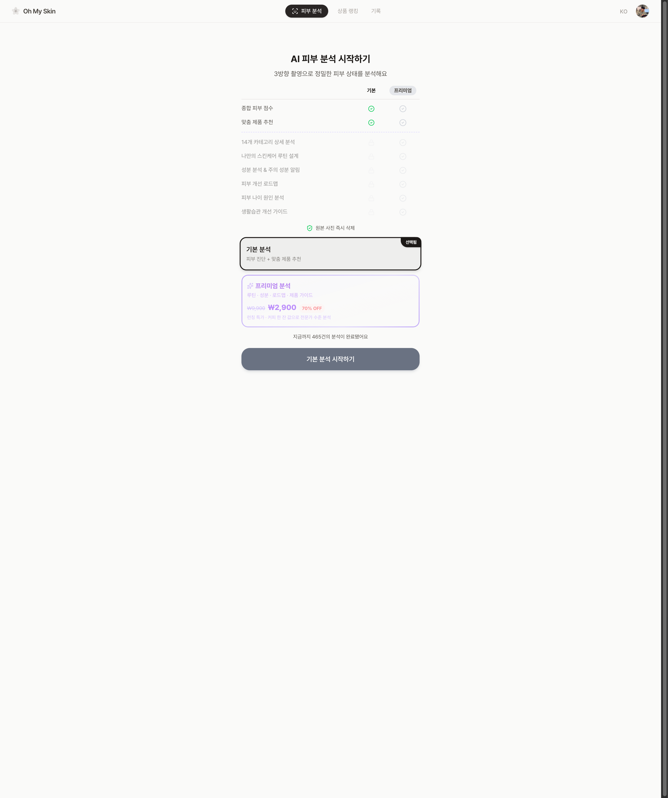

### 설계 의도

| 항목 | 내용 |
|------|------|
| **예상한 사용자 행동** | "지금 무료로 분석하기" 클릭 → 로그인 → 기본/프리미엄 플랜 비교 화면에서 기본(무료) 선택 후 진행 |
| **느꼈으면 하는 감정** | "무료로 먼저 해볼 수 있구나" — 가벼운 시작 |
| **예상되는 불편** | 로그인 선행이 귀찮을 수 있다. "왜 로그인을 먼저 해야 하지?" |

### 데이터

- 이 구간의 정확한 전환율 데이터는 없지만, 랜딩 이탈률 71.6%와 세션 시간(2분 39초)을 고려하면, 로그인과 촬영 구간에서 대규모 이탈이 발생하는 것으로 추정.
- 로그인은 분석 시작의 전제 조건이므로, 여기서 떨어지는 사용자가 가장 많을 가능성이 높다.

### 진단

- **로그인 선행이 가장 큰 마찰.** 셀카 분석이라는 가벼운 행위에 로그인을 요구하면 "귀찮아서 안 하겠다"는 반응이 나올 수 있다.
- 플랜 선택 화면 자체는 깔끔하지만, **여기까지 도달하는 사람이 극소수**라는 게 문제.
- **개선 레버: 게스트 모드(로그인 없이 분석 → 결과 확인 시 로그인 유도)가 이 구간의 전환율을 가장 크게 올릴 수 있는 장치.**

---

## 2-2. 촬영 + 결과 확인 — Aha Moment. 도달하면 가치를 느낀다

### 화면

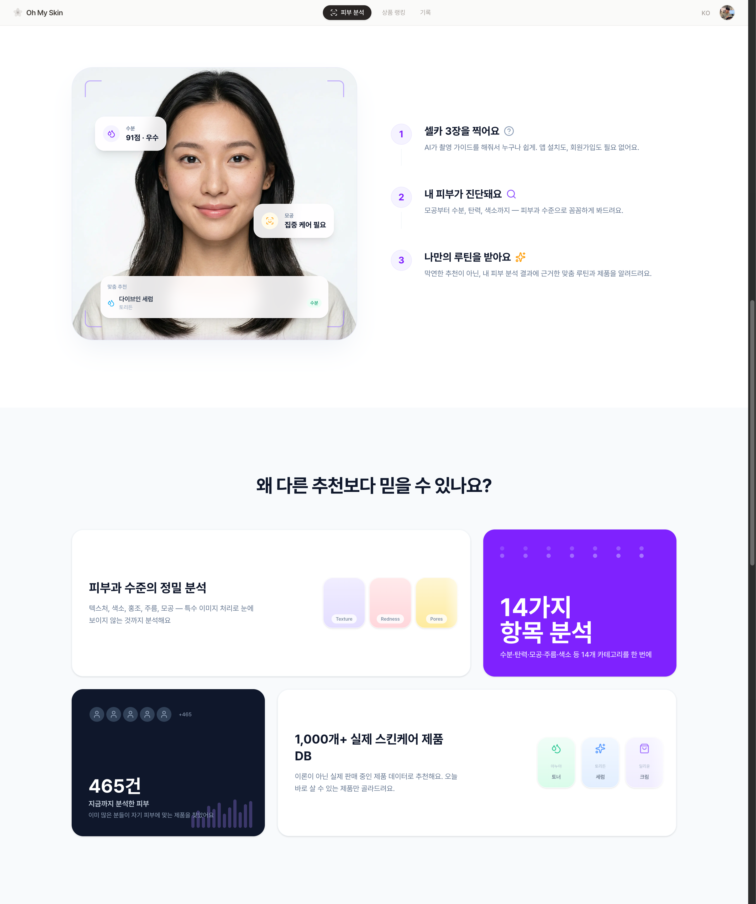
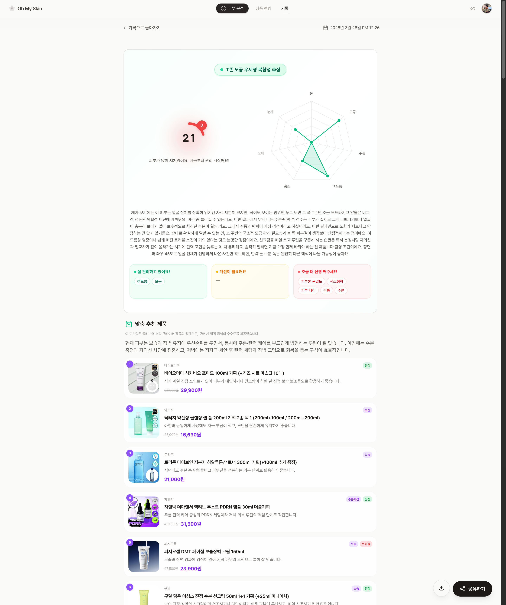

### 설계 의도

| 항목 | 내용 |
|------|------|
| **예상한 사용자 행동** | 셀카 3장 촬영(정면→좌측→우측, 프로그레스 바 + 가이드) → 짧은 대기 → 무료 분석 결과 확인. 종합 점수(레이더 차트), 피부 타입, 카테고리별 상태, 맞춤 추천 제품이 한 화면에 보인다. |
| **느꼈으면 하는 감정** | "생각보다 빠르고 신기하다", "이 정도면 꽤 믿을 만한데?" — Aha moment |
| **예상되는 불편** | 3각도 촬영이 번거롭거나 어색할 수 있다. 무료 공개 범위가 제한적이면 아쉬움. |
| **만든 이유** | **첫 결과에서 바로 가치가 느껴지는 것.** "이 서비스가 실제로 내 피부 상태를 읽어주는구나"라는 순간. |

### 데이터

```
평균 세션 시간: 2분 39초 (Amplitude) / 참여 시간 1분 12초 (GA4)
External Referral(결과 링크 추정): 세션 5분 13초, 사용자당 1.42세션
Referral: 세션 23분, 사용자당 1.61세션
누적 분석 완료: 465건 (랜딩에 표시된 수치)
```

### 진단

- **결과에 도달한 사람은 오래 머문다.** Referral 세션 23분, External Referral 5분 13초. 결과를 본 사람은 제품/루틴까지 탐색한다.
- **3각도 촬영이 두 번째 마찰.** 정면→좌측→우측 3단계는 정확한 분석을 위해 필요하지만, 사용자 입장에서는 번거롭다.
- **핵심: 이 단계가 Aha moment이고, Revenue로 이어지는 기반이다.** 여기까지 오는 사람만 늘리면 매출이 따라온다.
- **결론: Activation 구간의 마찰이 이 서비스의 최대 병목. 결과에 도달하면 가치를 느끼는 구조는 있지만, 이탈률 71.6%와 로그인/촬영 마찰이 도달률을 심하게 제한하고 있다.**

---

## 3. Retention — 사실상 존재하지 않는다

### 화면

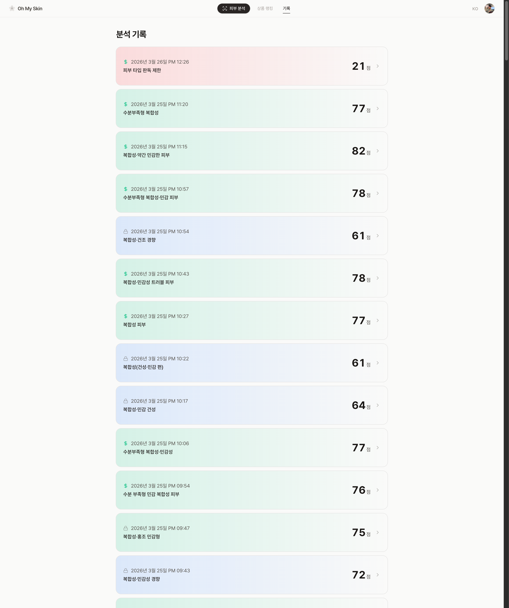
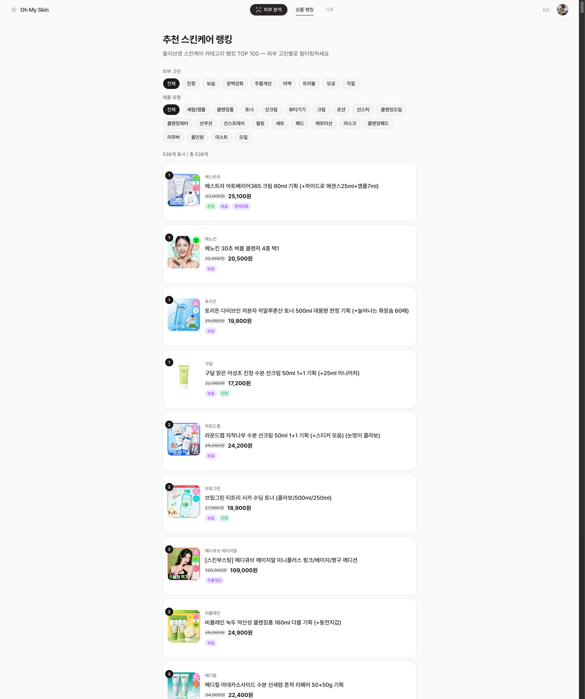

### 설계 의도

| 항목 | 내용 |
|------|------|
| **예상한 사용자 행동** | 일정 시간이 지난 후 재분석하고, 예전 기록과 비교. 기록 화면에서 날짜별 분석 목록과 점수가 보이고, 상품 랭킹에서 1,000개+ 제품 DB를 탐색. |
| **느꼈으면 하는 감정** | "지난번보다 나아졌을까?", "관리한 게 실제로 반영됐을까?" |
| **예상되는 불편** | 다시 들어올 이유가 약하면 기억에서 사라질 수 있다. 변화 비교가 명확하지 않으면 재방문 동기↓ |
| **만든 이유** | 단발성 재미를 넘어서, **내 피부 데이터를 계속 쌓고 비교하고 싶게** 만드는 것. |

### 실제 데이터

| Day | 유지율 | 잔존 사용자 |
|-----|--------|-----------|
| Day 0 | 100% | 1,259명 |
| Day 1 | **1.02%** | 12명 |
| Day 2 | 0.91% | 10명 |
| Day 3 | 0.91% | 9명 |
| Day 4 | 0.71% | 6명 |
| Day 5 | 0.45% | 3명 |
| Day 6 | 0.37% | 1명 |
| Day 7 | **0.00%** | 0명 |

### 진단

- **Day 1에 12명, Day 7에 0명.** 서비스가 완전한 1회성 경험으로 인식되고 있다.
- **"재분석해서 변화를 비교하고 싶다"는 동기가 전혀 작동하지 않고 있다.** 기록 화면은 있지만 사용자가 도달하지 않거나 재분석 가치를 느끼지 못한다.
- **사용자당 세션수 1.12** — 거의 모든 사용자가 1회 방문 후 영영 떠남.
- **의도와 현실의 간극이 가장 큰 구간.** 다만, Activation 도달자 수 자체가 적어 리텐션 실험이 유의미하지 않을 수 있다.
- **결론: Retention은 설계되었지만 작동하지 않는다. 재방문 트리거(알림, 리마인더, 변화 예측)가 부재하거나 전달되지 않고 있다.**

---

## 4-1. 업셀 + 결제 — 이 서비스에서 가장 잘 작동하는 부분

### 화면

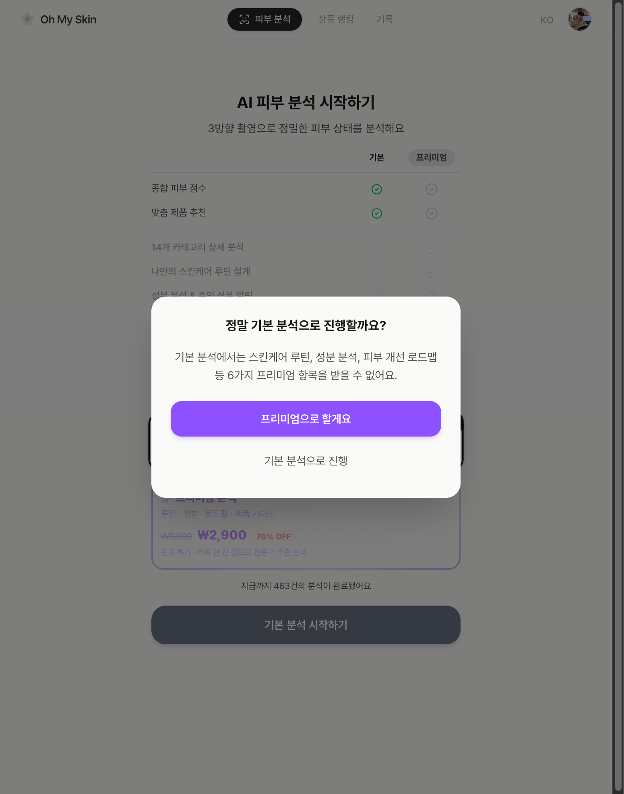
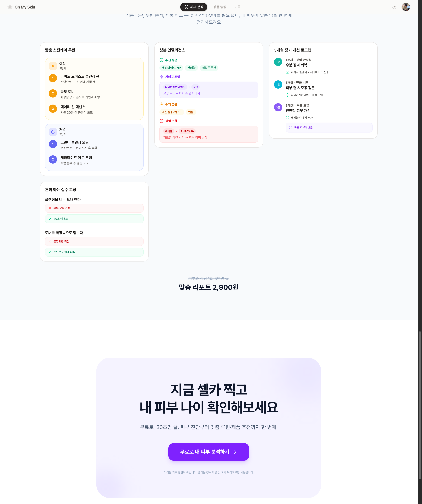

### 설계 의도

| 항목 | 내용 |
|------|------|
| **예상한 사용자 행동** | 무료 결과를 본 뒤, 더 자세한 분석과 루틴/성분/로드맵을 보기 위해 결제. 기본 선택 시 "정말 기본으로?" 업셀 모달이 한 번 더 프리미엄 가치를 상기시킴. CTA도 "프리미엄으로 할게요"(보라색 강조) vs "기본 분석으로 진행"(회색)으로 시각적 위계. |
| **느꼈으면 하는 감정** | "이 정도면 돈 낼 만하다", "한 번쯤은 상세 결과를 보고 싶다" |
| **예상되는 불편** | 결제 전에 프리미엄 가치가 충분히 전달되지 않으면 망설일 수 있다. |
| **만든 이유** | 무료 결과만으로도 가치를 느끼게 하고, 자연스럽게 **더 알고 싶다**는 감정이 결제로. 낮은 가격(₩2,900)은 전환 허들을 줄이기 위한 장치. |

### 데이터

```
실제 결제: 22건 (28일)
프리미엄 가격: ₩2,900 (70% 할인 적용)
매출: 22 × ₩2,900 = ₩63,800 (약 6.4만원/28일)
※ 정확한 전환율은 분석 완료 이벤트 → 결제 이벤트 퍼널이 설정되어야 측정 가능
```

### 진단

- **28일간 22건 결제가 발생했다.** 절대 숫자는 작지만, 프리미엄 전환 설계(비교표, 업셀 모달, 앵커링)가 작동하고 있다는 신호.
- **업셀 모달**("정말 기본으로?")은 손실 회피 심리를 활용. CTA 시각적 위계(보라색 vs 회색)도 잘 설계.
- **정확한 결제 전환율은 현재 측정 불가.** 분석 결과 도달자 수를 정확히 모르기 때문. Amplitude에서 분석 완료 → 결제 퍼널을 설정해야 한다.
- **결론: 결제가 발생하고 있고, 전환 설계 장치가 잘 갖춰져 있다. Activation 도달자를 늘리면 매출이 비례해서 증가할 가능성이 높다.**

---

## 4-2. 프리미엄 리포트: 전체 분석 요약


- 피부 점수 + 카테고리별 상세 + 맞춤 루틴(아침/저녁) + 성분 인텔리전스(추천 성분, 주의 성분, 시너지/위험 조합) + 3개월 장기 개선 로드맵 + 흔히 하는 실수 교정
- **2,900원 치고 콘텐츠 양이 매우 많다.** "피부과 상담 1회 5만원 vs 맞춤 리포트 2,900원" 앵커링이 설득력 있을 수준의 깊이.
- 이 한 페이지만으로도 "돈 낸 가치가 있다"는 느낌을 줄 수 있음.

---

## 4-3. 프리미엄 리포트: 추천 제품 목록

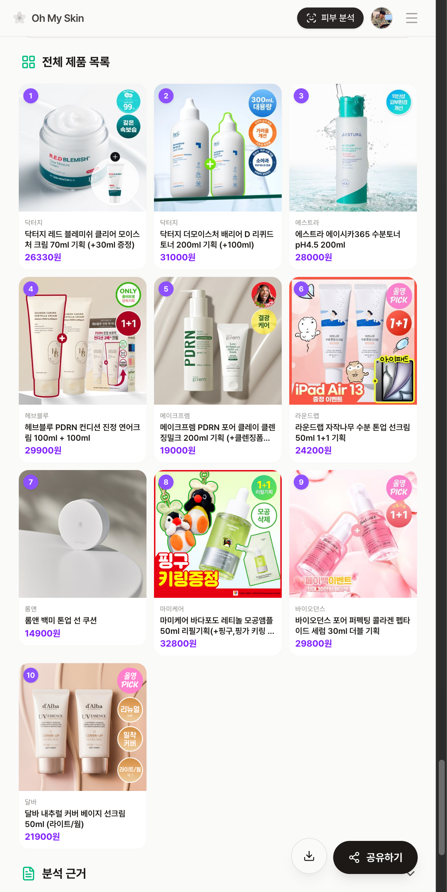

- 실제 구매 가능한 제품 그리드 (가격, 이미지 포함). 추천에서 끝나지 않고 **실제 구매까지 연결**.
- 커머스 전환 가능성이 있다. 제품별 쿠팡/올리브영 링크가 있다면 어필리에이트 수익 구조도 가능.
- 사용자 입장에서는 "분석 결과에 근거한 맞춤 쇼핑 리스트"로 느껴짐.

---

## 4-4. 프리미엄 리포트: AI 분석 근거

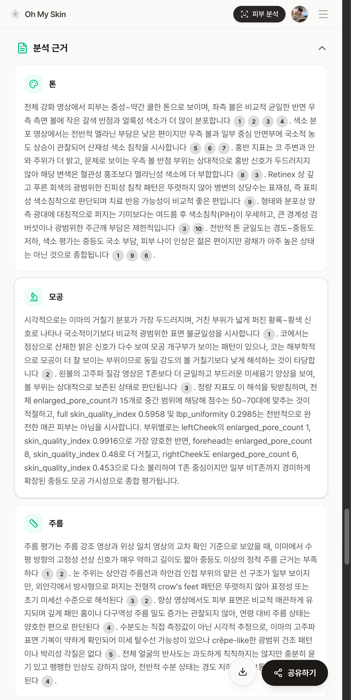

- 톤, 모공, 주름 등 항목별로 **AI가 왜 그렇게 판단했는지** 텍스트로 상세 설명.
- "그냥 점수만 주는 게 아니라 근거가 있다"는 인상 — **신뢰도를 높이는 핵심 요소.**
- 다만 텍스트가 길어서 실제로 다 읽는 사용자는 적을 수 있음. 핵심 수치나 시각 요소를 더 강조하면 가독성↑

---

## 4-5. 프리미엄 리포트: 피부 분석 뷰

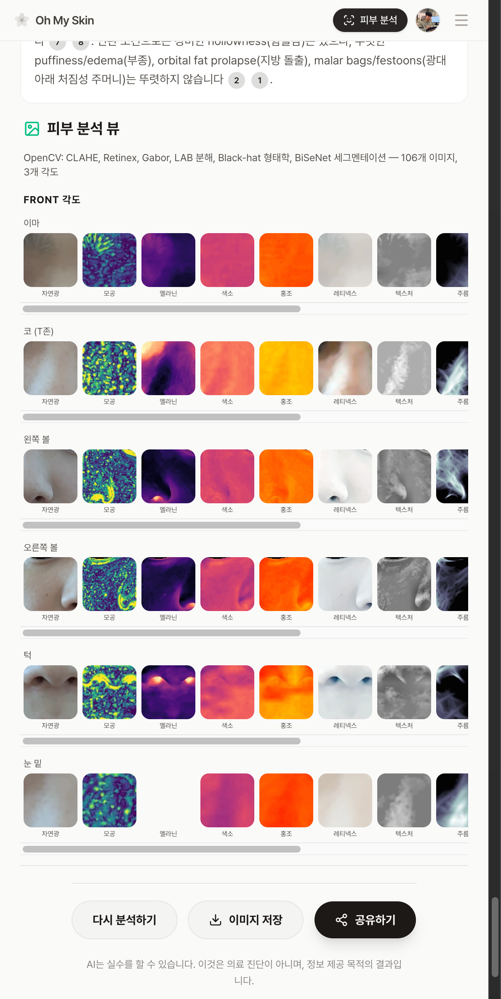

- OpenCV, CLAHE, Retinex, Gabor, Black-hat, BiseNet 등 **10개 이상의 이미지 처리 결과**를 FRONT/좌측/우측 3각도로 시각화.
- **이 서비스의 기술적 차별화가 가장 잘 드러나는 부분.** 단순 AI 점수가 아니라 실제 컴퓨터 비전 파이프라인의 결과물을 보여줌.
- "이 서비스가 진짜 분석을 하고 있구나"라는 신뢰를 만드는 데 결정적.
- 이 화면이 Referral의 기반이 되어야 하지만, 현재는 프리미엄 결과를 공유할 동기가 약하다. **하이라이트를 공유 가능한 카드로 만들면** Referral 루프 강화 가능.

---

## 5. Referral — 가장 높은 잠재력, 현재는 미작동

### 설계 의도

| 항목 | 내용 |
|------|------|
| **예상한 사용자 행동** | 자기 결과를 친구에게 공유하고, 친구도 링크를 눌러 들어와 분석을 시작. 결과 화면에 공유하기 버튼 + 랜딩 하단 CTA가 재진입 유도. |
| **느꼈으면 하는 감정** | "이건 친구한테도 보여주고 싶다", "남 결과도 궁금하다" |
| **예상되는 불편** | 보상이 없으면 공유 동기가 약할 수 있다. 카드가 덜 매력적이면 퍼뜨리고 싶지 않을 수 있다. |
| **만든 이유** | 핵심 성장 루프. 결과를 개인 경험에서 끝내지 않고 **공유 가능한 사회적 오브젝트**로 만들어, Referral → 다음 Acquisition 연결. |

### 실제 데이터

```
Referral 채널: 19명 (세션 23분, 사용자당 1.61세션)
External Referral: 119명 (세션 5분 13초, 사용자당 1.42세션)
Direct: 1,093명 (세션 2분 5초, 사용자당 1.08세션)
```

### 진단

- **Referral로 들어온 사용자가 가장 건강하다.** 세션 23분은 Direct(2분)의 11배. 공유 링크를 통해 들어온 사람은 결과를 보고, 제품을 탐색하고, 자기도 분석을 시작.
- **하지만 19명이다.** 전체 1,247명 중 1.5%. 의미 있는 규모로 돌아가려면 최소 10배 필요.
- **공유 동기가 약하다.** "내 점수가 82점이에요"라는 결과는 나에게는 의미 있지만, 친구에게 보내고 싶을 만큼 도발적이지 않다. vir-tually.love의 "나의 AI가 너와 연애했다"와 비교하면 감정적 자극이 약하다.
- **결론: Referral은 가장 높은 잠재력을 가진 채널이지만 현재는 미작동. 공유 동기를 강화하면(비교 카드, 랭킹, 도발적 프레이밍) 가장 건강한 성장 루프가 될 수 있다.**

---

## 종합 — 이 서비스의 성장 전략

가장 큰 문제는 Retention이 0%라는 것이 아니라, **Activation까지의 마찰이 너무 크다**는 것이다. 이탈률 71.6% + 로그인/촬영 마찰로 인해 분석 결과에 도달하는 사용자가 극도로 제한적이다.

**데이터 기반 우선순위:**

**1순위: Activation 마찰 제거**
- 로그인 선행 제거(게스트 모드) 또는 3각도 촬영 간소화가 핵심 레버
- 분석 결과 도달자를 늘리면 결제가 비례해서 늘어날 가능성이 높다

**2순위: Referral 루프 강화**
- Referral 이탈률 41~52% vs Direct 78% — Referral 유입을 늘리면 Acquisition의 질이 구조적으로 개선
- 비교 카드("친구는 82점, 나는 몇 점?"), 릴스 중심 콘텐츠(7배 높은 참여)

**3순위: Acquisition 훅 강화**
- 이탈률 71.6% → 랜딩 첫 3초에 감정적 훅이 필요
- 릴스(57 좋아요) vs 카드(8 좋아요)에서 보듯, 자극적 훅 + 영상이 효과적

**4순위: Retention (모수 확보 후)**
- 현재 모수가 너무 적어 리텐션 실험이 유의미하지 않음
- 푸시 알림/이메일 리마인더, "다음 분석 예약", Before/After 비교 강화

---

## 해커톤 관점에서 왜 상대적으로 덜 먹혔을까

Oh My Skin은 서비스 자체가 나쁜 게 아니라, **해커톤이라는 짧은 심사 맥락에서 강하게 보이는 포인트가 상대적으로 약했다.**

첫째, Activation과 Revenue를 촘촘하게 설계했지만 그 강점이 **짧은 데모 안에서 즉시 전달되기 어렵다.** 써보면 좋은 서비스인데, "보는 순간 바로 퍼진다"는 감각이 약함.

둘째, **Referral의 강도가 상대적으로 약했다.** 상위권 서비스들은 결과를 보는 순간 바로 남에게 보여주고 싶어지는 감정이 강했다.

셋째, **감정의 밀도보다 기능의 완성도에 더 가까운 서비스였다.** 해커톤에서는 실용성보다 즉시 반응을 끌어내는 감정적 훅이 더 강하게 먹혔다.

넷째, **반복 사용이나 장기 가치 쪽이 강점인데 해커톤에서는 보이지 않는다.** 재분석, 변화 비교, 프리미엄 리포트 같은 중장기 경험은 짧은 시연에서 불리.

결국 Oh My Skin은 **장기적으로 괜찮은 제품 구조**를 가졌지만, **해커톤에서 먹히는 감정 구조와 성장 구간을 전면에 내세웠느냐의 차이**가 컸다.

## 메모
- 내가 만든 서비스라서, 실제 사용자 반응과 의도한 감정/행동 사이의 차이를 보는 게 중요하다.
- "내가 사용자가 이렇게 느꼈으면 좋겠다"와 "실제 사용자는 귀찮거나 애매하게 느꼈을 수 있다"의 간극이 다음 개선 포인트.
