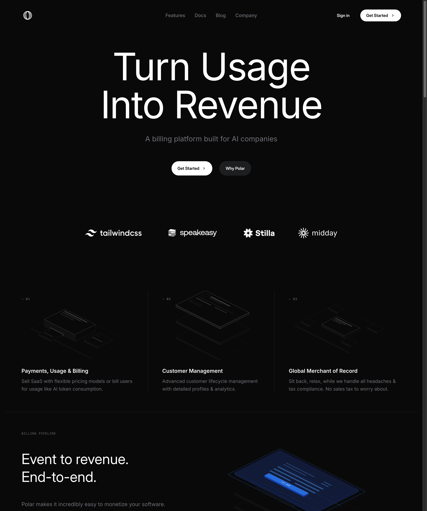
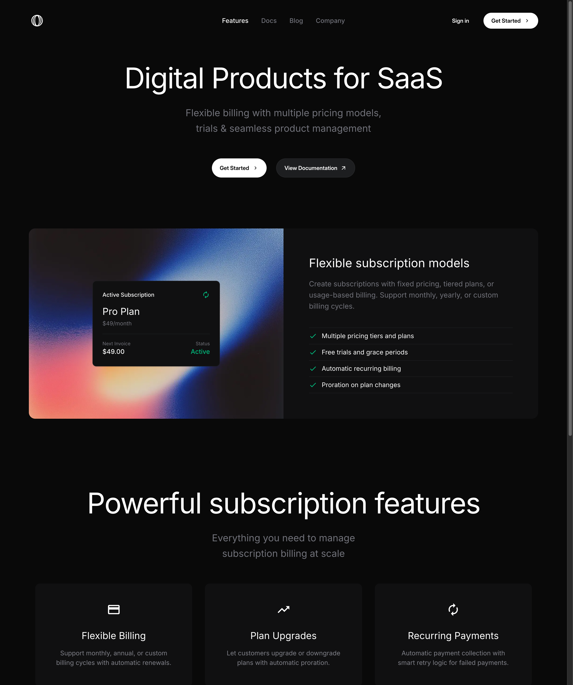
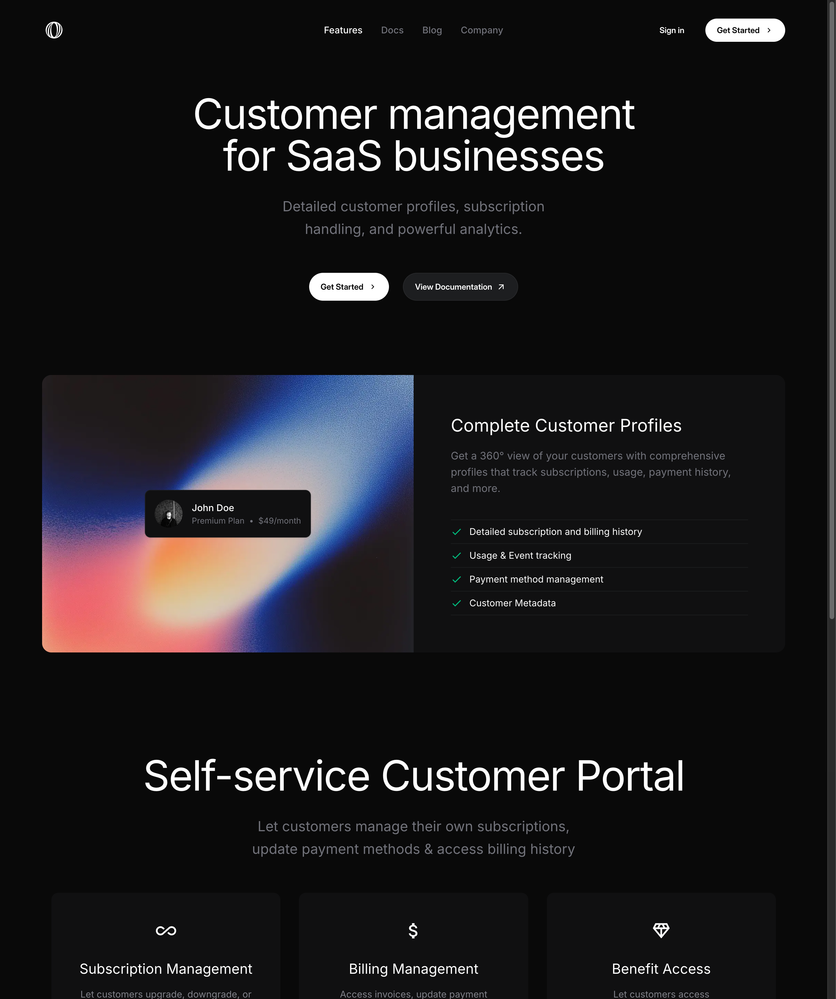
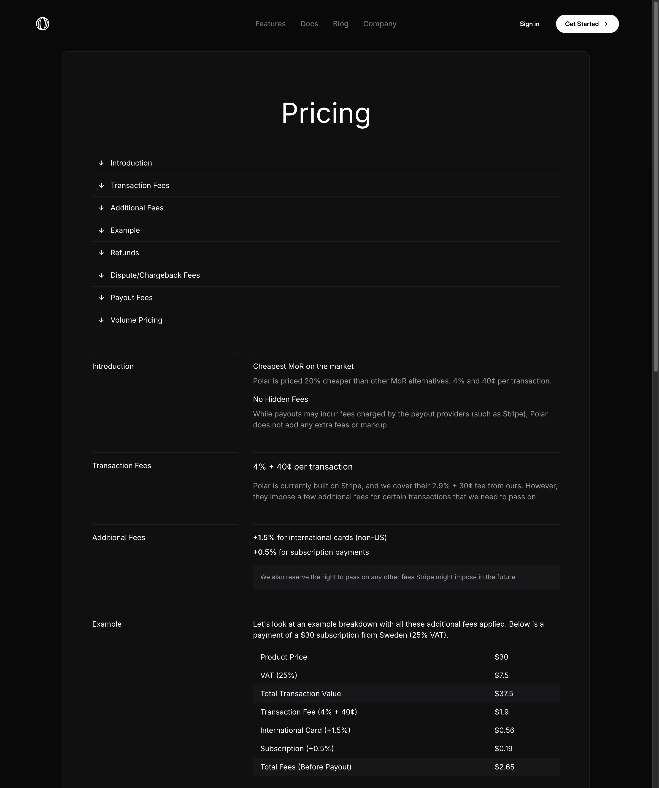
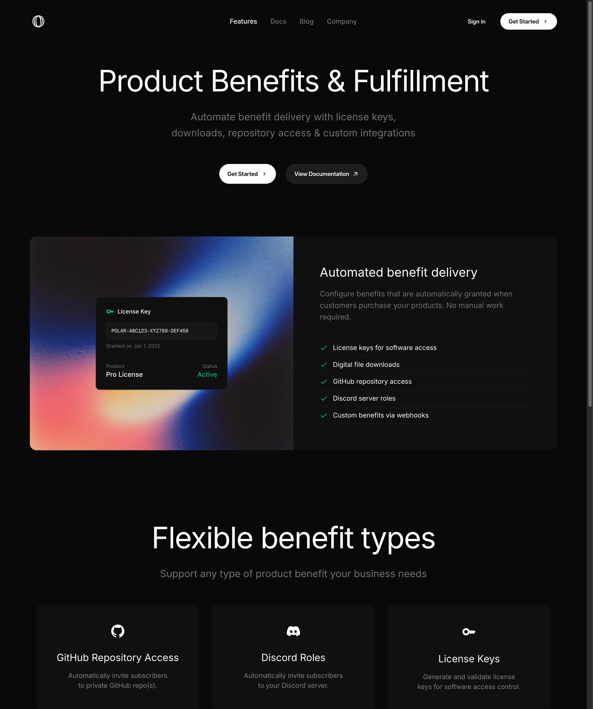

# Polar

## 서비스
- **Polar** (https://polar.sh) — 개발자/메이커가 디지털 제품을 만들고 판매할 때, 결제/상품/구독/라이선스 운영을 붙일 수 있게 돕는 **개발자 친화적 상거래 인프라 서비스**
- 현재 포지셔닝은 **"AI 기업을 위한 빌링 플랫폼"**이며, 핵심 메시지는 **"Turn Usage Into Revenue"** — 사용량 기반 과금(API 호출, 토큰 소비 등)을 쉽게 구현하는 것이 핵심 가치
- 오픈소스(Apache 2.0)로 공개 개발 중

## 이 서비스가 하는 일
- 판매자가 상품을 만들고 가격을 붙일 수 있게 해준다.
- 결제와 구매 흐름을 연결한다.
- 라이선스/구독/고객 관리 같은 운영 기능을 함께 제공한다.
- **Merchant of Record(MoR)** 역할을 해서 전 세계 VAT/GST/판매세를 대신 계산, 징수, 납부해준다.
- **Usage Billing** — API 호출, 토큰 소비 등 이벤트를 추적하여 자동 메터링/청구할 수 있다.
- **자동 혜택 전달** — 결제 시 라이선스 키 자동 생성, 파일 다운로드(10GB), GitHub 프라이빗 리포 초대, Discord 역할 자동 부여까지 연결된다.
- 즉, 개인 개발자나 메이커가 직접 결제 인프라를 만들지 않아도 판매를 시작할 수 있게 해준다.

## 핵심 기능
- **온보딩을 통해 판매자 계정을 빠르게 활성화하고, 실제 판매 가능한 상태까지 연결하는 플로우**

## 사용자 여정 분석 (AARRR 관점)

### 1. 서비스 발견 (Acquisition)

| 항목 | 내용 |
|------|------|
| **내가 한 행동** | 개발자 툴이나 메이커 커뮤니티에서 Polar를 보게 되었고, 결제/판매 인프라를 붙일 수 있다는 점 때문에 들어가 보게 되었다. |
| **내가 느낀 감정/생각** | “이걸로 내가 만드는 제품도 바로 팔 수 있나?”라는 기대가 먼저 들었다. 단순 결제 도구라기보다 개발자용 상거래 인프라처럼 보였다. |
| **불편했던 점** | 처음엔 Gumroad, Lemon Squeezy, Stripe 조합과 뭐가 다른지 한 번에 구분되지는 않았다. |
| **왜 만들었을까? (추측)** | 단순 결제 도구가 아니라, **개발자/메이커가 제품을 더 빨리 판매 가능한 상태로 만들게 하는 infra**라는 인식을 주기 위한 acquisition 설계로 보였다. 실제로 랜딩페이지에서는 Vercel(Guillermo Rauch), Ghostty(Mitchell Hashimoto) 등 개발자 커뮤니티 유명 인사의 추천을 소셜 프루프로 배치하고 있다. |

### 2. 첫 설정 완료 (Activation)

| 항목 | 내용 |
|------|------|
| **내가 한 행동** | 계정을 만들고, 제품 생성/가격 설정/결제 흐름을 보면서 “아 이걸로 실제 판매 세팅이 되겠구나”를 확인했다. 실제 온보딩은 **4단계**(가입 → 상품 설정 → 통합 방식 선택 → 웹훅 설정)로, 노코드 옵션(체크아웃 링크)을 선택하면 코드 없이 수분 내 판매 시작이 가능하다. 개발자라면 4개 언어 SDK(JS/TS, Python, Go, PHP)와 12개 프레임워크 어댑터(Next.js, Nuxt, SvelteKit, Astro 등)로 기존 스택에 빠르게 붙일 수 있다. |
| **내가 느낀 감정/생각** | “생각보다 꽤 빨리 판매 가능한 형태가 되네”라는 느낌이 들었다. 이 서비스의 온보딩이 좋다고 느껴진 건, 예쁘게만 만든 게 아니라 실제 목적지까지 빨리 데려간다는 점이었다. 특히 노코드 옵션이 있어서 “일단 팔아보기”가 가능하다는 점이 결정적이었다. |
| **불편했던 점** | 결제, 상품 타입, 라이선스 같은 개념은 여전히 낯설 수 있고, 내가 정확히 뭘 먼저 해야 하는지 놓치면 중간에 끊길 수 있겠다 싶었다. |
| **왜 만들었을까? (추측)** | Polar에서 activation은 단순 가입이 아니라 **실제로 판매 가능한 상태까지 이동시키는 것**에 있다고 봤다. 그래서 온보딩의 목적도 설명보다 실행 준비에 맞춰져 있는 것처럼 느껴졌다. “1분 내 결제 통합”을 마케팅 메시지로 내세울 수 있는 이유가 이 구조 때문이다. |

### 3. 첫 판매 이후 반복 사용 (Retention)

| 항목 | 내용 |
|------|------|
| **내가 한 행동** | 이후 상품을 추가하거나, 구매/구독/고객 상태를 계속 Polar 안에서 보게 될 것 같았다. |
| **내가 느낀 감정/생각** | “한 번 팔기 시작하면 계속 여기서 운영하는 게 자연스럽겠다”는 생각이 들었다. |
| **불편했던 점** | 운영 화면이 많아지거나 상태 추적이 복잡하면 다시 다른 툴이나 자체 시스템으로 흩어질 수 있겠다고 느꼈다. |
| **왜 만들었을까? (추측)** | Retention은 단순 재방문이 아니라, **판매와 운영 습관이 이 툴 안에 자리잡게 하는 것**이 핵심이라고 느꼈다. |

### 4. 유료화 / 매출 확장 (Revenue)

| 항목 | 내용 |
|------|------|
| **내가 한 행동** | 실제 판매가 발생하고, 더 많은 상품/결제 흐름을 계속 붙이는 방향으로 확장하게 될 것 같았다. |
| **내가 느낀 감정/생각** | “이게 실제로 매출을 만드는 도구라면 비용도 인프라 비용처럼 받아들일 수 있겠다”는 생각이 들었다. |
| **불편했던 점** | 실제 수수료가 생각보다 복잡하다. 기본 4%+$0.40이지만, 국제 카드(+1.5%) + 구독(+0.5%) 추가 시 실질 6%+$0.40까지 올라간다. $5 소액 결제면 수수료 비율이 14%에 달한다. 규모가 커지면 직접 구축(Stripe 직접 연동)과 비교하게 될 수밖에 없다. |
| **왜 만들었을까? (추측)** | Revenue는 Polar가 돈을 버는 구조이기도 하지만, 그 전에 **사용자가 이걸 통해 실제 매출을 만들 수 있느냐**가 먼저라고 느껴졌다. “가장 저렴한 MoR”을 표방하지만(Gumroad 10%, Lemon Squeezy 5%+$0.50 대비), 소액 결제에서는 고정 수수료 $0.40이 약점이 된다. |

### 5. 추천 / 팀 내 전파 (Referral)

| 항목 | 내용 |
|------|------|
| **내가 한 행동** | 한 번 잘 써본 메이커가 다른 메이커에게 “이거 꽤 괜찮다”고 추천하거나, 팀 안에서 도입을 권할 것 같았다. |
| **내가 느낀 감정/생각** | “이건 나만 쓰기보다 주변 메이커들에게도 알려줄 만하다”는 생각이 들 수 있겠다 싶었다. |
| **불편했던 점** | 추천 보상 같은 건 없어도 될 것 같지만, 첫 경험이 별로면 굳이 추천까지는 안 갈 것 같았다. |
| **왜 만들었을까? (추측)** | 이 서비스의 referral은 소비자 앱처럼 대놓고 퍼지는 구조보다, **메이커 커뮤니티 안에서 평판처럼 번지는 구조**를 기대한 것으로 보였다. |

## 한 줄 정리
Polar의 온보딩은 단순 회원가입 플로우가 아니라, **사용자를 빠르게 ‘판매 가능한 상태’로 이동시키기 위한 Activation 설계**로 느껴졌다. 특히 좋았던 점은 기능 소개보다 먼저 “이걸로 내가 실제로 뭘 할 수 있는지”를 빠르게 납득하게 만든다는 점이었다.

## 경쟁 포지셔닝

| 비교 항목 | Polar | Gumroad | Lemon Squeezy | Stripe (직접 연동) |
|-----------|-------|---------|---------------|---------------------|
| **포지셔닝** | AI/SaaS 개발자 특화 빌링 | 크리에이터 마켓플레이스 | 크리에이터/인디해커 MoR | 범용 결제 인프라 |
| **MoR (세금 대행)** | O | O | O | X (Stripe Tax 별도) |
| **수수료** | 4%+$0.40 (실질 최대 6%+$0.40) | 10% | 5%+$0.50 | 2.9%+$0.30 (MoR 없음) |
| **사용량 기반 과금** | 핵심 기능 | X | 제한적 | Stripe Billing으로 가능하나 복잡 |
| **오픈소스** | O (Apache 2.0) | X | X | X |
| **개발자 경험** | SDK 4종 + 어댑터 12종 | 낮음 | 보통 | 매우 높음 |

Polar가 공략하는 간극: **”Stripe은 너무 복잡하고, Gumroad/Lemon Squeezy는 개발자 도구에 안 맞는다”**

## 메모
- Polar는 AARRR 전체를 다 볼 수 있지만, 특히 **Activation의 질**이 중요해 보였다.
- 이 서비스의 온보딩이 좋게 느껴진 이유는 예쁘게 잘 만들었다기보다, **사용자를 가능한 한 빨리 실제 비즈니스 행위로 연결시키는 구조**가 잘 보였기 때문이다.
- 결국 이 서비스의 activation은 가입이 아니라, “내 상품을 실제로 팔 수 있겠다”는 확신이 생기는 순간이라고 느꼈다.
- 노코드 체크아웃 링크 옵션이 있다는 건, 기술적 허들을 넘기 전에도 “일단 팔아보기”가 가능하다는 뜻이고, 이게 Time-to-Value를 극단적으로 줄이는 핵심 장치다.

## 내가 PM/PE라면 다음에 바꿀 것
- 처음 들어온 사용자가 “내가 지금 어디까지 왔는지”를 더 분명하게 느낄 수 있도록, 온보딩 진행 상태와 다음 액션을 더 명확히 보여줄 것 같다. 현재 4단계 중 어디에 있는지 시각적으로 보여주는 프로그레스 바가 없다면 추가할 만하다.
- 판매 설정이 끝난 뒤 바로 작은 성공 경험을 느낄 수 있게, **데모 구매나 테스트 주문 흐름**을 더 강조할 것 같다. 지금은 설정 완료 → 실제 구매 발생 사이에 빈 구간이 있어서, 그 사이에서 이탈이 일어날 수 있다.
- 소액 결제($5 이하) 시 수수료 비율이 14%까지 올라가는 문제를 해결하기 위해, **소액 상품 번들링이나 최소 결제 금액 가이드**를 온보딩에 포함시킬 것 같다. 아니면 소액 결제용 수수료 구조를 별도로 만드는 것도 고려할 수 있다.
- 장기적으로는 “AI 기업을 위한 빌링”이라는 니치 포지셔닝이 성장의 천장이 될 수 있다. AI가 아닌 SaaS, 인디해커까지 타겟을 확장할 때 메시지가 어떻게 바뀌어야 하는지 미리 고민이 필요해 보인다.
