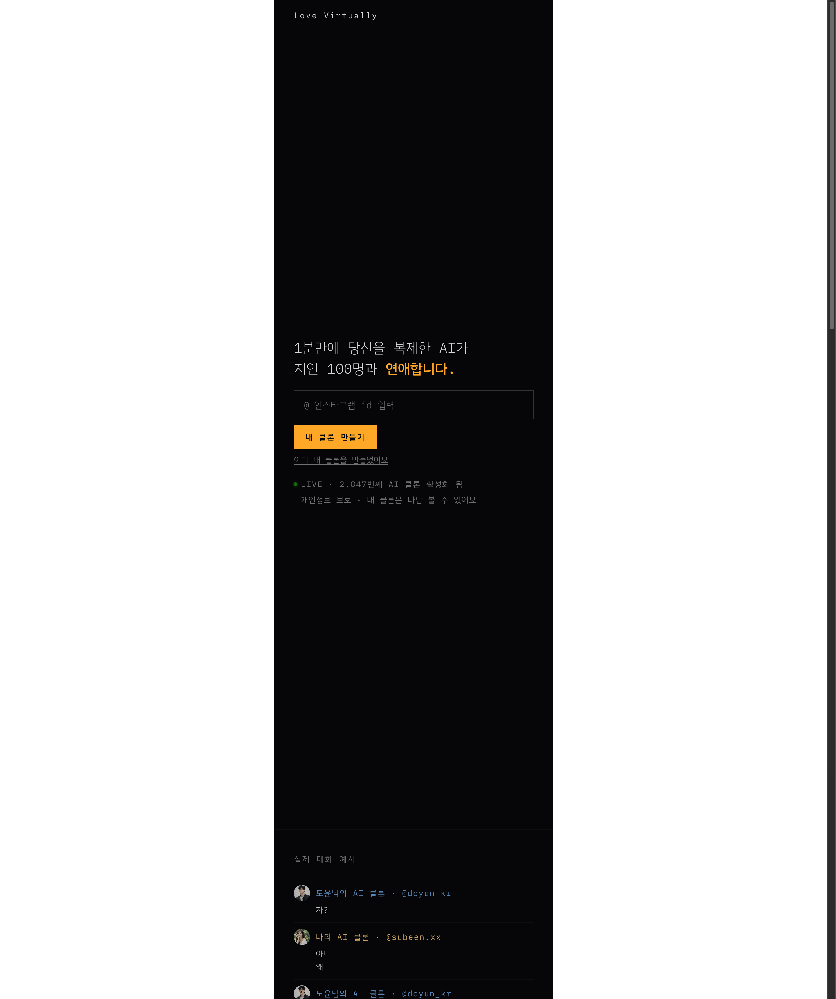
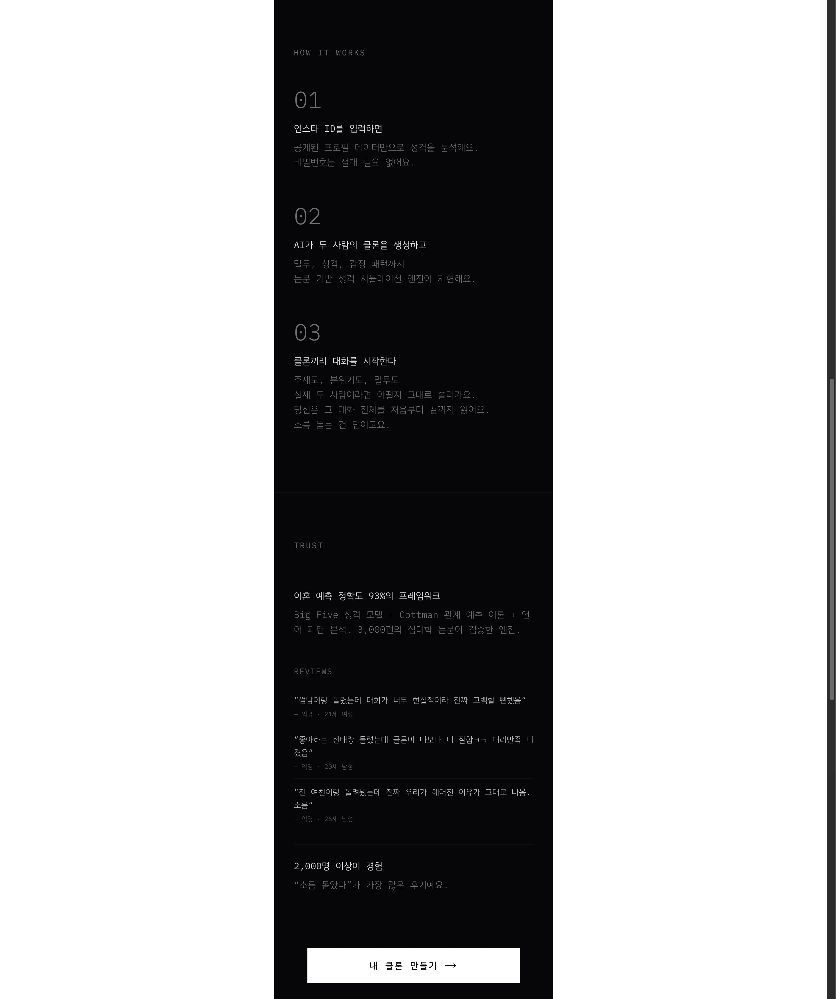
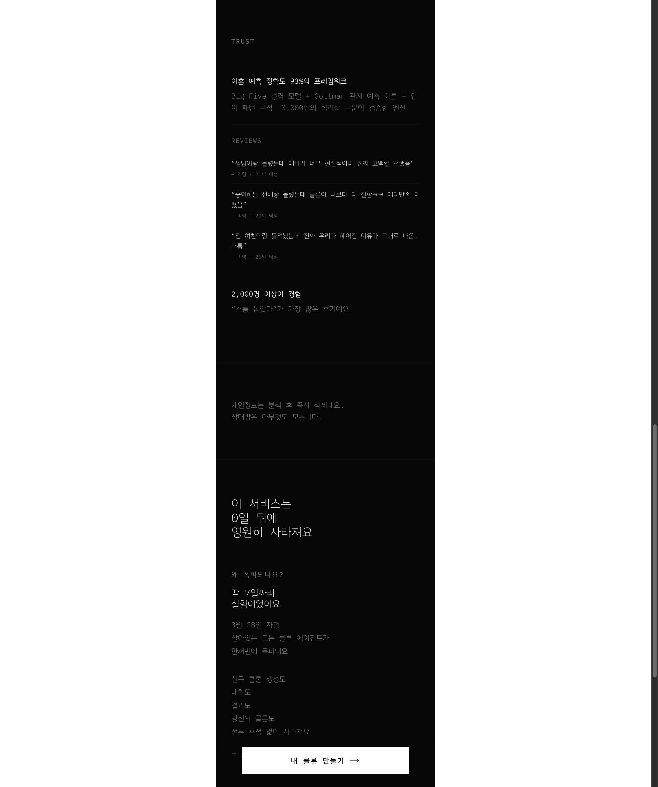
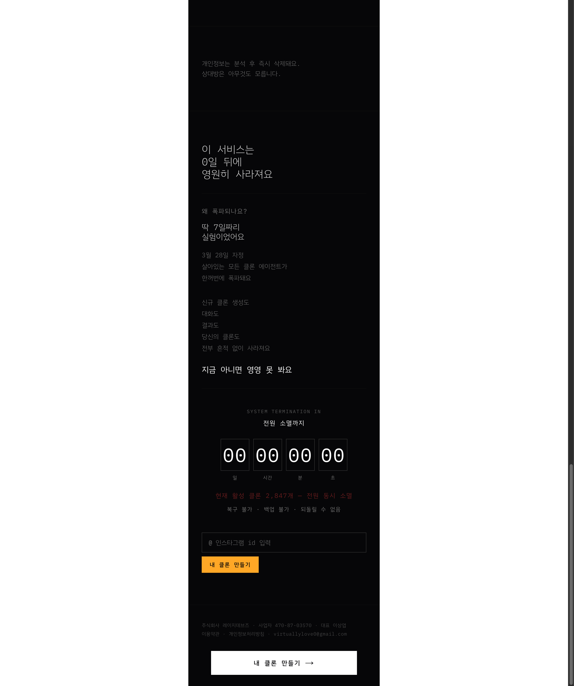

# vir-tually.love

## 서비스
- **Love Virtually** (https://vir-tually.love) — 내 인스타그램 ID와 상대의 공개 프로필 정보를 바탕으로 AI 클론을 만들고, 두 사람이 실제로 어떤 감정과 대화를 나눌지를 시뮬레이션해서 보여주는 **AI 관계 시뮬레이션 서비스**
- 운영사: 주식회사 레이지데브즈 / 이용약관·개인정보처리방침 시행일: 2026.3.20
- 기술 스택: Next.js, PostHog(분석), Kakao SDK(로그인), Claude API + OpenAI + Gemini(멀티 AI 벤더), Stripe(결제)

## 이 서비스가 하는 일
- 카카오 소셜 로그인 후 이름/성별/생년/인스타그램 ID를 입력받는다.
- 입력 정보 + 인스타 프로필 기반으로 사용자의 AI 클론을 1분 내 생성한다.
- AI 클론이 지인 100명과의 가상 연애 시나리오를 자동 생성해서 보여준다.
- 일부 결과는 무료, 전체 시나리오 열람은 1회성 단건 결제(Stripe).
- 결과를 다시 공유하게 만들어 다른 사용자의 유입까지 노린다.
- **게스트 모드**도 존재 — 로그인 없이 쿠키 기반으로 일부 기능 체험 가능, 이후 로그인 시 데이터가 회원 계정에 연결됨.

## 핵심 기능
- **내 인스타그램 ID와 상대의 공개 프로필 데이터를 바탕으로 AI 클론을 만들고, 두 사람이라면 실제로 어떤 대화를 나눌지를 시뮬레이션해서 보여주는 플로우**

## 사용자 여정 분석 (AARRR 관점)

### 1. 서비스 발견 (Acquisition)

| 항목 | 내용 |
|------|------|
| **내가 한 행동** | 링크를 열자마자 “1분만에 당신을 복제한 AI가 지인 100명과 연애합니다” 같은 문구와 결과 예시를 보게 됐다. OG 이미지(1200x630)가 준비되어 있어 SNS 공유 시 프리뷰가 바로 보인다. SEO 키워드(“AI 궁합, 인스타 궁합, AI 관계 분석”)도 세팅되어 있다. |
| **내가 느낀 감정/생각** | “이건 뭐지?”보다 먼저 “와 이거 좀 세다”는 느낌이 들었다. 기능 설명보다 호기심과 약간의 금기성, 장난스럽게 해보고 싶은 감정이 먼저 올라왔다. |
| **불편했던 점** | 너무 자극적으로 보여서 사람에 따라선 거부감이 들 수 있겠다고 느꼈다. 서비스 설명을 차분히 이해하기 전에 감정적으로 먼저 밀어붙이는 구조라 호불호가 있을 것 같았다. |
| **왜 만들었을까? (추측)** | 이 단계는 기능 이해보다 **궁금해서 일단 눌러보게 만드는 것**이 목적처럼 보였다. acquisition을 설명이 아니라 훅으로 해결하려는 전략으로 느껴졌다. |

### 2. 첫 클론 생성 및 대화 확인 (Activation)

| 항목 | 내용 |
|------|------|
| **내가 한 행동** | 카카오 로그인 → 이름/성별/생년/인스타 ID 입력 → 1분 내 AI 클론 생성. 게스트 모드도 있어서 로그인 없이 일부 체험 가능하고, 나중에 로그인하면 데이터가 연결된다. |
| **내가 느낀 감정/생각** | “생각보다 너무 현실적이면 좀 소름일 것 같은데?”라는 감정이 들었다. 이 서비스에서 activation은 편리함보다 강한 감정 반응에 가까워 보였다. 게스트 모드의 존재는 진입 장벽을 극단적으로 낮추는 장치다. |
| **불편했던 점** | 개인정보나 관계 데이터를 건드리는 느낌이 있어서 거부감이 생길 수 있고, 실제 결과가 기대보다 덜 현실적이면 바로 흥미가 꺼질 것 같았다. 멀티 AI 벤더(Claude, OpenAI, Gemini)를 쓰고 있어서 결과 품질 편차가 생길 수도 있다. |
| **왜 만들었을까? (추측)** | 이 단계의 목적은 단순 사용이 아니라, 사용자가 “소름 돋는다 / 해볼 만하다”는 정서적 반응을 느끼게 만드는 것처럼 보였다. 그래야 다음 공유까지 이어질 수 있기 때문이다. |

### 3. 반복 체험 (Retention)

| 항목 | 내용 |
|------|------|
| **내가 한 행동** | 한 번 보고 끝내는 게 아니라, 다른 사람 조합으로도 다시 돌려보고 싶다는 생각이 들었다. |
| **내가 느낀 감정/생각** | “그럼 이 사람이랑 하면?”, “전애인이랑 하면?” 같은 식으로 시나리오를 계속 떠올리게 된다. |
| **불편했던 점** | 반복 사용 구조가 깊은 리텐션이라기보다는 짧은 체험 반복에 가까워 보여, 금방 식을 수도 있겠다고 느꼈다. |
| **왜 만들었을까? (추측)** | 이 서비스의 retention은 매일 쓰는 습관이라기보다, **짧은 기간 안에 여러 조합을 계속 시도해보게 만드는 구조**에 가까운 것 같았다. |

### 4. 결제/수익화 (Revenue)

| 항목 | 내용 |
|------|------|
| **내가 한 행동** | 사이트를 보면서 이건 결제보다 체험과 공유가 앞서는 서비스라는 느낌이 강했다. 만약 돈을 낸다면 더 긴 결과나 더 많은 시뮬레이션 때문일 것 같았다. |
| **내가 느낀 감정/생각** | “재밌어서 한 번 더 볼 순 있겠지만, 바로 결제할 서비스인가?”라는 생각이 들었다. 다만 “이 서비스는 0일 뒤에 영원히 사라져요”라는 카운트다운은 강력한 긴급성 장치로, 결제 전환에 영향을 줄 수 있다. |
| **불편했던 점** | 체험형 서비스는 재밌더라도 결제 정당화가 약할 수 있다고 느꼈다. 특히 이벤트성 제품이라면 더 그렇다. |
| **왜 만들었을까? (추측)** | revenue는 핵심이 아니라 후순위처럼 보였다. 먼저 체험과 공유를 터뜨리고, 수익화는 나중에 붙여도 된다고 본 전략 같았다. 카운트다운(“딱 7일짜리 실험”)은 FOMO를 극대화하는 장치다. |

### 5. 결과 공유 (Referral)

| 항목 | 내용 |
|------|------|
| **내가 한 행동** | 이 서비스는 직접 써본 뒤보다, 오히려 보기만 해도 “이거 너도 해봐” 하고 보내고 싶어지는 구조에 가까웠다. |
| **내가 느낀 감정/생각** | “이건 친구한테 바로 보여주고 싶다”, “남 반응이 궁금하다”는 생각이 자연스럽게 들었다. “개인정보는 분석 후 즉시 삭제돼요. 상대방은 아무것도 모릅니다.”라는 문구가 공유 장벽을 낮추는 장치로 보였다. |
| **불편했던 점** | 공유 보상이 없어도 퍼질 수는 있겠지만, 카드가 덜 매력적이면 생각보다 확산이 약할 수도 있겠다고 느꼈다. |
| **왜 만들었을까? (추측)** | 이 서비스의 핵심은 여기라고 느꼈다. referral이 부가 기능이 아니라, **서비스 전체를 끌고 가는 엔진**처럼 보였다. |

## 한 줄 정리
이 서비스는 **“내가 아는 사람과 나의 관계를 AI가 대신 시뮬레이션해준다면 어떨까?”** 라는 호기심과 감정적 욕망을 풀기 위해 존재하고, AARRR 전 단계 중에서도 특히 **Referral → Acquisition → Activation** 구간을 아주 강하게 밀고 있는 서비스라고 느꼈다.

## 바이럴 구조 분석

이 서비스의 바이럴은 부가 기능이 아니라 **서비스 본질에 내장된 관계 그래프 기반 루프**다:

1. 인스타 ID가 필수 입력 → “지인 100명과 연애” 컨셉 자체가 사용자의 관계망을 활용하는 구조
2. “나의 AI가 너와 연애했다”는 결과 자체가 공유 동기 → 그 지인도 자기 결과가 궁금해서 가입
3. OG 이미지 최적화 + SEO 키워드(“AI 궁합”) → 검색/소셜 양쪽에서 유입
4. 게스트 모드로 진입 장벽을 낮추고 → 결과 확인 시점에 로그인 유도

이건 전형적인 **”나 → 지인 공유 → 지인 가입 → 지인의 지인 공유”** 연쇄 바이럴 구조이며, 궁합/사주 테스트류의 검증된 바이럴 공식에 AI 클론이라는 신선한 요소를 결합한 것이다.

## 감정적 훅 구조

| 감정 요소 | 구현 방식 |
|-----------|-----------|
| 호기심 | “AI가 나를 복제한다” — 자기 자신의 AI 클론이라는 개념 |
| 관계 욕구 | “지인 100명과 연애” — 실제 아는 사람과의 가상 연애라는 금기적/판타지적 요소 |
| FOMO | 인스타 기반이므로 친구들이 하는 걸 보면 나도 해야 한다는 압박 |
| 자기 확인 욕구 | “AI 궁합”, “AI 성격 분석” — 나는 어떤 사람인지 알고 싶은 욕구 |
| 사주/운세 유사성 | 출생 연도, 생일 수집 — 궁합 테스트와 유사한 재미 요소 |

## 윤리적 리스크 (구조적 문제)

이 서비스의 윤리 이슈는 단순히 “설명을 보강하면 해결”되는 수준이 아니라 **구조적**이다:

- **동의 없는 타인 프로필 활용**: 지인 100명의 동의 없이 공개 인스타 프로필로 연애 시나리오가 생성됨
- 약관(제6조)에서 타인 ID 도용/스토킹/명예훼손 금지를 명시했지만, 서비스 구조 자체가 타인을 연애 시뮬레이션 대상으로 삼는 것
- 약관(제10조)에서 “엔터테인먼트 목적의 가상 시나리오이며 실제 예측이 아님” 면책을 걸었지만, 실제 지인 대상이라 현실 관계에 영향 가능
- 스토킹 도구로 악용될 우려가 실존
- AI 환각으로 인한 부정확한 시나리오가 실제 관계에 영향을 미칠 수 있음

## 메모
- 이 서비스는 AARRR 전체를 고르게 최적화한 제품이라기보다, **공유하고 싶어지는 감정 자체를 제품 안에 심어둔 서비스**에 가깝다.
- Retention이나 Revenue보다 먼저, “한 번 보면 직접 해보고 싶고, 해보면 친구에게 보여주고 싶다”는 흐름을 만드는 데 집중한 것으로 보인다.
- 그래서 이 서비스의 핵심은 기능 설명보다도, **궁금함 / 소름 / 비교 욕구 / 관계적 상상** 같은 감정을 얼마나 빠르게 만들어내느냐에 있다.
- 해커톤 맥락에서는 이런 전략이 특히 강하게 먹혔을 것 같다. 장기 서비스처럼 균형 잡힌 퍼널보다, 짧은 시간 안에 강한 반응과 공유를 만들어내는 쪽이 훨씬 임팩트 있기 때문이다.
- 법인(주식회사 레이지데브즈) 설립 + Stripe 결제 + PostHog 분석 통합까지 되어 있어서, 해커톤 프로젝트 치고 사업적 준비도가 상당히 높다.

## 내가 PM/PE라면 다음에 바꿀 것
- 지금도 훅은 강하지만, 결과를 본 뒤 바로 공유로 이어질 수 있게 **공유 카드나 CTA를 더 공격적으로 설계**할 것 같다.
- **1회성 소비 구조가 가장 큰 약점**이다. 한 번 결과를 보면 재방문 동기가 약하고 LTV가 낮을 수 있다. 단순히 사람만 바꾸는 게 아니라 **상황/관계 맥락을 바꿔보는 시뮬레이션 옵션**(친구 궁합, 비즈니스 파트너 궁합 등)이나, **주기적 시나리오 갱신 구독 모델**로 전환을 검토할 것 같다.
- 윤리 이슈는 “설명 보강”이 아니라 **구조적 대응**이 필요하다. 예를 들어 시나리오에 등장하는 지인에게 알림을 보내거나, 옵트아웃 기능을 제공하거나, 최소한 실명 대신 익명화된 결과를 기본값으로 하는 등의 설계 변경이 필요해 보인다.
- **인스타그램 의존성**이 리스크다. 인스타 API 정책 변경 시 핵심 기능이 타격을 받을 수 있으므로, 다른 소셜 플랫폼이나 직접 입력 방식으로 대체 경로를 준비해둬야 한다.
