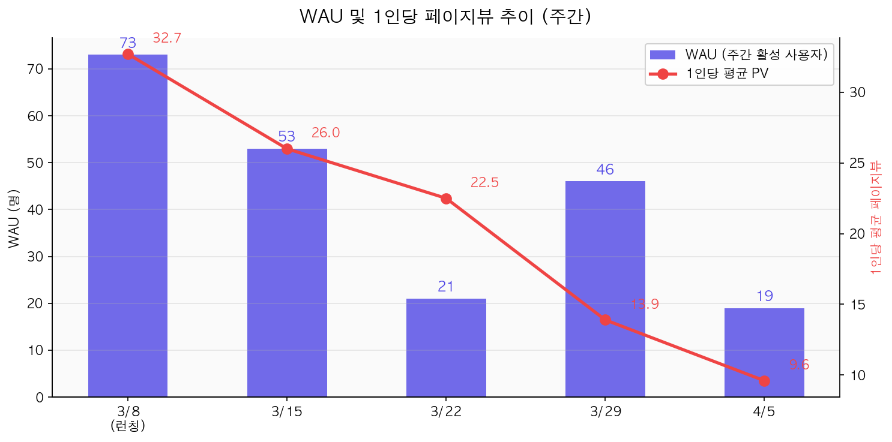
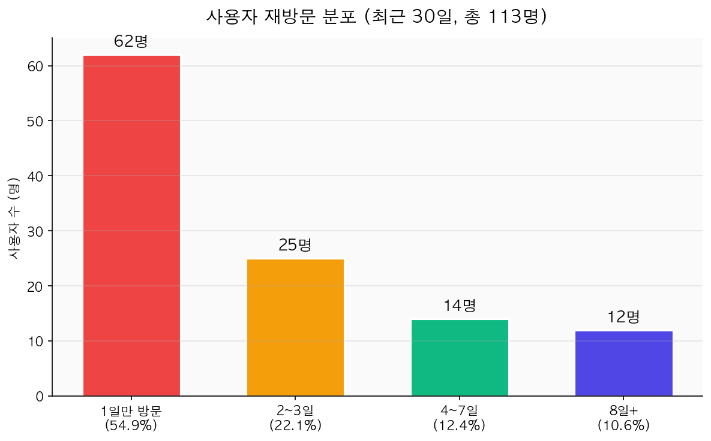
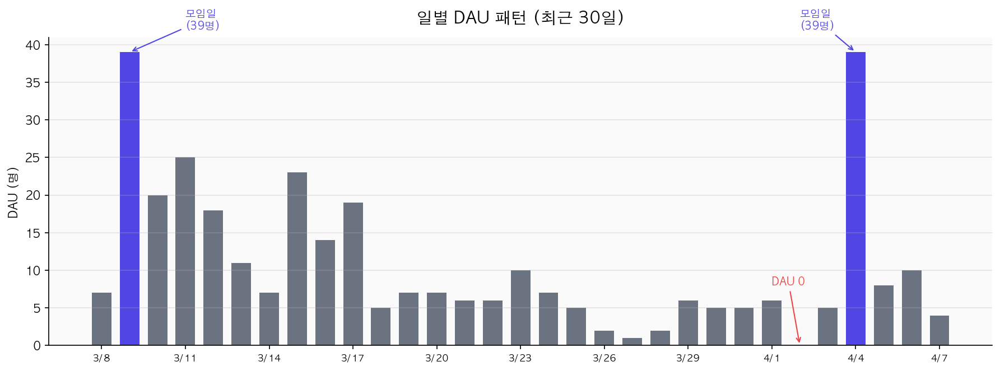
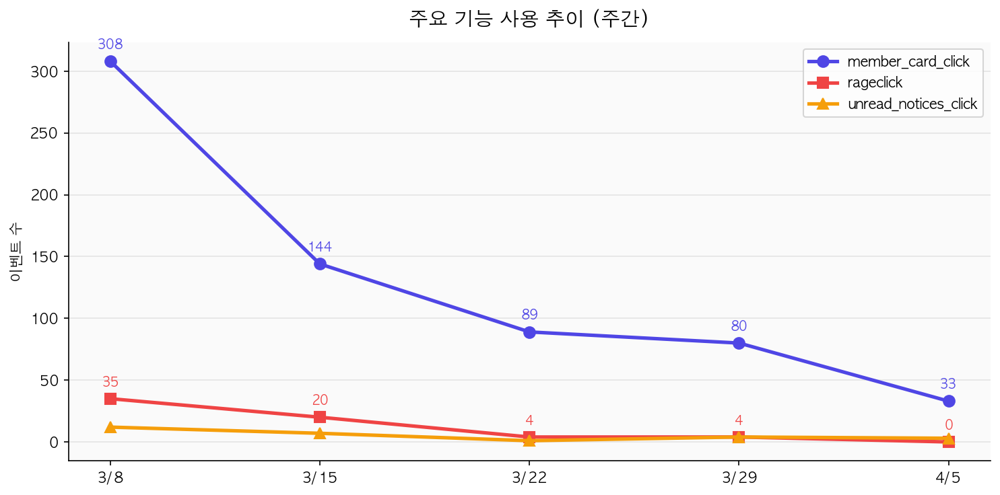
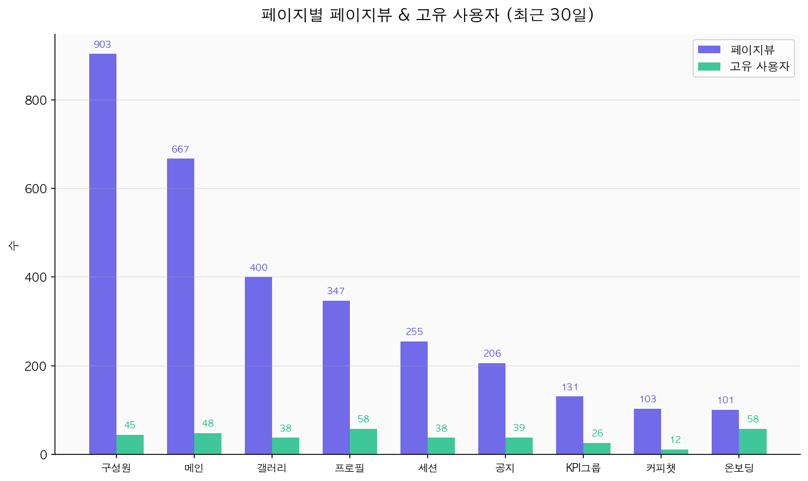

# 3주차: 공개 데이터로 프로덕트 읽기

## 분석 대상
- **서비스**: SIPE-HUB
- **분석한 기능**: 동아리 활동 참여 및 구성원 연결 (가입 → 출석 → 갤러리/구성원 탐색 → 커피챗)
- **서비스 유형**: 내부 도구 (동아리 커뮤니티 플랫폼)

## 2주차에서 발견한 페인포인트
1. 뭔가 계속 방문해야 하는 유인이 적다 — QR 출석 찍고 나면 앱을 닫게 됨. 출석 후 자연스럽게 다른 기능으로 연결되는 동선이 약함
2. 구성원 간 연결 고리 부족 — 프로필은 있지만 다른 사람의 프로필을 "왜" 봐야 하는지 동기가 약함. 커피챗 같은 액션으로 연결되는 흐름이 필요

---

## 공개 데이터 분석

- **사용한 소스**: PostHog 제품 분석 (내부 정량 데이터) + [2주차 과제 PR #13 코멘트](https://github.com/sipe-team/5-1_sipe_product_engineering_lab/pull/13) (정성적 사용자 피드백)
- **소스 선정 이유**: SIPE-HUB은 외부에 공개된 앱스토어 리뷰나 G2 등의 피드백이 존재하지 않는 내부 도구이므로, PostHog에 수집된 실제 사용자 행동 데이터 + PR에 남긴 동아리 구성원들의 코멘트를 사용자 리뷰로 활용
- **분석한 데이터**: 최근 30일 기준 574개 세션, 113명 고유 사용자, 5,058 페이지뷰 이벤트 + PR 코멘트 3건

### PR 코멘트 기반 사용자 피드백 (정성적 데이터)

SIPE-HUB은 앱스토어 리뷰가 없으므로, [2주차 과제 PR #13](https://github.com/sipe-team/5-1_sipe_product_engineering_lab/pull/13)에 남긴 동아리 구성원들의 코멘트를 사용자 리뷰로 활용했다.

> "SIPE의 경우 소통을 보통 **SLACK으로 하다보니 SIPE-HUB를 들어갈 이유가 크게 느끼지 못했습니다!**"
> — @GaBaljaintheroom
> → 페인포인트 1(방문 유인 부족)과 직접 연결. Slack이라는 강력한 대체재가 있어서 HUB를 방문할 동기 자체가 약함.

> "커피챗을 하면 사진찍고 인증을 올리면 **포인트같은걸 줬는데, 다들 포인트 얻으려고 열심히 사진을 올렸거든요!** 그렇게 되니까 자연스럽게 인증 채널이 활성화 되고 더 많은 모임이 형성되기도 하더라구요!"
> — @sojin2
> → 페인포인트 2(구성원 연결 고리 부족)에 대한 해결 사례 제시. 인센티브 설계가 커피챗 활성화에 효과적이었다는 경험 공유.

> "유입률을 높이기 위해 개발했던 요소들: **유저들이 자발적으로 들어올 수 있는 재미 요소** (MBTI 필터링 → 꾸준한 유입률), 끝말잇기 게임 → 유입률은 높아졌으나 지속적이지 않음, **슬랙 글들 hub로 가져오기** (채용 공고 및 커피챗 → hub의 링크로 유입)"
> — @yujindonut
> → 유사 서비스 운영 경험에서 "재미 요소"와 "Slack 연동"이 유입에 효과가 있었다는 피드백. 다만 게임은 지속적이지 않았다는 한계도 공유.

> "sipe가 현업 개발자들의 네트워킹이 주인만큼! **커피챗 및 네트워킹 요소가 hub에서 활발하게 이루어졌으면 좋겠어요!! 커피챗 기능 !! 너무나 원합니다!!**"
> — @yujindonut
> → 커피챗 기능에 대한 명확한 수요 확인. 현재 12명만 사용하는 커피챗이 잠재적으로는 핵심 기능이 될 수 있음을 시사.

### 내 페인포인트와 겹치는 데이터 (정량적 검증)

**페인포인트 1: 뭔가 계속 방문해야 하는 유인이 적다**

> **[데이터] WAU(주간 활성 사용자) 추이**: 런칭 주 73명 → 2주차 53명 → 3주차 21명 → 4주차 46명 → 5주차 19명
> → 런칭 후 WAU가 **74% 감소**(73명 → 19명). 4주차에 일시적 반등(46명)이 있었으나 지속되지 못하고 다시 하락. 이벤트(OT/모임)가 있는 날에만 잠깐 올라가는 "이벤트 드리븐" 패턴.

> **[데이터] 사용자 재방문 분포 (30일)**: 전체 113명 중 1일만 방문 62명(54.9%), 2-3일 25명(22.1%), 4-7일 14명(12.4%), 8일+ 12명(10.6%)
> → 전체 사용자의 **55%가 단 1일만 방문**하고 이탈. "한번 와보고 안 쓰는" 서비스가 되고 있음.

> **[데이터] 세션 체류 시간**: 평균 6.1분이지만, **중앙값은 0분**. 세션당 페이지뷰도 평균 8.8이지만 중앙값은 4.
> → 절반 이상의 세션이 페이지 한두 개 보고 바로 이탈. 출석 체크하고 나가는 패턴으로 추정됨.

> **[데이터] 일별 DAU 패턴**: 모임일(일요일)에 스파이크(3/9: 39명, 4/4: 39명), 평일 평균 DAU 2-7명, 4/2에는 **DAU 0명** 기록
> → 모임 날에만 잠깐 방문하고, 평일에는 거의 사용하지 않는 패턴. 서비스 자체의 방문 유인이 아니라 오프라인 이벤트에 의존하고 있음.

> **[데이터] 1인당 평균 페이지뷰 하락**: 런칭 주 32.7 → 5주차 9.6
> → 방문하더라도 탐색하는 깊이가 점점 줄어들고 있음. 초기 호기심이 사라진 후 할 게 없다는 것을 반증.

**페인포인트 2: 구성원 간 연결 고리 부족**

> **[데이터] member_card_click 추이**: 런칭 주 308회 → 2주차 144회 → 3주차 89회 → 4주차 80회 → 5주차 33회
> → 멤버 카드 클릭이 **89% 감소**. 초기에는 "오 이런 사람이 있구나" 호기심으로 탐색했지만, 프로필을 본 후 할 수 있는 액션이 없어서 흥미가 급감.

> **[데이터] `/coffee-chat` 페이지**: 103 페이지뷰, 고유 사용자 **12명**
> → 커피챗은 아직 정식 오픈 전이며, 구성원에게 별도 안내도 하지 않은 상태. 그럼에도 12명이 알아서 찾아와 103번 조회했다는 건 **숨겨진 수요가 존재한다는 강한 신호**. PR 코멘트에서도 "커피챗 기능 너무나 원합니다!"라는 피드백과 일치하며, 정식 오픈 시 핵심 기능이 될 가능성이 높음.

> **[데이터] `/members` 페이지**: 903 페이지뷰(1위), 고유 사용자 45명
> → 가장 많이 조회되는 페이지이지만, 45명이 1인당 평균 20회 반복 조회하는 구조. "구경은 하지만 연결로 이어지지 않는" 패턴.

### 피드백 트렌드
- **최근 vs 초기 비교**: 런칭 주(3/8) 대비 5주차(4/5)에 모든 핵심 지표가 하락 추세
  - WAU: 73명 → 19명 (▼74%)
  - member_card_click: 308 → 33 (▼89%)
  - 1인당 페이지뷰: 32.7 → 9.6 (▼71%)
  - rageclick: 35 → 0 (런칭 주 Supabase 다운으로 인한 서버 무응답이 주 원인. 이후 서버 안정화 + 사용자 감소로 자연 소멸)
- **개선된 점**: 특별히 관찰되지 않음. 런칭 이후 기능 추가나 UX 개선의 흔적이 데이터상 보이지 않음.

---

### 앱 업데이트 기록
- PostHog 이벤트 데이터 기준, 런칭(3/8) 이후 새로운 커스텀 이벤트가 추가되지 않음
- 주요 페이지 구조(`/`, `/members`, `/gallery`, `/sessions`, `/notices`, `/coffee-chat`, `/kpi/group`, `/profile`)는 런칭 시점부터 동일하게 유지
- → 런칭 이후 기능 추가나 개선 배포가 활발하지 않은 것으로 추정

---

## 종합 판단

> SIPE-HUB의 "동아리 활동 참여 및 구성원 연결" 기능은 **부분적 실패 — 방향은 맞지만 실행이 부족한 상태**이다.
>
> **근거:**
> 1. **Retention 실패**: WAU 74% 감소, 55%의 사용자가 1일 방문 후 이탈. 출석 이후 서비스에 머무를 이유를 만들지 못하고 있음.
> 2. **연결 기능의 잠재력은 있으나 미활성**: 커피챗은 미오픈 상태임에도 12명이 자발적으로 방문(숨은 수요). 하지만 구성원 탐색(member_card_click)은 89% 감소하여, "구경"에서 "연결"로 이어지는 동선이 부족.
> 3. **이벤트 의존적 사용 패턴**: DAU가 모임일에만 스파이크를 보이고 평일에는 거의 0에 수렴. 서비스 자체의 방문 동기가 없음.
> 4. **Slack이라는 강력한 대체재**: PR 코멘트에서 "Slack으로 소통하다보니 HUB를 들어갈 이유가 없다"는 피드백. 소통 채널이 이미 Slack에서 해결되고 있어 HUB만의 차별화된 가치가 부족.
>
> **한계:**
> - PostHog 정량 데이터만으로는 "왜 사용자가 재방문하지 않는지"의 정성적 이유를 확정할 수 없음 (설문/인터뷰 필요)
> - 세션 체류 시간 중앙값 0분은 PostHog의 측정 방식(단일 페이지 세션은 duration=0) 특성일 수 있어, 실제 체류와 차이가 있을 수 있음
> - 런칭 후 5주밖에 되지 않은 서비스이므로, 초기 감소가 자연스러운 현상일 수 있음 (다만 감소 폭이 과도함)

## 외부 추론 vs 내부 현실 (자사 서비스인 경우)

> 2주차 User Journey Map에서 순수 사용자 관점으로 발견한 페인포인트와 PostHog 데이터의 대조:
>
> **일치하는 부분:**
> - "출석 이후 할 게 없다" → 세션 중앙값 체류 0분, DAU가 모임일에만 스파이크 → 데이터가 이 페인포인트를 강하게 뒷받침
> - "구성원 간 연결 고리 부족" → member_card_click 89% 감소, coffee-chat 12명만 사용 → 데이터가 이 페인포인트를 명확히 확인
> - "활동 기록의 축적이 안 보인다" → 1인당 페이지뷰가 32.7 → 9.6으로 하락. 축적된 콘텐츠를 확인하러 돌아오는 패턴이 없음
>
> **추가로 알게 된 부분:**
> - rageclick 35건(런칭 주)은 Supabase 다운으로 인한 서버 무응답이 주 원인. 단, User Journey에서 "디자인이 별로다"로 느낀 불만과 복합적으로 작용했을 가능성도 있음
> - PR 코멘트에서 "Slack으로 소통하다보니 HUB를 들어갈 이유가 없다"는 피드백은 사용자 관점에서는 명확히 체감했지만, 정량 데이터만으로는 파악하기 어려웠던 부분. 정성 피드백과 정량 데이터를 함께 봐야 온전한 그림이 나옴

## (선택) 내가 PM이라면 다음에 뭘 할 것인가?

> 1. **출석 후 동선 설계**: 출석 체크 기능을 만들어 출석을 잘할 시, 뭔가 리워드 (당근 마켓 뱃지 같은 거라도) 가 제공되면 좋을 것 같음
> 2. **커피챗 접근성 개선**: 커피챗 기능 오픈 후, 뭔가 애니메이션이라도 줘야 할 듯. 그리고 커피챗 온도가 높으면 뭐 뱃지나 이펙트 같은게 들어가야 할 듯
> 3. **Slack 연동으로 유입 경로 만들기**: PR 코멘트에서 제안된 "슬랙 글들 hub로 가져오기" 전략. slack 에서 sipe-hub 와 연결 포인트를 뭘로 가져가야 할 지 고민이 됨.
> 4. **추가 기능**: SIPE 고양이 다마고치처럼 키우기, 잡담 게시판 등, 뭔가 계속 방문할 유인이 될 추가 기능이 있으면 좋을 것 같음.

---
---

# 3주차: 공개 데이터로 프로덕트 읽기 (2) — 리멤버

## 분석 대상
- **서비스**: 리멤버 (Remember)
- **분석한 기능**: 명함 관리 → 커리어 플랫폼 전환 (명함 촬영 → 프로필 → 채용 매칭 → 커뮤니티/콘텐츠)
- **서비스 유형**: B2C 앱 (직장인 대상)

## 2주차에서 발견한 페인포인트
1. 명함 앱 → 커리어 플랫폼 전환이 부자연스럽다 — "명함 정리하러 왔는데 왜 프로필을 채우라고 하지?" 맥락 단절
2. 채용 제안 품질 문제 — 안 맞는 제안이 많으면 알림 자체를 꺼버림. 매칭 정확도가 곧 Revenue 파이프라인
3. 리멤버 나우(콘텐츠)의 정체성 혼란 — 명함 + 채용 + 뉴스가 한 앱에서 "이 앱이 뭘 하는 앱이지?"를 모호하게 만듦
4. Referral 장치 부족 — 자연 바이럴은 있지만 의도적 추천 메커니즘이 약함

---

## 공개 데이터 분석

- **사용한 소스**: Google Play Store 리뷰, App Store 리뷰, 브런치/블로그 분석 글, 리멤버 커뮤니티, 뉴스 기사
- **소스 선정 이유**: B2C 앱이므로 앱스토어 리뷰가 1차 소스. 애플 앱스토어 평점이 4.8/5.0, 구글 스토어 4.1/5.0로 높아 부정 리뷰가 묻혀 있으나, 최신순으로 정렬하면 구체적인 불만이 다수 확인됨. 블로그/커뮤니티의 심층 분석 글과 뉴스를 보조 소스로 활용.
- **분석한 피드백 수**: Google Play 리뷰 60건 + 블로그 분석 글 3건 + 커뮤니티 글 1건 + 뉴스 기사 5건

### 내 페인포인트와 겹치는 피드백

**페인포인트 1: 명함 앱 → 커리어 플랫폼 전환이 부자연스럽다**

> "명함 빠르게 등록하고 확인하려고 이 앱 쓰는건데 명함 항목 도대체 어디로 가고 **이상한 이벤트에 광고 설문 이런게 메인에 있어요**; 누가 써요 이러면? 원래 취지대로 돌아가면 좋겠어요"
> — Google Play, YOUNG DEOK HAN (2025.06.30)
> → 명함 관리가 목적인 사용자에게 채용/이벤트/광고가 메인을 차지하면서 "원래 취지"를 잃었다는 불만. 내 페인포인트와 일치.

> "광고창, 헤드헌팅때문에 점점 짜증이 나네요. 업무중에 바쁜데 앱 종료하기전에 광고보라고 잡고 있는거 정말 어이가... 가입자 수 늘어나니 이거저거 수익창출하려는건 알겠는데 **본질을 잃지마시길 바랍니다.** "
> — Google Play, 오상훈 (2025.06.01), 5명이 유용하다고 평가
> → "본질을 잃었다"는 표현이 핵심. 명함 관리 앱의 정체성에서 벗어나고 있다는 사용자 인식.

> "명함 확인해야 하는데 **지나친 광고에 확인할 수 없음에 짜증나요**. 다른 앱으로 갈아타려고 찾고 있어요."
> — Google Play, 복희강 (2025.03.16)
> → 핵심 기능(명함 확인)을 수행하기 어려울 정도로 광고가 침범. 이탈 의사까지 표현.

> "리멤버 CEO 최재호: '비타민으로는 유저를 모을 수 없다. 대신 진통제 같은 서비스'. 명함 관리(진통제)로 유저를 모은 뒤, 커리어 프로필(비타민)로 전환시키는 전략"
> — [나는 왜 이 어플을 지우지 못했나? 리멤버 앱 분석](https://brunch.co.kr/@positive-kim/35)
> → 회사도 이 전환이 자연스럽지 않다는 걸 인지하고 있으며, "진통제 → 비타민" 전환이라는 의도적 설계임을 확인. 다만 사용자 입장에서는 여전히 맥락 단절로 느껴짐.

> 리멤버가 사명을 '드라마앤컴퍼니' → '리멤버앤컴퍼니'로 변경 (2024.10). "회사 성장 속도가 더 빨아질 변곡점인 지금, 회사명을 바꾸고 새로운 도약을 천명"
> — [연간 흑자 전환 노리는 명함 앱 '리멤버', 사명 바꿔 제2의 도약](https://m.ddaily.co.kr/page/view/2024101612023875915)
> → 회사 차원에서 "명함 앱" 정체성을 완전히 벗고 "커리어 플랫폼"으로 전환하려는 강한 의지. 사명 변경은 이 전환이 얼마나 전략적으로 중요한지를 보여줌.

**페인포인트 2: 채용 제안 품질 문제**

> "원티드에서 탈락한 기업으로부터 리멤버 AI 자동 제안을 받아 수락했습니다. 수락 후 아무 연락이 없어, 직접 인사 담당자에게 물어봤고, 그 담당자는 **'AI 자동 제안이며, 리멤버 측에도 전달하겠다'**고 답했습니다. (...) 제안을 먼저 보낸 것도 리멤버인데, 그 이후는 왜 책임이 없는지 이해할 수 없습니다."
> — Google Play, changseop Yeom (2025.12.19)
> → AI 자동 제안 후 무응답이라는 구조적 문제. 사용자가 직접 기업에 확인해보니 AI가 보낸 것이었다는 점에서, 2주차 페인포인트 "제안 품질 문제"의 근본 원인을 확인.

> "직무랑 상관없거나, 역량이 맞지않는 오퍼가 계속오는데 어이없는건 **ai추천받아서 회사 인사팀이 직접 보낸다는 거짓말을 함**. 홍보용인가? 알고리즘 문제?"
> — Google Play, sy park (2025.12.10)
> → AI 추천을 인사팀 직접 제안처럼 포장하는 것에 대한 명확한 분노.

> "10년 다녔던 전 직장 다시 다니라고 친절하게 써치펌에서 제안옴. **프로필 보지도 않고 제안을 남발** 한다는 것을 알게됨."
> — Google Play, Terry Kim (2025.04.22)
> → 매칭 알고리즘이 사용자 프로필(이전 재직 이력)조차 고려하지 못하는 수준.

> "프라이빗 포지션 제안이있다고 톡이 와서 보내주신 링크나 버튼으로 들어가보면 **항상 요청하신 페이지가 없다고 나와요** 올해 초인가부터 쭉 그래왔어요"
> — Google Play, 김민정 (2025.10.13), **21명이 유용하다고 평가**
> → 제안 품질 이전에 제안 링크 자체가 깨져있는 기술적 문제. 21명이 공감한 것은 이 문제가 광범위함을 시사.

> "ㅋㅋ보험가입권유과 맞춤 알림이예요? 초심 다 잃음"
> — Google Play, Natalie Park (2025.02.25), 2명이 유용하다고 평가
> → 채용 제안이 아닌 보험 등 관련 없는 알림까지 혼재.

> "리멤버의 '포지션 제안'은 실제 헤드헌팅이 아니라 **AI 기반 시스템을 통한 지원 유도 메시지** 에 불과하다. 메시지는 '포지션 제안 드립니다'(스카웃 느낌)이지만, 실제 버튼은 '[지원하러 가기]'(일반 지원)."
> — [리멤버 AI 추천, '포지션 제안' 문구의 함정](https://brunch.co.kr/@ung2daily/4)
> → 구조적 원인 분석. AI 자동 추천임을 명확히 표시하지 않아 사용자 기대와 현실의 괴리가 발생.

> "헤드헌터별로 실력이 천차만별이라 이직 준비하다 보면 스트레스가 상당하다. **헤드헌터도 리뷰할 수 있는 사이트가 필요하다** "
> — [리멤버 커뮤니티](https://community.rememberapp.co.kr/post/134844)
> → 헤드헌터 품질 편차에 대한 구조적 불만이 커뮤니티에서 공유되고 있음.

**페인포인트 3: 리멤버 나우(콘텐츠)의 정체성 혼란**

> "관심산업 동향이나 이슈 같은거면 몰라도 **커뮤니티 게시글로 알림 오는 거 너무 불편합니다** . 앱의 목적을 채용, 이직 등에 두고 있는 사용자 입장에서는 왜 새로운 글이 올라왔을때 알림받는게 디폴트로 되어 있는지 모르겠어요 **이것때문에 알림을 아예 꺼두고 있네요**ㅠ"
> — Google Play, MJ Y (2026.03.21)
> → 채용 목적 사용자에게 커뮤니티 알림은 노이즈. 알림을 아예 꺼버리면 채용 제안도 못 받게 됨 → Revenue 파이프라인에 직접 영향.

> "쓸데없는 알림 엄청 자주 옴"
> — Google Play, 정수민 (2025.10.06)

> "점점 더 광고알림이 많아 짜증남 **앱 삭제함!!**"
> — Google Play, JY LEE (2025.09.10)

> "갈수록 광고가 여기저기 붙으면서 사용자 편의성이 떨어짐. 끌때도 지연시킴. 나중 그저그런 웹으로 전락할거같음"
> — Google Play, JS Chae (2025.10.21)

> "탈 / 삭제 할때가 되었나 ㅡ_ㅡ **갈수록 광고 + ui 이상해짐**"
> — Google Play, Apious (2025.09.01)
> → 광고 과잉이 단순한 불편을 넘어 **앱 삭제/이탈 의사**로 이어지고 있음. 명함 + 채용 + 커뮤니티 + 콘텐츠 + 광고가 뒤섞이면서 "이 앱이 뭘 하는 앱이지?"라는 정체성 혼란이 심화.

> 리멤버 커넥트(비즈니스 SNS) 2026.03.04 정식 출시. "명함관리 서비스에서 출발해 채용, 커뮤니티를 거쳐 **세 번째 플랫폼 도약**"
> — [리멤버 커넥트, 링크드인과 뭐가 다를까](https://zdnet.co.kr/view/?no=20260310151916)
> → 기능이 줄어드는 게 아니라 오히려 계속 확장 중. 명함 → 채용 → 커뮤니티 → 콘텐츠 → 비즈니스 SNS로 레이어가 쌓이고 있음.

### 추가로 발견한 페인포인트

- **광고 과잉 + 앱 종료 강제 지연**: 60건 중 12건 이상이 광고 관련 불만. "앱 종료를 강제로 지연시키는 앱이라니" (배지훈), "앱이 3초 있다가 꺼지니까 별로" (xcv lion), "종료할때 광고보라고 잡고 있는거" (오상훈). 광고가 수익화의 핵심이지만 사용자 이탈을 촉진하는 양날의 검.
- **UI/UX 개악**: "인터페이스 왜 이리 불편하게 바꾸셨는지... 업데이트를 사용자가 더 불편한 쪽으로" (James Yoon, 5명 유용), "원래 인터페이스가 더 쓰기 편함 정말 불편함" (강필수Essential)
- **연락처 동기화 버그**: "명함 등록한 전화번호가 미친듯이 중복으로 늘어나서 제 연락처가 **4만개 가까이 불어났습니다**" (게배, **18명 유용**), "배터리 소모를 극심하게 하고 있습니다" (Jinwoo Kim, 3명 유용)
- **커넥트(신기능) 품질 문제**: "커넥트 AI가 대신 써준다고 해서 진행했는데 마지막 스텝에서 **업무소개 글이 다 날아갔네요** CRUD 테스트 안합니까?????" (Dave KIM, **8명 유용**)
- **명함 핵심 기능 후퇴**: "예전만큼 명함저장 안되는게 많은지" (ᄏdo, 2명 유용), "명함이 사라지는 경우가 있습니다... 서비스 직원은 입력 자체를 하지 않았다고" (정종운, **6명 유용**)

### 피드백 트렌드
- **최근(2025~2026) 불만 키워드 TOP 3**: ① 광고 과잉/종료 지연 (12건+) ② 채용 제안 품질/AI 추천 투명성 (5건) ③ UI/UX 개악 (3건)
- **최근 vs 과거**: 과거(~2023)에는 "명함 인식 정확도", "연락처 동기화" 등 핵심 기능 관련 불만이 주였으나, 최근(2024~2026)에는 **"광고 과잉", "채용 제안 품질", "기능 과잉/정체성 혼란"** 등 플랫폼 확장 + 수익화 과정에서 발생하는 새로운 불만이 지배적
- **여전히 반복되는 불만**: 연락처 동기화 버그(중복 증식, 배터리 소모)는 2025년에도 18명이 유용하다고 공감할 정도로 여전히 해결 안 됨
- **개선 노력 확인**: 리멤버 커넥트 출시(2026.03)로 네트워킹 기능 강화, AI 채용 비서 고도화 진행 중. 다만 앱 업데이트 기록을 보면 최근 3회 연속 "안정성 개선"만 기재되어 있어 사용자 체감 변화는 크지 않을 수 있음

---

## 기업 공개 정보

### 기술 블로그
- [리멤버 기술 블로그](https://tech.remember.co.kr) (Medium) — 서버 엔지니어링, 웹 프론트엔드, AI Lab, QA 팀 인터뷰 및 기술 아티클 운영
- → AI Lab이 별도로 존재한다는 것은 AI 기반 매칭/추천에 상당한 엔지니어 리소스를 투자하고 있다는 신호

### 채용 공고
- [리멤버 채용 페이지](https://hello.remember.co.kr/) — 입사 축하금 100만원 제공
- 200명 이상 신규 채용 (2024년) → 공격적 인력 확장
- → 대규모 채용은 사업 확장기에 있다는 확실한 신호. AI 기술 고도화와 리멤버 커넥트 등 신사업에 인력을 배치하고 있을 것으로 추정

### 뉴스/투자
- **시리즈D 1,600억원 투자 유치** (아크앤파트너스 주도, 사람인HR 공동 투자)
- **2024 매출 684.6억원** (전년 대비 **72.7% 성장**), 3분기 누적 500억원
- **영업손실 42.1억원** (전년 21억원 대비 2배 확대) — AI/마케팅/인력에 공격적 투자 중
- **월 단위 흑자 달성**, 연간 흑자 전환 기대
- **누적 회원 500만명** (2025.02) — 대한민국 직장인 절반 수준
- **누적 스카웃 제안 700만건 이상**
- **사명 변경**: 드라마앤컴퍼니 → 리멤버앤컴퍼니 (2024.10) — 명함 앱 정체성 탈피 의지
- **경영진 개편**: 창업자 최재호(비전/신사업) + 송기홍(핵심사업 성장) 각자대표 체제
- → 매출은 급성장하지만 적자가 확대되는 구조. "성장을 위해 돈을 태우는" 단계. 채용 사업이 Revenue의 핵심이며, AI 고도화에 베팅하고 있음.

### 앱 업데이트 기록
- **v26.14.703** (2026.04): 안정성 개선
- **v26.13.702** (2026.03.26): 안정성 개선
- **v26.12.700** (2026.03.19): 안정성 개선
- **v26.11.697** (2026.03.12): **비즈니스 SNS "리멤버 커넥트" 출시**
- **v26.10.696** (2026.03.05): 커넥트 기능 확장
- → 리멤버 커넥트가 최근 가장 큰 업데이트. 출시 후에는 안정성 개선에 집중하고 있어, 아직 안정화 단계인 것으로 보임.

### 재무정보 / 조직 규모
- 2024 연결 매출: **684.6억원** (YoY +72.7%)
- 2024 영업손실: **42.1억원** (YoY 2배 확대)
- 리멤버앤컴퍼니 단독 매출: 251.6억원 (YoY +27.2%), 적자 116.8억원
- 자회사: 앵커리어, 이안손앤컴퍼니 100% 인수, 브리스캔영어쏘시에이츠 지분 74.77%
- → 연결 기준으로는 흑자에 가까워지고 있지만, 리멤버 본체는 여전히 적자. 자회사 인수를 통해 채용/HR 생태계를 확장하고 있음.

---

## 종합 판단

> 리멤버의 "명함 관리 → 커리어 플랫폼 전환"은 **방향은 맞지만, 전환 과정에서 마찰이 큰 부분적 성공** 상태이다.
>
> **근거:**
> 1. **비즈니스 전환은 성공적**: 명함 앱에서 채용 플랫폼으로의 피봇은 매출 72.7% 성장, 500만 회원, 700만+ 스카웃 제안이라는 숫자로 검증됨. B2B 채용 솔루션이 핵심 Revenue 엔진으로 작동하고 있음.
> 2. **사용자 경험에는 마찰 존재**: "포지션 제안" 알림이 실제로는 AI 자동 추천이라는 점에서 기대와 현실의 괴리 발생. 이는 단기 지원률은 높이지만 장기 신뢰를 훼손할 위험. 헤드헌터 품질 편차도 커뮤니티에서 반복적으로 지적됨.
> 3. **정체성 확장은 계속 진행 중**: 명함 → 채용 → 커뮤니티 → 콘텐츠(나우) → 비즈니스 SNS(커넥트)로 기능이 계속 늘어나고 있음. 리멤버 커넥트는 출시 4일 만에 역대 최대 DAU를 기록하며 가능성을 보여줬으나, "이 앱이 뭘 하는 앱이지?" 혼란은 심화될 수 있음.
> 4. **회사는 문제를 인식하고 투자 중**: 사명 변경, 경영진 개편, 200명+ 신규 채용, AI 기술 고도화 — 전환을 가속하기 위해 조직 전체가 움직이고 있음.
>
> **한계:**
> - 앱스토어 평점 4.8/5.0로 매우 높아, 부정적 리뷰가 상대적으로 적게 노출됨. 앱스토어 리뷰만으로는 불만의 규모를 정량적으로 판단하기 어려움.
> - "채용 제안 품질"에 대한 불만은 블로그/커뮤니티에서 확인되지만, 전체 사용자 중 얼마나 겪는 문제인지는 외부 데이터만으로 확정 불가.
> - 리멤버 커넥트가 정체성 혼란을 해소할지, 심화할지는 아직 판단하기 이른 시점.

## (선택) 내가 PM이라면 다음에 뭘 할 것인가?

> 1. **채용 제안 투명성 개선**: "포지션 제안"과 "AI 추천 공고"를 명확히 구분 표시. 사용자가 헤드헌터의 직접 제안인지, AI 자동 매칭인지 알 수 있어야 장기 신뢰 유지 가능.
> 2. **기능 정리 또는 명확한 탭 분리**: 명함/채용/커뮤니티/나우/커넥트가 한 앱에 있으면 진입장벽이 높아짐. 사용자의 주 사용 목적에 따라 홈 화면을 개인화하거나, 기능별 명확한 분리가 필요.
> 3. **커넥트에 집중**: 리멤버 커넥트가 성공하면 "명함 앱" 정체성에서 완전히 탈피할 수 있음. 출시 초기 DAU가 역대 최대라는 건 강한 수요 신호이므로, 여기에 리소스를 집중하는 것이 전략적.

---

## 참고 자료 감상평

[references.md](../week-3/refrences/references.md)에서 최소 2개의 글을 읽고, 각각 2문장 이상의 감상평을 적어주세요.

**글 1: (제목 + 링크)**
> (감상평 2문장 이상 — 이 글에서 어떤 인사이트를 얻었는지, 본인의 분석에 어떻게 적용할 수 있을지)

**글 2: (제목 + 링크)**
> (감상평 2문장 이상)
