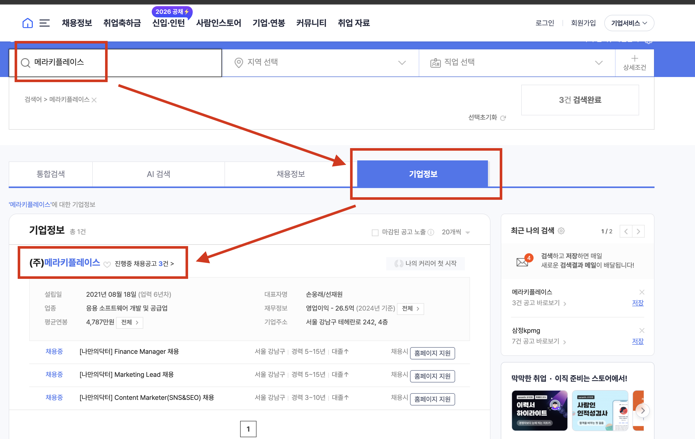
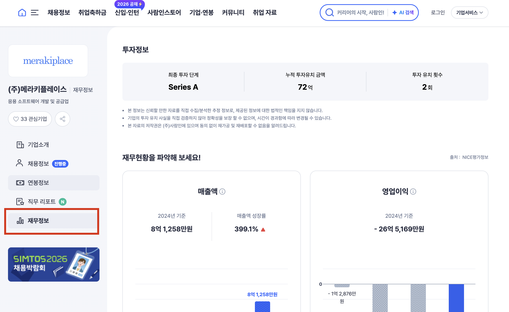
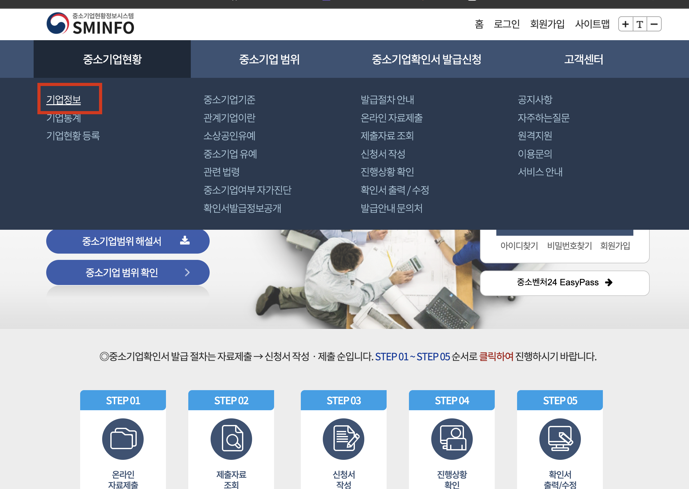
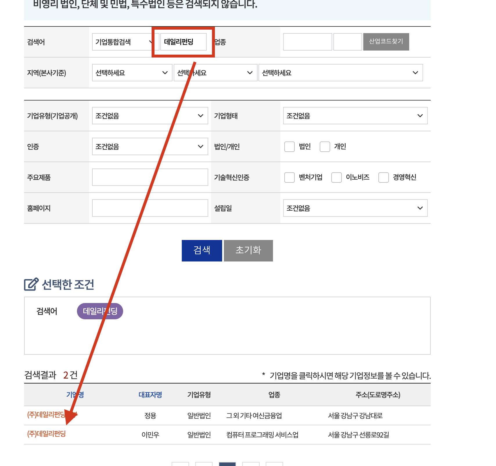

# 3주차: 공개 데이터로 프로덕트 읽기 — "밖에서 성공/실패를 추론하기"

## 이번 주 질문

> **"2주차에서 발견한 페인포인트는 나만의 문제인가, 모두의 문제인가?"**

2주차에서 User Journey Map을 그리면서 불편한 점을 발견했죠? 이번 주는 그 페인포인트가 **나만 느끼는 건지, 다른 사용자들도 겪고 있는 건지**를 공개 데이터로 검증하는 시간입니다.

정답을 맞추는 게 아니라, **"근거를 가지고 추론하는 근육"** 을 키우는 게 이번 주의 핵심이에요.

---

## 분석 방식 선택

아래 중 본인 상황에 맞는 방식을 선택하세요:

### A. 외부 서비스 분석

- 앱스토어 리뷰, 기술 블로그, 채용 공고 등 **공개 데이터** 활용
- 대부분의 참여자는 이 방식

### B. 본인 회사 / 사이드 프로젝트 분석

- 내부 데이터 활용 가능 (공유 가능한 범위에서)
- 구체적인 수치 대신 "전환율이 N% 수준", "이탈률이 높은 편" 등 추상화된 표현도 OK
- 회사 보안 정책상 공유 어려운 부분은 생략해도 괜찮습니다
- 대신 **"어떤 지표를 보고 있는지", "왜 그 지표를 선택했는지"** 에 집중해주세요
- 자사 서비스 분석 시, 이미 내부 사정을 아는 상태에서 **의식적으로 외부인 시점을 유지**하는 것이 중요합니다. 이게 어색할 수 있지만, 경쟁사를 분석하거나 투자 검토를 할 때 — 우리는 늘 공개 데이터만으로 추론해야 하니까요.

> **B 방식 참여자 주의점**: 내부 데이터에서 이미 알고 있는 문제와, 2주차 Journey Map에서 순수하게 사용자 관점으로 발견한 문제를 구분하세요. 이번 과제에서는 **후자만** 가져옵니다. 내부에서 알고 있는 것은 Step 4에서 대조용으로 씁니다.
>
> **반드시 공개 데이터 분석을 먼저 완료한 뒤에 내부 데이터와 대조하세요.** 순서가 바뀌면 추론 연습이 아니라 확인 작업이 됩니다. "외부인 시점으로 추론 → 내부 데이터로 검증 → 갭 분석"의 순서를 지켜야 이 과제에서 가장 실전적인 학습이 됩니다.

---

## AARRR, B2B/내부 도구에서는 어떻게 볼까?

2주차에서 AARRR 프레임워크를 사용했는데, B2B 서비스나 내부 도구를 분석하는 분들은 끼워맞추기 어려운 부분이 있었을 거예요. AARRR 자체가 B2C 중심 프레임워크이기 때문입니다. 아래처럼 **재해석**하면 B2B/내부 도구에서도 쓸 수 있어요:


| AARRR 단계        | B2C 앱                   | B2B SaaS / 내부 도구            |
| --------------- | ----------------------- | --------------------------- |
| **Acquisition** | 앱 다운로드, 가입              | 영업 파이프라인, 데모 요청, 클러스터 할당    |
| **Activation**  | 첫 핵심 기능 사용 (Aha Moment) | 첫 성공적 배포, 첫 보고서 생성, 첫 알람 수신 |
| **Retention**   | DAU/MAU, 재방문            | 팀 단위 지속 사용률, 월간 활성 프로젝트 수   |
| **Revenue**     | 결제, 구독                  | 계약 갱신율(NRR), 절감된 엔지니어링 시간   |
| **Referral**    | 친구 초대, 공유               | 사내 다른 팀 도입, 고객사 추천          |


핵심은 **"이 프레임워크의 각 단계가 내 서비스 맥락에서 무엇을 의미하는가?"** 를 스스로 정의하는 거예요. 억지로 끼워맞추기보다, 맞지 않는 단계는 과감히 건너뛰거나 재정의하세요.

---

## 이번 주 할 일 (Step by Step)

### Step 1. 2주차 페인포인트 복기

2주차에 작성한 User Journey Map에서 발견한 페인포인트를 다시 꺼내되, **1~2개만 선택**하세요.

이번 주는 넓게 조사하는 주가 아니라, **핵심 문제를 근거로 깊게 검증하는 주**입니다. 너무 많이 잡으면 하나도 제대로 검증하지 못해요.

**좋은 페인포인트의 기준:**
- 기능 하나에 충분히 연결되어 있다
- 다른 사람도 겪을 가능성이 있다
- 공개 데이터나 간접 신호로 검증 가능하다
- 회사가 실제로 중요하게 볼 법한 문제다

> **예시 (리멤버):**
>
> 1. 명함 앱 → 커리어 플랫폼 전환이 부자연스럽다
> 2. 채용 제안 품질이 들쭉날쭉하다
> 3. 리멤버 나우(콘텐츠)의 정체성이 모호하다

> **예시 (B2B HR SaaS):**
>
> 1. 후보자 매칭 결과의 품질이 불안정하다
> 2. 컨설턴트가 수작업으로 보정하는 비율이 높다
> 3. 고객사가 대시보드를 잘 안 본다

---

### Step 2. 공개 데이터에서 검증 (가장 중요!)

**이게 이번 주 과제의 핵심이에요. 다른 건 못해도 이것만은 꼭 해주세요.**

#### 내 상황에 맞는 데이터 소스 찾기


| 내 상황               | 사용할 공개 데이터 소스                                                        |
| ------------------ | -------------------------------------------------------------------- |
| **앱 서비스 (B2C)**    | App Store / Play Store 리뷰                                            |
| **웹 서비스 / SaaS**   | G2, Capterra, TrustRadius, ProductHunt, Reddit, Hacker News          |
| **B2B 서비스**        | G2/Capterra (B2B 리뷰 많음), 고객사 피드백 (추상화), LinkedIn, 업계 포럼              |
| **내부 도구 / DevOps** | 같은 문제를 푸는 외부 도구의 GitHub Issues, Stack Overflow, Reddit → **"대리 검증"** |
| **기획 중인 서비스**      | 진입하려는 시장의 기존 플레이어 리뷰 → 경쟁/유사 서비스 선정해서 분석                             |


#### 어떻게 하나요?

1. 위 표에서 본인에 맞는 공개 데이터 소스를 선택
2. **부정적 피드백에 집중** 해서 **최소 30개** 를 읽어보세요
3. 읽으면서 아래를 체크:


| 체크 항목                                               | 메모  |
| --------------------------------------------------- | --- |
| 내가 발견한 페인포인트를 다른 사용자도 언급하고 있는가?                     |     |
| 내가 발견하지 못한 새로운 페인포인트가 있는가?                          |     |
| 가장 많이 반복되는 불만 키워드는?                                 |     |
| 최근 피드백(1-3개월) vs 과거 피드백(6개월-1년 전)에서 불만 내용이 바뀌었는가? |     |


#### 피드백 분석 꿀팁

- **별점 5점 / 긍정 리뷰는 건너뛰세요.** "좋아요~" 수준이라 인사이트가 없어요
- **별점 2~3점 / 중간 점수가 가장 유용해요.** 서비스를 쓰고는 있지만 불만이 있는 유저의 목소리
- **별점 1점 / 최하점은 가려서 보세요.** 감정적 불만 vs 구체적 문제를 구분해야 해요
- 리뷰를 읽을 때 **"이 사람은 AARRR의 어느 단계에서 이탈하고 있는가?"** 를 생각하면 분석이 깊어져요
- **B2B라면 "관리자 vs 실무자"** 관점 차이에 주목하세요

#### "대리 검증" — 직접적인 리뷰가 없는 경우

내부 도구나 기획 중인 서비스처럼 직접적인 리뷰가 없다면, **같은 문제를 풀고 있는 외부 도구의 공개 데이터** 를 분석하세요.

> **예시 (사내 배포 시스템):**
>
> - 내 페인포인트: "배포 롤백이 너무 느리고 수동 작업이 많다"
> - 대리 검증 대상: ArgoCD GitHub Issues
> - → "rollback" 키워드로 검색하면 유사한 불만 다수 발견
> - → 이 문제는 우리만의 문제가 아님을 확인

> **예시 (기획 중인 식단 관리 앱):**
>
> - 내 페인포인트: "기존 식단 앱은 한국 음식 DB가 부족하다"
> - 대리 검증 대상: 미핏, 팻시크릿 앱스토어 리뷰
> - → "한국 음식", "한식" 관련 불만 리뷰 다수 발견
> - → 실제 사용자들도 이 페인포인트를 겪고 있음을 확인

#### 예시: 리멤버 앱스토어 리뷰 분석

> **내 페인포인트**: "명함 앱인데 왜 커리어 프로필을 채우라고 하지?"
>
> **리뷰에서 발견한 것들:**
>
> ⭐⭐ "명함 관리 앱이라 깔았는데 채용 알림이 계속 와서 짜증나요. 끄는 법도 모르겠고"
> → 내 페인포인트와 동일! 다른 사용자도 맥락 전환을 불편해하고 있음
>
> ⭐⭐⭐ "명함 인식은 좋은데, 앱이 점점 무거워지고 기능이 너무 많아졌어요"
> → 기능 과잉에 대한 불만. 정체성 혼란과 연결됨
>
> ⭐⭐ "헤드헌터 연락이 오는데 대부분 나랑 안 맞는 포지션이에요"
> → 채용 제안 품질 문제를 다른 사람도 겪고 있음!
>
> **결론**: 내가 발견한 페인포인트 3개 중 3개 모두 다른 사용자도 겪고 있다. 특히 "채용 알림 피로"와 "정체성 혼란"은 반복적으로 나타나는 핵심 불만.

---

### Step 3. 기업이 공개한 정보 찾기

앱스토어 리뷰가 **"사용자의 목소리"** 라면, 이 단계는 **"회사의 목소리"** 를 찾는 거예요.

전부 다 할 필요 없고, **찾을 수 있는 것만** 하면 됩니다.

자사 서비스의 경우, **외부인이 볼 수 있는 정보만** 사용하는 것이 포인트입니다. 내가 이 회사에 대해 아무것도 모른다는 가정 하에 읽어보세요.

#### 3-1. 기술 블로그

**찾는 법**: 구글에 `[서비스명] 기술 블로그` 또는 `[회사명] tech blog` 검색

**읽는 법**:

- "이 회사가 어떤 기술적 문제를 해결하려고 노력했는가?" → 그 기능이 회사에게 중요하다는 신호
- "어떤 지표를 공개했는가?" → 회사가 중요하게 보는 KPI가 뭔지 추론 가능

> **예시:**
> 당근 기술 블로그에서 "동네생활 피드 추천 알고리즘 개선기"라는 글을 발견
> → 추천 알고리즘에 엔지니어 리소스를 쓰고 있다는 것은, "피드 체류 시간"이나 "게시글 참여율" 같은 Engagement 지표를 중요하게 보고 있다는 의미


#### 3-2. 채용 공고

**찾는 법**: 해당 회사 채용 페이지, 원티드, 잡코리아 등에서 검색

**읽는 법**: 채용 공고는 "회사가 지금 어디에 투자하고 있는지"를 보여주는 신호예요.


| 채용 공고에서 보이는 것     | 추론할 수 있는 것            |
| ----------------- | --------------------- |
| "프로덕트 엔지니어" 채용    | 프로덕트 중심으로 조직을 전환하고 있다 |
| "데이터 엔지니어" 급하게 채용 | 데이터 인프라에 투자를 시작하고 있다  |
| "OO 도메인 PM" 채용    | 그 도메인으로 사업을 확장하려 한다   |
| "시니어만 채용"         | 빠르게 성과를 내야 하는 상황      |
| "대규모 채용 (10명+)"   | 해당 팀/기능이 회사의 핵심 성장 동력 |


> **예시:**
> 리멤버가 "AI 매칭 엔지니어"를 채용하고 있다면?
> → 채용 제안 품질(매칭 정확도)을 개선하려는 시도.
> → 내가 발견한 "제안 품질 문제"를 회사도 인식하고 있다는 근거

#### 3-3. 뉴스 / 투자 정보

**찾는 법**: 구글에 `[서비스명] 투자`, `[서비스명] 시리즈`, `[회사명] 인수` 검색


| 뉴스 내용              | 추론할 수 있는 것                          |
| ------------------ | ----------------------------------- |
| "시리즈 B 300억 투자 유치" | 성장 단계. PMF를 찾았고 스케일업 중              |
| "MAU 500만 돌파"      | 공식적으로 공개한 지표. 성장 추세 판단 가능           |
| "OO 기업 인수"         | 해당 기능/도메인을 직접 만들기보다 사서 빠르게 확보하려는 전략 |
| "구조조정 / 감원"        | 비용 절감 모드. 수익화가 안 되고 있을 수 있음         |


#### 3-4. 앱/서비스 업데이트 기록

**찾는 법**: 앱스토어에서 해당 앱 → "버전 기록" 또는 "새로운 기능" 탭. 웹 서비스라면 릴리즈 노트, 체인지로그 확인.

**읽는 법**:

- 최근 3~6개월 업데이트에서 어떤 기능을 추가/개선했는지 → **회사가 지금 집중하고 있는 곳**
- 같은 기능이 반복적으로 업데이트되면 → 아직 만족스러운 수준에 도달 못 했다는 신호
- 버그 수정만 계속되면 → 신규 기능보다 안정화에 집중하고 있다는 신호

> **예시:**
> 리멤버 최근 업데이트 기록:
>
> - v4.52: "프로필 추천 정확도 개선" → 매칭 품질 문제를 개선하고 있는 중!
> - v4.50: "커리어 프로필 작성 UX 개선" → 프로필 완성률을 올리려는 시도
> - v4.48: "리멤버 나우 피드 개인화" → 콘텐츠 Engagement를 올리려는 시도
>
> → 회사가 "프로필 완성률"과 "매칭 품질"에 집중하고 있다는 걸 업데이트 기록으로 확인 가능

#### 3-5. 재무정보 / 조직 규모 (선택 — 상장사 또는 공시 기업만 해당)

**찾는 법**: 

[DART 전자공시](https://dart.fss.or.kr/)

[사람인 기업정보](https://www.saramin.co.kr/zf_user/search/company?searchType=search&searchword=%EB%A9%94%EB%9D%BC%ED%82%A4%ED%94%8C%EB%A0%88%EC%9D%B4%EC%8A%A4&panel_type=&search_optional_item=y&search_done=y&panel_count=y&preview=y)
1. 해당 링크에서, 기업 검색 -> 기업 정보 탭 클릭 -> 기업 클릭

2. 왼쪽 메뉴에 재무정보 클릭


[혁신의숲 - 스타트업 정보](https://www.innoforest.co.kr/company/CP00010559/%EB%A9%94%EB%9D%BC%ED%82%A4%ED%94%8C%EB%A0%88%EC%9D%B4%EC%8A%A4)
회사 이메일로 가입 (개인 계정으론 가입 불가)

[중소기업현황정보시스탬](https://sminfo.mss.go.kr/)
회원가입 필요
1. 로그인 후 메뉴에서 기업 정보 클릭

2. 검색할 기업 입력 후 자세한 정보 보기


**읽는 법**:


| 재무/조직 데이터          | 추론할 수 있는 것                              |
| ------------------ | --------------------------------------- |
| 매출은 느는데 영업이익이 줄어든다 | 마케팅 비용을 태워 성장 중 (프로덕트 vs 마케팅 드리븐 성장 구분) |
| 매출 정체              | PMF를 아직 못 찾았거나, 시장 포화                   |
| 특정 사업부 인원 급증       | 그 영역에 베팅하고 있다는 확실한 신호                   |
| 전체 인원 대비 엔지니어 비율   | 테크 컴퍼니인지, 영업 중심인지 판단 가능                 |
| 퇴사율 급증 (크레딧잡)      | 조직 문제 또는 구조조정 전조                        |


> **예시:**
> 올리브영(CJ올리브영) IR 자료에서 온라인 매출 비중 추이를 보면, "오늘드림이 실제로 Revenue를 견인하고 있는가?"를 숫자로 검증할 수 있다.

> **참고**: 스타트업은 재무정보가 비공개인 경우가 많아요. 뉴스에 공개된 투자 라운드 정보 정도가 전부일 수 있고, 그것만으로도 충분합니다.
>
> 자세한 활용법은 [재무정보/고용 데이터 가이드](./refrences/data-sources-finance-hiring.md)를 참고하세요.

---

### **Step 4. 종합 판단 작성**

모든 조사를 마쳤으면, 아래 질문에 답하면서 정리하세요:

1. **내가 발견한 페인포인트를 다른 사용자도 겪고 있는가?** (공개 데이터 근거)
2. **회사도 이 문제를 인식하고 있는가?** (채용, 업데이트, 블로그 근거)
3. **종합적으로 이 기능은 성공인가, 실패인가, 개선 중인가?**
4. **(자사 서비스인 경우)** 공개 데이터로 추론한 결과와, 내가 내부에서 알고 있는 현실 사이에 **갭** 이 있는가?
5. (선택) 내가 PM이라면 다음에 뭘 할 것인가?

#### 4번이 자사 서비스 분석의 핵심 보너스입니다

외부 데이터의 추론과 내부 현실 사이의 갭을 발견하는 것 자체가 강력한 인사이트예요.

- 외부에서는 문제로 보이는데 내부에서는 우선순위가 낮다면 → **왜?**
- 내부에서는 큰 문제인데 외부에서는 안 보인다면 → **왜?**
- 외부 추론과 내부 현실이 일치한다면 → 공개 데이터 기반 추론이 잘 작동한다는 **검증**

이 갭의 원인까지 생각해보면, 좋은 PRD 작성하는 데 큰 인사이트가 될 것 입니다!

#### 좋은 주장의 형태

결론은 반드시 "성공" 아니면 "실패" 둘 중 하나일 필요가 없습니다. 오히려 아래와 같은 결론이 더 현실적이고 좋은 분석이에요:

- 이 기능은 **문제를 제대로 풀고 있지만**, 특정 구간에서 마찰이 크다
- 이 기능은 **사용자에게는 가치가 있지만**, 회사가 원하는 방향으로는 덜 작동하는 것 같다
- 이 기능은 **분명한 니즈를 잡았지만**, 확장 과정에서 정체성 혼란이 생겼다
- 반대로, 내가 불편하다고 느낀 지점은 생각보다 대중적인 문제는 아닐 수도 있다

> **부분적 성공, 국소적 실패, 방향은 맞지만 실행이 부족함** — 이런 결론도 충분히 좋은 결론입니다.

#### 근거와 추론을 구분해서 쓰기

문서에서 이 구분이 분명하면 분석 품질이 확 올라갑니다.

> **예시:**
> - **근거**: 최근 3개월 앱스토어 리뷰에서 "알림이 너무 많다"는 불만이 반복된다
> - **근거**: 최근 업데이트 기록에서 알림 설정 UX 개선이 2차례 있었다
> - **추론**: 회사도 알림 피로 문제를 인지하고 있을 가능성이 높다
> - **한계**: 다만 이 기능이 실제 리텐션에 어떤 영향을 주는지는 외부 데이터만으로는 확정할 수 없다

이렇게 `근거`, `추론`, `한계`를 분리해서 쓰면, "리뷰 몇 개 읽어보니 안 좋은 것 같다" 수준을 넘어서는 분석이 됩니다.

---

## 증거의 강도는 다릅니다

"찾은 정보가 있느냐"보다 **"그 정보가 얼마나 강한 근거냐"**를 판단하는 감각도 중요합니다.

**상대적으로 강한 근거:**
- 반복적으로 등장하는 사용자 불만
- 최근 여러 버전에서 반복적으로 수정된 기능
- 공식 문서나 기술 블로그에서 직접 언급한 방향
- 채용 공고에서 선명하게 드러나는 투자 영역

**상대적으로 약한 근거:**
- 리뷰 1~2개만 보고 내린 결론
- 한 기사만 보고 내린 큰 추론
- 회사 전체 재무 수치만 보고 특정 기능 성패를 단정
- 내부 맥락을 다 아는 상태에서 외부 분석인 척 쓰는 문서

---

## 이번 주에 특히 피하고 싶은 것

- "리뷰 몇 개 읽어보니 안 좋은 것 같다" 수준에서 끝내기
- AARRR을 억지로 다 채우기
- 자사 제품 분석인데 내부 정보를 그대로 서술하기
- 외부 제품 분석인데 회사 입장을 너무 쉽게 단정하기
- 결론 없이 자료만 나열하기

---

## 검증 결과가 안 나올 때

혹시나 !!
리뷰에서 내 페인포인트와 겹치는 걸 못 찾았다고 당황하지 마세요. **"겹치는 게 없다"는 것 자체가 유의미한 결론** 입니다.


| 검증 결과                 | 어떻게 해석할까                                            |
| --------------------- | --------------------------------------------------- |
| 내 페인포인트 = 다른 사용자도 언급  | 공통된 문제. 해결하면 임팩트가 클 가능성 높음                          |
| 내 페인포인트 ≠ 다른 사용자 의견   | 나만의 문제이거나 아직 표면화되지 않은 문제. "왜 다른 사람은 안 느끼는가?"를 생각해보기 |
| 공개 데이터에서 새로운 페인포인트 발견 | 내가 놓친 관점. 2주차 Journey Map을 보완할 기회                   |
| 공개 데이터 자체가 부족         | "데이터가 없다"는 것도 인사이트. 시장이 작거나 피드백 채널이 없는 구조일 수 있음     |


---

## 산출물 템플릿

`week-3/{username}.md` 파일에 아래 형식으로 작성해주세요:

```md
# 3주차: 공개 데이터로 프로덕트 읽기

## 분석 대상
- **서비스**: (예: 리멤버)
- **분석한 기능**: (예: 명함 관리 → 커리어 플랫폼 전환)
- **서비스 유형**: (예: B2C 앱 / B2B SaaS / 내부 도구 / 기획 중)

## 2주차에서 발견한 페인포인트
1. (예: 명함 앱 → 커리어 플랫폼 전환이 부자연스럽다)
2. (예: 채용 제안 품질이 들쭉날쭉하다)
3. (예: 리멤버 나우 콘텐츠의 정체성이 모호하다)

---

## 공개 데이터 분석

- **사용한 소스**: (예: App Store 리뷰 / G2 / GitHub Issues 등)
- **소스 선정 이유**: (예: B2C 앱이므로 앱스토어 리뷰가 가장 적합)
- **분석한 피드백 수**: __개 (최소 30개)

### 내 페인포인트와 겹치는 피드백

**페인포인트 1: ________**
> "(피드백 원문 인용)"
> → (이 피드백이 내 페인포인트와 어떻게 연결되는지 한 줄 해석)

**페인포인트 2: ________**
> "(피드백 원문 인용)"
> → (해석)

### 추가로 발견한 페인포인트
- (공개 데이터에서 새로 발견한 불만이 있다면)

### 피드백 트렌드
- 최근 vs 과거 비교: (개선된 점이 있는지, 여전한 불만이 있는지)

---

## 기업 공개 정보 (찾은 것만 작성)

### 기술 블로그
- (찾은 글 제목 + 링크 + 한 줄 인사이트)
- (예: "프로필 추천 알고리즘 개선기" → 매칭 품질에 엔지니어 리소스를 투자하고 있음)

### 채용 공고
- (어떤 포지션을 채용하고 있는지 + 추론)
- (예: "AI 매칭 엔지니어 채용 중" → 제안 품질 개선에 투자하고 있다는 신호)

### 뉴스/투자
- (관련 뉴스가 있다면 + 추론)

### 앱 업데이트 기록
- (최근 업데이트 내용 + 추론)

### 재무정보 / 조직 규모 (해당시)
- (상장사의 경우 매출 추이, 조직 변화 등 + 추론)

---

## 종합 판단

> 이 기능은 **[성공 / 실패 / 부분적 성공 / 개선 중]**이다.
>
> **근거:**
> 1. (공개 데이터 근거)
> 2. (기업 공개 정보 근거)
> 3. (종합적 판단)
>
> **한계:**
> - (공개 데이터만으로는 확정할 수 없었던 부분)

## 외부 추론 vs 내부 현실 (자사 서비스인 경우)

> 공개 데이터만으로 추론한 결과와 내부에서 알고 있는 현실의 갭:
> - (일치하는 부분)
> - (불일치하는 부분과 그 이유)

## (선택) 내가 PM이라면 다음에 뭘 할 것인가?

> (4주차 PRD의 씨앗이 됩니다. 가볍게 한 줄이라도 적어두세요)

## 참고 자료 감상평

[references.md](../week-3/references.md)에서 최소 2개의 글을 읽고, 각각 2문장 이상의 감상평을 적어주세요.

**글 1: (제목 + 링크)**
> (감상평 2문장 이상 — 이 글에서 어떤 인사이트를 얻었는지, 본인의 분석에 어떻게 적용할 수 있을지)

**글 2: (제목 + 링크)**
> (감상평 2문장 이상)
```

---

## 이번 주 과제 요약


| 항목      | 내용                                                  |
| ------- | --------------------------------------------------- |
| **필수**  | 공개 데이터에서 피드백 최소 30개 읽고 분석 (소스는 서비스 유형에 맞게 선택)       |
| **권장**  | 기술 블로그, 채용 공고, 뉴스, 업데이트 기록 중 1~2개 추가 조사             |
| **선택**  | 재무정보/조직 규모 분석 (상장사 해당), 자사 서비스의 외부 추론 vs 내부 현실 갭 분석 |
| **산출물** | `week-3/{username}.md` PR 제출                        |
| **리뷰**  | 서로의 PR에 1인 1코멘트                                     |


---

## 참고 자료

- [3주차 참고 자료 모음](./refrences/references.md) — 리뷰 분석 방법론, VOC 체계, 데이터 기반 의사결정, 프로덕트 지표 프레임워크 등

