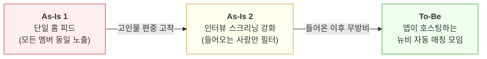
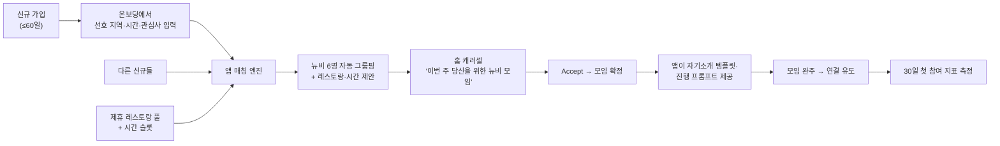
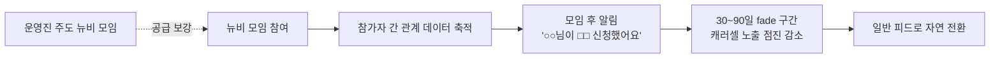

# 동행 신규 멤버 "뉴비환영 트랙" PRD

> 작성일: 2026-04-14 · 상태: Draft · 외부 서비스(동행) 분석 기반
>
> **한 줄 요약**: 인터뷰로 걸러 들인 신규의 73.7%가 떠났다. `#뉴비환영` 태그 하나로 첫 모임을 또래끼리 깔아준다.

**관련 문서:**
- [3주차 공개 데이터 분석 — 동행](../week-3/kimjisub.md)

---

## 0. 동행(同行)은 어떤 서비스인가

**한마디로**: 10분 화상 인터뷰를 통과한 사람들끼리 서울 핫플 레스토랑에서 함께 저녁을 먹는 소셜 다이닝 커뮤니티.

**핵심 차별점**: "검증된 사람만". 운영사 세븐픽쳐스는 건전한 목적·매너·커뮤니티 적합성 3가지 기준으로 스크리닝한다. 이 무거운 진입 장벽이 프리미엄 브랜드를 만든다.

**수익 모델**: 3개월 15만원 선결제. 소모임(월 2,900원)·문토(모임당 3~4만원)보다 훨씬 무겁다. 그런데 **중도 환불이 된다.** 마음에 안 들면 남은 기간만큼 돌려받는다. 브랜드는 "무거운 진입 장벽"이지만 Revenue는 첫 경험에 극도로 민감하다.

**규모**:
- 누적 유료 구매 3,795명, 2025 연매출 6억, 내부 만족도 4.68/5.0
- 매출 6억 ÷ 연 ARPU 60만 = **현재 결제 유지는 약 1,000명**
- 나머지 2,795명은 이미 해지

**타겟**: 외롭지만 혼자서는 아무것도 안 하는 직장인. 소개팅은 72.9%가 안 한다. 1인 가구는 804만. 진짜 경쟁자는 소모임·문토가 아니라 "약속 안 잡는 것".

**본 PRD가 다루는 것**: 인터뷰로 걸렀는데도 **들어온 사람의 73.7%가 떠나는 구조적 누수**.

---

## 1. 문제 정의

### 발견된 문제

**동행은 10분 인터뷰로 사람을 걸러 들였다. 그런데 들어온 사람의 73.7%가 떠났다.**

누적 유료 3,795명. 지금 남은 건 1,000명. 나머지 2,795명은 첫 모임 몇 번 가보고 사라졌다.

**편중의 규모** (3주차 분석):
- 월평균 참여 **2.52회**. 1인 최다 누적 **132회**. 한 사람이 전체 4,222회의 **3.1%를 혼자 차지**한다.
- 앱스토어 평점 분포가 극단적이다. 5점 71개 / **4점은 0개** / 1점 16개. "좋거나 나쁘거나" 중간이 없다.
- 내부 만족도는 4.68인데 앱스토어는 4.2~4.4. 남은 사람은 만족하고, 떠난 사람은 조용히 1점을 남긴다.

**신규가 실제로 하는 말** (리뷰 인용):

> "정기모임이 너무 많고 같은 사람들끼리만 돌아가요"
> "기존 멤버들이 이미 친해 보여서 끼기 어렵다"
> "뉴비 모임 같은 게 있으면 좋겠다"

신규 본인이 "뉴비 모임"이 필요하다고 말한다. 이 PRD는 그 말을 그대로 구현한다.

**영향받는 사용자 규모 (다중 출처 삼각측량)**:

### 퍼널: 단계별 이탈률

| # | 단계 | 규모 | **이탈률** |
|---|------|----:|---------:|
| 1 | 인터뷰 신청 (12개월) | 17,000 | — |
| 2 | 유료 전환 (누적) | 3,795 | **77.7%** |
| 3 | 현재 결제 유지 | **~1,000** | **73.7% = 이미 해지** |
| 4 | 월 실제 참여자 | ~559~1,117 | 결제 유지와 격차 = "잠자는 유료자" 수백명 |

**핵심**: 단계 2→3 — 누적 유료 3,795명 중 **2,795명(73.7%)이 이미 해지**. 이게 본 PRD가 방어하는 실제 누수다.

<b>📐 수치 근거 · 두 역산 방법 · 감도 분석 (펼쳐보기)</b>

**출처 / 역산 방법**:
- 단계 1 (17,000): 채용 페이지 공시
- 단계 2 (3,795): 채용 페이지 공시. 단 분자-분모 기간 이질(누적 vs 12개월)로 엄밀한 코호트 전환율은 아님
- **단계 3 (~1,000)**: 매출 역산 — 2025 매출 6억 ÷ 연 ARPU 60만(월 5만 × 12) = 약 1,000명이 현재 결제 유지
- **단계 4 (559~1,117)**: 모임 역산 — 월 모임 352회(=4,222÷12) × 모임당 N명 ÷ 1인 월 2.52회

**두 역산은 서로 다른 것을 측정한다**:
- 매출 역산 = "이번 달 **돈 내고 있는** 사람" (단계 3)
- 모임 역산 = "이번 달 **실제 모임 간** 사람" (단계 4)
- 두 수치의 **차이** = 결제 유지 중이지만 월 미참여 = "진짜 잠자는 유료자"

**모임 역산 N 감도**:

| N (모임당 참가자) | 월 실제 참여자 | 결제 유지 1,000과의 차이 (잠자는 유료자) |
|-----------------:|-------------:|------------------------------------:|
| 4명 | ~559 | ~441명 결제 유지 중 비활성 |
| 5명 | ~698 | ~302명 |
| 6명 | ~838 | ~162명 |
| **7명 (매출-모임 수렴)** | **~978** | **~22명 (사실상 일치)** |
| 8명 | ~1,117 | (불일치 — 매출 상한 위배) |

**주의**:
- 4,222회 집계 기간이 "최근 12개월" 가정. 누적 3~4년이면 월 모임은 ~100회로 떨어져 모임 역산과 매출 역산이 불일치 → 오히려 "4,222 = 12개월"이 간접 지지됨.
- 2.52회/월이 "참여자 기준"인지 "전체 유료자 기준"인지 불명 (Open Questions #7, #8).
- 소셜 다이닝 테이블 기준 4~8인이 일반적이고, 매출-모임 교차검증에서 N≈7이 수렴하므로 중앙 추정.

### 타겟은 누구인가

3,795명이라고 다 같은 사람이 아니다. **세 그룹**으로 쪼개야 한다.

| 세그먼트 | 규모 | PRD 대상? |
|---------|----:|:---:|
| **해지 위험군 신규** — 가입 후 30일 내 첫 모임 실패 | 연 1,900~2,700명 | ✅ 핵심 |
| **앞으로 유입될 신규** | 연 3,800명 | ✅ 예방 |
| **이미 해지한 과거 유료자** | 2,795명 | ❌ 손 안 닿음 |

**이 PRD는 1번만 공략한다.** 2,795명은 이미 떠났고, 다른 전략이 필요하다.

### 그래서 이게 왜 큰일인가

**1) 인터뷰가 돈 먹는 기계가 된다**

신규 1명마다 파트타임 인터뷰어의 10분을 쓴다. 그런데 그 10명 중 7~8명이 첫 모임도 못 가보고 사라진다. 인터뷰 비용은 전원에게 나가고, 매출은 소수에게서만 회수된다.

**2) 돈이 즉시 새어나간다**

선결제지만 **중도 환불이 가능**하다. 첫 경험이 나쁘면 며칠 안에 15만원이 그대로 빠져나간다. 매출은 "받은 시점"이 아니라 "3개월 버틴 시점"에 확정된다.

- **단기**: 나쁜 첫 경험 → 중도 환불 → 매출 즉시 반환
- **중기**: 환불 안 해도 3개월 후 갱신 거절
- **장기**: 갱신율이 낮아 신규 유입을 계속 펌프질 → 인터뷰 비용 ×N 증가 → CAC/LTV 악화
- 성장 투자(채용 7개 오픈) 타이밍에 bottom이 새면 ROI 근거 자체가 흔들린다

**→ 결국 "들어온 이후 첫 경험"이 Revenue 방어선이다.**

**3) 나쁜 입소문이 쌓인다**

"인터뷰까지 봤는데 끼기 어려웠다"는 일반 앱의 "별로였다"보다 훨씬 강한 실망이다. 앱스토어 1점, 블라인드, 트위터에 누적된다. 프리미엄 브랜드가 **"인터뷰만 깐깐하지 들어가면 소용없는 곳"**으로 뒤집힌다.

**4) 코어 유저도 결국 지친다**

누적 132회 참여하는 코어는 지금 커뮤니티가 살아있어 보이게 만든다. 하지만 같은 사람끼리의 반복은 피로하다. 신규가 안 들어오면 코어는 "다 아는 사람만 있는 서비스"에 지쳐 떠난다. **지금의 코어 집중은 미래의 코어 이탈을 예약하는 행위다.**

### 왜 이 문제가 생기는가?

| 원인 | 설명 |
|------|------|
| **맥락 비대칭 구조** | 정기모임 참여자끼리는 "지난주", "저번에", "○○ 누님이"라는 내부 맥락이 쌓여있지만, 신규는 이 맥락에 접근할 수 없다. 결과적으로 같은 모임 안에서 신규만 대화의 외곽에 놓인다. |
| **피드의 단일성** | 홈 피드는 "인기 순/최신 순" 등 단일 기준으로 노출된다. 기존 코어가 반복 신청하는 정기모임이 상단을 차지하므로 신규에게도 같은 피드가 보이지만, 의미는 전혀 다르다. |
| **인터뷰 이후 설계 공백** | 인터뷰 통과까지의 경험은 촘촘하게 설계되어 있지만, "통과 후 첫 모임 신청"을 지원하는 장치는 없다. 신규는 홀로 피드를 탐색해야 한다. |
| **신뢰 장치의 스케일 한계** | 동행은 사전 인터뷰라는 가장 무거운 신뢰 장치를 택했다. 이 무게는 들어오기 전에는 강력한 보증이지만, 들어온 이후에는 더 이상 일하지 않는다. |

### 실제로 어디서 발생하는가?

| 구간 | 추정 규모 | 주요 신호 | 현재 지원 |
|------|----------|---------|---------|
| **가입 직후 ~ 첫 신청 전** | 유료 전환자 중 상당수 | "뭘 신청해야 할지 모르겠다" | 없음 |
| **첫 모임 참여 중** | 정기모임 신청한 신규 전체 | "내부 맥락에 끼지 못함" | 없음 |
| **첫 모임 직후** | 첫 모임 경험자 중 다수 | "다음에 또 오라는 말을 들었지만 불확실" | 없음 |
| **30~90일 방치 구간** | "죽은 유저" 세그먼트 | 로그인만 있고 신청 없음 | 일반 푸시 알림만 |

### 결론

**신규의 첫 경험을 따로 설계해야 한다.** 단, 기존 코어는 건드리지 말고, 인터뷰 브랜드도 깎지 말고, 가설 검증까지 2주 안에 도달해야 한다.

이 장치가 작동하면:
- 신규는 또래와 첫 모임을 완주한다
- 코어 피드는 그대로 유지된다
- 플랫폼은 "어떤 신규가 어떤 모임에서 붙는가" 데이터를 쌓는다
- 그 위에 V1(운영진 주도)과 V2(자동 매칭)을 얹는다

### 자기 검열 — 인과가 거꾸로면?

본문은 "**고인물 편중 → 신규 이탈**"을 전제한다. 반대 가능성도 열어둬야 한다.

- **역인과**: 신규가 먼저 떠나서 코어만 남은 것일 수 있다. 그럼 편중을 풀어도 이탈은 안 줄어든다.
- **제3변수**: 가격 5만원 ARPU가 진짜 원인이고, 편중과 이탈은 같이 가는 결과일 수 있다.

**그래도 본 PRD는 유효하다.** "또래 진입 경로 부재"는 인과 방향과 무관하게 신규 관점에서 실제 페인이다. 뉴비 모임은 "코어에 편입하고 싶었는데 못 낀 신규"도, "혼자 낯선 자리가 부담스러운 신규"도 똑같이 구한다. 어떤 가설이 맞는지는 Release 1의 지니계수 변화로 판정한다 (Open Q #11).

---

## 2. 개선 목표

> **최종 목표**: 인터뷰를 통과한 신규 멤버가 30일 이내에 동등한 또래와 함께 첫 모임을 완주하고, 두 번째 모임을 자발적으로 신청하는 상태를 만든다.

### Before → After

| 구간 | Before (현재) | After (목표) |
|------|-------------|-------------|
| 가입 직후 홈 화면 | 모든 모임이 동일 기준으로 노출 | 신규 전용 "뉴비환영 캐러셀" 우선 노출 |
| 첫 모임 신청 | 정기모임에 뛰어들어 내부 맥락에 끼어야 함 | `#뉴비환영` 모임에서 또래와 자기소개 대화 |
| 첫 모임 중 경험 | "구경꾼" 포지션, 대화 외곽 | "참여자" 포지션, 자기 이야기 공유 |
| 첫 모임 후 | 재신청 유인 없음 | 30~90일 fade 구간 동안 점진적으로 일반 피드로 확장 |
| 90일 이후 | 방치 또는 이탈 | 뉴비 동기 3-4명과 함께 일반 모임 탐색 (캐러셀 완전 사라짐) |

### 사용자 시나리오 (박지훈 페르소나)

위 Before/After 표의 변화가 실제 한 사용자의 3개월에 어떻게 나타나는지를 페르소나 박지훈(28세, 서비스 기획자)으로 구체화했다.

<b>👤 Before 시나리오 — 박지훈의 이탈 (펼쳐보기)</b>

박지훈은 10분 화상 인터뷰까지 통과해 동행에 들어왔다. 가입 당일 앱을 열자 정기모임 20여 개가 떠 있다. "을지로 와인바 – 매주 목요일 정기"를 신청한다.

당일 저녁, 5명이 이미 도착해 있다. "지난주 그 레스토랑 진짜 별로였죠"로 시작하는 대화가 이미 굴러가고 있다. 박지훈은 90분 동안 웃고 끄덕이지만 자기 이야기를 꺼낼 틈을 찾지 못한다. 마지막에 "다음에 또 봬요" 인사를 듣지만, 그 "다음"에 자기가 포함된다는 감각은 없다.

3주 뒤 비슷한 시도를 한 번 더 한다. 같은 패턴이다. 이후 앱을 열어도 "신청할 모임이 없는 것처럼" 느껴진다. 앱 알림은 켜뒀지만 열지 않는다.

1개월째, 친구에게 "나 그 인터뷰까지 본 앱 결국 15만원짜리 방치 중"이라고 토로한다. 앱은 더 이상 열지 않는다.

6주차, 문득 멤버십에 15만원 낸 게 생각나 설정 메뉴를 뒤진다. **중도 환불 페이지**를 발견한다. 남은 기간만큼 환불받고 앱을 삭제한다. 앱스토어에 리뷰는 남기지 않는다. 조용히 사라진다. **동행 입장에서는 무엇이 문제였는지도 모른 채 이미 인식했던 매출의 절반 이상을 반환하고, 신규 1명 획득에 들어간 인터뷰 비용만 순손실로 남는다.**

<b>👤 After 시나리오 — 같은 상황, 개선 후 (펼쳐보기)</b>

박지훈이 가입하자 홈 화면 상단에 "이번 주 뉴비환영 모임" 캐러셀이 일반 피드 위로 뜬다. 태그 설명이 붙어있다: "**새로 인터뷰 통과하신 분들과 함께하는 모임**".

"성수 이자카야 – 뉴비환영"을 신청한다. 참여자 6명 중 4명이 가입 3주차 이내. 자기소개가 자연스러운 주제다. "어떻게 동행 알게 되셨어요?", "처음이라 떨리셨어요?" 같은 대화가 흐른다.

모임이 끝날 때 앱 알림이 온다: "함께 참여한 김○○님이 다음 주 □□ 모임을 신청했어요." 박지훈은 신청한다.

60일이 지나면서 뉴비 캐러셀 노출이 점진적으로 줄어든다(30일 100% → 60일 50% → 90일 0%). 이 시점에는 이미 알고 지내는 동행 멤버가 3~4명 생겨있다. 일반 피드의 모임을 신청해도 "혼자 들어가는" 느낌이 아니다.

90일째, 박지훈은 월 2회 꾸준히 참여하고 있다. 갱신 알림이 오자 고민 없이 결제한다.

### 성공 지표 (HEART Framework)

**Release 1 지표:**

| HEART | 지표 | 측정 방법 | 현재 | 목표 |
|-------|------|---------|-----|------|
| **Task Success** (North Star) | 신규 30일 첫 모임 참여율 | `COUNT(first_meeting_within_30d) / COUNT(new_signups)` | 미측정 (MVP 전 baseline 확보 필수) | baseline 대비 **+15%p** |
| Happiness | `#뉴비환영` 태그 모임 노쇼율 | 태그 모임의 noshow 비율 | N/A (신규 지표) | **< 10%** |
| Engagement | 참여 분포 지니계수 | 월별 유저당 참여 횟수의 Gini coefficient | 미측정 | V1 누적 관점 **-0.10** |
| Retention | 뉴비 트랙 졸업자 vs 비졸업자 90일 리텐션 격차 | 졸업자(60일차까지 `#뉴비환영` 모임 1회 이상 참여) 90일 리텐션 − 비졸업자(동 기간 뉴비 모임 0회) 90일 리텐션 | 미측정 | V1 이후 **격차 +10%p** |
| Revenue (선행) | 뉴비 트랙 참여자 vs 미참여자 30일 중도 환불률 격차 | 가입 30일차까지 `#뉴비환영` 모임 1회+ 참여자 그룹의 환불률 − 미참여자 그룹의 환불률 | 미측정 | MVP 관측 창 **격차 -5%p 이상** |

**핵심 지표: Task Success — 30일 첫 참여율 +15%p**

이 지표가 MVP의 North Star인 이유:
- MVP 기간(6주) 안에 실제 관측 가능
- "신규가 첫 발을 떼는가"라는 가장 직접적 신호
- 뉴비환영 피드의 효과와 인과관계 추적 용이

**주의 — baseline 공백**: 현재 수치는 추정치조차 없다. MVP 설계 진입 전에 내부 데이터로 baseline 확보가 선행 조건이다.

---

## 3. 솔루션 접근법

### 시스템 변천

**As-Is 1: 단일 홈 피드** — 모두에게 같은 피드. 코어 정기모임이 상단을 차지하고, 신규도 같은 걸 본다. 의미가 다르다.

**As-Is 2: 인터뷰 스크리닝 강화** — 지금 동행의 전략. 들어오는 사람 품질은 올렸다. 들어온 이후는 무방비.

**To-Be: 앱이 호스팅하는 뉴비 자동 매칭 모임** — 인터뷰와 일반 피드 사이에 **앱이 직접 호스트 역할을 하는 신규 전용 모임**을 끼워넣는다. 가입 시점이 비슷한 신규들을 앱이 자동으로 그룹핑하고, 레스토랑·시간·진행 템플릿을 앱이 관리한다. **호스트 없음. 앱이 호스트**. 코어는 이 모임의 존재 자체를 모른다.

### 경쟁사는 어떻게 풀었나

<b>🔍 경쟁사 4사 상세 비교표 (펼쳐보기)</b>

| 서비스 | 신뢰 장치 | 규모 | 주요 문제 | 트레이드오프 |
|--------|----------|------|---------|------------|
| **소모임** | 없음 | 누적 500만+ 다운로드, DAU 12-14만 (4명 조직 운영) | 고인물, 성비 차별, 노쇼, 종교 포교 | 신뢰 비용 0 → 빠른 스케일, 품질 방치 |
| **문토** | 사후 매너점수 | 누적 회원 80만, 투자 72억 | 환불 분쟁, 스팸 DM, 성비 불균형 | 중간 무게 신뢰 → 중간 규모, 이해관계 충돌 |
| **동행** | 사전 인터뷰 | 유료 구매 3,795명 (9명 조직) | 인터뷰 마찰, 고인물, 가격 저항 | 가장 무거운 신뢰 → 작은 규모, 경험 편차 |
| (해외 참고) **Timeleft** | 성격 테스트 알고리즘 | 52개국 200+ 도시 | - | 가장 가벼운 신뢰 → 글로벌 스케일 |

**핵심**: 신뢰가 무거울수록 스케일이 작다. 소모임은 신뢰 비용 0으로 500만 다운로드, 문토는 사후 매너점수로 80만 회원, 동행은 사전 인터뷰로 3,795명. 동행은 이 스펙트럼의 **가장 무거운 끝**에 있고, 그래서 다른 경쟁사엔 없는 "들어온 이후 경험 편차" 문제가 생긴다. 본 PRD는 **이 무게를 유지하면서 경험 편차만 줄인다** — 신뢰 장치는 그대로, 그 뒤 구간을 메운다.

### ICE Score (대안 비교)

4가지 후보를 ICE(Impact × Confidence × Ease)로 비교한다.

| 후보 접근법 | 설명 | Impact | Confidence | Ease | ICE Score | 판단 |
|-----------|------|-------:|-----------:|-----:|----------:|------|
| **A. 앱 호스팅 뉴비 자동 매칭 모임** | 앱이 신규들을 자동 그룹핑·레스토랑 매칭·진행 가이드까지 직접 관리 | 9 | 6 | 5 | **270** | **채택** |
| B. 운영진 주도 뉴비 모임 | 운영진이 주 N회 신규 모임 직접 기획·진행 | 8 | 5 | 5 | 200 | V1 대안 후보 |
| C. 호스트 자발 태그 (`#뉴비환영`) | 기존 호스트가 체크박스로 뉴비 모임 선언 | 7 | 5 | 7 | 245 | 보류 |
| D. 참여 횟수 상한(쿨다운) | 코어 유저의 월 참여 횟수 제한 | 7 | 5 | 6 | 210 | 기각 |

<b>📊 각 점수 근거 (펼쳐보기)</b>

**Confidence 매길 때 적용한 원칙**: 각 안의 Impact 주장이 **어떤 가정에 기대고 있는지**를 본다. 그 가정이 미검증이면 Confidence는 낮다.

- **A-Impact 9**: 공급이 호스트 자발성에 의존하지 않음 → 신규 유입량에 비례해 공급이 자동 맞춰짐. 품질도 앱이 균일하게 담보.
- **A-Confidence 6**: "앱이 호스팅한다"는 가정(매칭 알고리즘·레스토랑 자동 배정·무인 진행 UX)은 미검증이지만 **플랫폼이 직접 통제하는 영역**이라 엔지니어링으로 해결 가능.
- **A-Ease 5**: 호스트 UI/태그 정책은 불필요. 대신 매칭 알고리즘 + 레스토랑 예약 연동 + 앱 주도 진행 UX 필요. 2~3주.
- **B-Impact 8**: 사람이 호스팅하니 품질 높음.
- **B-Confidence 5**: "운영진이 뉴비 전용 정기 공급 루프를 돌릴 여력이 있다"는 가정이 핵심인데, 3주차에서 확인된 채용 7개 동시 오픈 = **리소스 빠듯**한 상태. 운영 역량 자체는 있지만 뉴비 전용에 투입 가능한지는 미검증.
- **B-Ease 5**: 기획·인력 배치·지속 공급 설계 필요.
- **C-Impact 7**: 호스트 자발성에 공급 상한이 걸림. 태그가 안 붙으면 효과 0.
- **C-Confidence 5**: "호스트가 뉴비환영 태그를 자발적으로 붙여준다"는 공급 측 가정이 **완전 미검증**. 진행 부담이 큰 모임을 왜 자원봉사로 호스팅하는가? 기존엔 수요 측(신규가 뉴비 모임 원함)만 근거 있고, 공급 측(호스트 자발성)은 가설에 불과. 초기 C-Confidence 8은 이 지점을 놓친 것.
- **C-Ease 7**: 불리언 필드 + 피드 분기로 구현은 가벼움.
- **D-Confidence 5**: "코어 제재 → 신규에게 슬롯 간다"는 인과 불확실. 코어 이탈로 공급이 함께 줄 가능성.
- **D-Impact 7**: 슬롯 확보는 되지만 신규 편입 자체가 자동으로 이뤄지는 건 아님.

**결과**: A가 270으로 1등. C는 245로 2등이지만 공급 측 자발성이라는 unverified 가정 때문에 Confidence가 눌림. B는 리소스 가정 때문에 Confidence 낮음.

### 왜 A안인가

**A안: 앱이 호스트다.** 신규 가입이 일정 코호트에 도달하면 앱이 자동으로 뉴비 6명을 그룹핑한다. 레스토랑은 제휴 풀에서 자동 선택, 시간 슬롯도 자동 제안. 모임 당일엔 앱이 자기소개 템플릿·진행 프롬프트·종료 후 연결 유도까지 관리한다. 호스트가 없어도 모임이 돌아간다.

**다른 안은 왜 뺐나**:

- **C (호스트 자발 태그, 245)**: 2등이지만 보류. 호스트 자발성이 미검증이라 Confidence가 낮고, 실패 시 피드 공백으로 가설 검증 자체가 무너진다. 공급 병목을 구조적으로 제거하는 A가 더 단단하다.
- **B (운영진 주도, 200)**: 품질은 높지만 운영 리소스 여력이 불확실. A가 안 먹히면 V1에서 B로 전환.
- **D (참여 상한, 210)**: 거절. 132회 참여하는 코어는 서비스의 유일한 "살아있음" 증거. 제재는 즉각 이탈 부른다.

**A의 대가**: Ease 5로 가장 낮음. 자동 매칭·예약·무인 진행 UX를 2~3주 안에 만들어야 한다. 대신 공급 병목이 구조적으로 해소되고, Release 2~3에서 매칭 품질만 정교화하면 된다.

### UX 설계 원칙

세 가지:

1. **앱이 호스트로 느껴지게** — 자기소개 템플릿, 진행 프롬프트, 종료 후 연결 유도까지 앱이 담당한다. 신규는 "오늘은 이 사람이 진행한다"가 아니라 "오늘은 앱이 가이드해준다"로 경험한다.
2. **가치 납득 먼저, 기능 노출 다음** — 가입 직후 짧은 온보딩으로 "앱이 첫 모임을 주선해준다"를 5초에 설명. 설명 없이 "당신에게 추천하는 모임"만 띄우면 신규가 혼란스럽다.
3. **코어에는 보이지 않게** — 뉴비 자동 매칭 모임은 60일 이내 멤버에게만 보인다. 코어 홈은 건드리지 않는다. 브랜드 리스크 차단.

### 목표 워크플로우

> **용어 정리** (앞뒤 섹션 통일):
> - **뉴비 트랙 활성 기간**: 가입 0~60일. 뉴비 캐러셀이 100% 비중으로 노출되는 기본 구간.
> - **졸업**: 60일차에 "활성 기간 종료", Retention 지표 측정의 기준 시점.
> - **Fade 기간 (V1 기능, F6)**: 60일 hard cutoff 대신 가입 30~90일에 걸친 gradual 노출 감소 (30일 100% → 60일 50% → 90일 0%). V1 이후 60일 벼랑을 완화.
> - **완전 일반화**: 90일차 이후(V1 fade 적용 시). MVP에서는 60일차부터 완전 일반화.
> - 따라서 본 문서에서 "After: 개선 후" 시나리오와 Before/After 표의 fade 언급은 **V1까지 적용된 미래 비전**을 그린 것이며, MVP 단독 상태는 60일 hard cutoff.

**Release 1: MVP 뉴비 트랙 (앱 호스팅)**

<b>🔀 Release 2 (V1 전환 보조) 워크플로우 — 펼쳐보기</b>

---

## 4. 범위 (Scope)

### 기능 요약

| ID | 기능 | 한줄 요약 | 상세 문서 |
|----|------|---------|---------|
| **F0** | 가입 직후 온보딩 + 선호도 입력 | "앱이 첫 모임을 주선합니다"를 5초에 설명 + 선호 지역/시간/관심사 입력 받음 | TBD |
| **F1** | **뉴비 매칭 엔진** | 가입일 기반 코호트 + 선호도 매칭으로 6명 단위 그룹핑 | TBD |
| **F2** | **모임 자동 생성** | 매칭된 그룹에 레스토랑(제휴 풀)·시간 슬롯 자동 배정 | TBD |
| **F3** | 뉴비 캐러셀 (MVP: 가입 0~60일 100% 노출, 60일 hard cutoff) | 자동 생성된 "이번 주 당신을 위한 뉴비 모임" 제안 | TBD |
| **F4** | **앱 호스트 UX** | 자기소개 템플릿 / 진행 프롬프트 / 종료 후 연결 유도 (Q&A 카드 · 타이머 기반 턴 제어 등) | TBD |
| **F5** | 이벤트 대시보드 | `newbie_match_accept` / `first_meeting_complete` / `second_meeting_apply` / 코어 이탈 감지 이벤트 집계 | TBD |
| **F6** | 모임 후 "다음 모임 추천" 알림 | 같이 참여한 뉴비의 다음 신청 소셜 신호 | TBD (V1) |
| **F7** | 30~90일 gradual fade 로직 | MVP의 60일 hard cutoff를 대체하는 점진 감소 (30일 100% → 60일 50% → 90일 0%) | TBD (V1) |
| **F8** | 매칭 알고리즘 고도화 | 성격 테스트, 관심사 임베딩, 노쇼 예측 등 품질 정교화 | TBD (V2) |

### 배포 전략

**Release 1: MVP 앱 호스팅 뉴비 매칭** (2~3주 개발 + 4주 관측)

> 달성 목표: 신규 30일 첫 모임 참여율 baseline 대비 +15%p

**포함 기능**: F0, F1, F2, F3, F4, F5

**제공 가치**: 신규가 앱이 주선한 모임에서 또래와 첫 경험을 완주한다. 호스트 자발성 병목 제거, 공급이 신규 유입에 자동 연동.

**한계**:
- 매칭 알고리즘은 초기 단순형 (가입일 + 선호 지역/시간만). 관심사 세밀 매칭은 V2.
- 레스토랑 풀은 동행 기존 제휴 식당으로 제한. 슬롯 충돌 발생 시 운영진 수동 조정 필요.
- 60일 hard cutoff라 61일째 "벼랑" 발생 가능.
- 무인 진행 UX가 어색할 경우 대비한 fallback(운영진 긴급 투입) 미포함.

**이 한계를 감수하고 분리 배포하는 이유**: "앱 호스팅"이라는 핵심 가설을 6주 안에 숫자로 검증해야 한다. 매칭 고도화·fade·fallback까지 한꺼번에 만들면 검증 전 4주가 더 든다.

**Release 2: V1 전환 보조** (다음 스프린트)

> 달성 목표: 뉴비 졸업자 vs 비졸업자 90일 리텐션 격차 +10%p

**포함 기능**: F6, F7

**제공 가치**: 뉴비 기간에 만든 관계를 일반 피드로 이어주는 다리. 60일 벼랑을 gradual fade로 완화.

**한계**: 매칭 품질은 단순 코호트 기반 그대로. 노쇼 예측·관심사 매칭 없음.

**이 한계를 감수하는 이유**: V2 고도화는 Release 1 데이터(어떤 조합이 잘 붙는가)가 쌓여야 설계 근거가 생긴다.

**Release 3: V2 매칭 고도화** (그 다음 분기)

> 달성 목표: 참여 분포 지니계수 baseline 대비 -0.10

**포함 기능**: F8 + 뉴비 졸업자의 코어 진입 동선 설계

**후반 Release에 대한 전제**: Release 3는 방향만 잡혀있고, 구체 설계는 Release 1/2 데이터를 보고 조정한다.

### 범위 밖 (Non-scope)

| 항목 | 이유 | 영구/확장 |
|------|------|---------|
| **참여 횟수 상한(쿨다운)** | 코어 유저 이탈 리스크가 직접적이고, "코어 제재 → 신규 기회 증가" 인과관계 불확실. 철학적으로 다른 방향 | **영구적 제외** |
| **인터뷰 프로세스 재설계** | 인터뷰는 "들어오는 사람"의 문제, 본 PRD는 "들어온 이후"의 문제. 별도 PRD가 필요 | 후속 확장 (별도 PRD) |
| **가격 정책 변경** | 본 PRD의 KPI(참여율/리텐션)가 개선되면 갱신율이 따라오는 구조이므로 가격은 건드리지 않음 | 후속 확장 |
| **앱 안정성 개선** | 3주차에서 확인된 D축 문제. 본 PRD와 독립적 | 후속 확장 (별도 PRD) |
| **성별 균형 매칭** | B축 하위 문제 중 하나지만, 이번 PRD의 MVP로는 태그만으로는 풀 수 없음 | 후속 확장 (V2 이후) |
| **호스트 교육 프로그램** | V1로 운영진 호스팅이 편입될 경우에만 필요. A안 성공 시 무관 | 조건부 후속 확장 |

---

## 5. 열린 질문 (Open Questions)

| # | 질문 | 왜 중요한가 | 답을 찾는 방법 |
|---|------|----------|-------------|
| 1 | 현재 신규 30일 첫 모임 참여율의 실제 baseline은? | 목표 +15%p가 타당한지, MVP 성공 판단 기준을 만들 수 있는지 좌우. **baseline-조건부 목표 규칙**: baseline ≥ 40%면 +15%p 유지 / 20% 이상 40% 미만이면 상대 +40% / < 20%면 +20%p 승격(낮은 기저에선 절대값 민감) | MVP 설계 진입 전 내부 데이터 쿼리 (선행 필수) |
| 2 | "60일" 경계가 적절한가? | Aha Moment 기준이 45일인지 90일인지에 따라 fade 커브가 달라짐 | V2 A/B 테스트. MVP는 60일 가설로 고정 |
| 3 | 앱 호스팅 UX가 실제 모임에서 작동하는가? | 자기소개 템플릿·진행 프롬프트 없이도 신규들이 자연스럽게 대화하는가. 어색하면 Release 1 가설 전체가 무너짐 | MVP 모임마다 사후 만족도 + 진행 관찰 |
| 4 | 기존 코어 유저가 뉴비 증가를 어떻게 체감하는가? | 캐러셀은 분리되어 있지만 "모임에 뉴비가 늘었다"는 인식이 생기면 반발 가능 | MVP 기간 중 3-5명 정성 인터뷰 |
| 5 | 인터뷰 통과 ~ 첫 모임 사이 평균 대기일은? | 이 구간이 길면 뉴비 모임 공급 주기를 거기 맞춰야 함 | MVP 설계 전 내부 데이터 쿼리 |
| 6 | 뉴비 기간 졸업자의 리텐션이 비졸업자보다 낮을 가능성은? | 만약 그렇다면 fade 커브를 재조정해야 함. 현재 커브는 가설 | V1 이후 90일 리텐션 비교 분석 |
| 7 | 모임당 평균 참가자 수는 몇 명인가? | 매출 역산으로 N≈7 삼각측량했으나, 실제 값이 5 또는 9면 월 활성 결제자 추정(1,000)이 ±30% 흔들림 | MVP 설계 전 내부 데이터 쿼리 (선행 필수) |
| 8 | "진짜 잠자는 유료자(결제 유지 + 월 미참여)"의 정확한 규모는? | 매출 역산 월 결제 유지자(~1,000)와 모임 역산 월 활성 참여자(~1,000)의 **차이**가 이 세그먼트. 현재는 수백명 추정이지만 정밀 측정 필요 | 내부 결제·참여 로그 조인 쿼리 |
| 9 | 동일 코호트 A/B 분할이 가능한가? | 캐러셀 노출을 홀드아웃할 수 있어야 시점 전후 비교의 confound(계절성, 마케팅)를 통제 | 프론트 feature flag 인프라 확인 |
| 10 | 매칭 그룹 크기는 몇 명이 적정인가? | MVP는 6명 가정이지만 4명이면 너무 조용하고 8명이면 대화가 쪼개짐. 진행 UX와 정합 필요 | MVP 관측 데이터 + 모임 만족도 상관 분석 |
| 11 | 역인과 가설(이탈이 편중을 만든다) 검증은 어떻게? | 섹션 1 "대안 가설"에서 제시한 역인과 가능성이 참이면 뉴비 트랙이 지니계수를 못 움직임. 본 PRD 접근의 validity에 직결 | Release 1 종료 시점에 지니계수 변화 방향 관측: ① 지니계수 ↓ (본문 가설 지지) ② 변화 없음 or ↑ (역인과 가설 지지 → V2 재설계) |

---

## 6. Premortem — 이 프로젝트가 실패한다면

### 시나리오 1: 매칭된 모임이 어색하다 (앱 호스팅 UX 실패)

앱이 자기소개 템플릿·진행 프롬프트를 제공해도 사람 호스트가 없다는 이유로 어색한 침묵이 계속된다. 신규는 "이럴 거면 그냥 일반 모임이 나았다"는 경험을 한다.

**대응**:
- **Kill-criterion**: 모임 후 만족도 3.5/5 미만이 3주 연속이면 A안 기각 → V1(운영진 주도 호스팅)로 이행.
- **진행 UX 반복**: 모임마다 시도 변형(타이머 기반 턴 / Q&A 카드 / 짝 토크 등) A/B 돌려 최적 포맷 발견.
- **긴급 fallback**: 해당 모임 실시간 모니터링해 진행이 막히면 운영진이 원격 메시지로 개입 (MVP 한정).
- **측정 보강**: `meeting_awkwardness_signal` (중간 이탈자 수, 대화 참여도 설문) 대시보드 추가.

### 시나리오 2: "아무나 환영"으로 읽혀 브랜드가 깎인다

코어가 "이것도 소모임처럼 됐다"는 불만을 리뷰에 남긴다.

**대응**:
- 캐러셀을 60일 이내 멤버에게만 노출 → 코어는 존재 자체를 모름
- 태그 문구를 "뉴비환영" → **"새로 인터뷰 통과하신 분들 환영"**으로 변경
- 뉴비 모임도 레스토랑·진행 가이드 동일 품질

### 시나리오 3: 30일 참여율은 올랐는데 90일 리텐션이 떨어진다

뉴비 모임은 완주했지만, 60일 hard cutoff 직후 일반 피드로 던져졌을 때 여전히 코어에 못 낀다. MVP는 성공처럼 보이지만 후행에서 실패.

**대응**:
- V1의 F5(다음 모임 추천)와 F6(gradual fade)를 빠르게 붙여 60일 벼랑 제거
- fade 커브를 데이터 기반으로 재조정 (예: 30일 100% → 90일 30% → 120일 0%로 늘림)
- 필요시 "뉴비 졸업생 전용 채널" 임시 운영

### 시나리오 4: 매칭 그룹이 성립 안 한다 (공급 부족 · 슬롯 충돌)

신규가 매칭 가능한 인원(코호트)이 부족해 한 주에 매칭되는 모임이 거의 없다. 또는 제휴 레스토랑 슬롯이 부족해 매칭은 됐는데 예약이 안 된다. 신규 홈은 "제안 없음" 상태가 길어진다.

**대응**:
- **코호트 크기 완화**: 가입 60일 경계를 늘리거나(예: 90일까지) 관심사 매칭 가중치를 낮춰 매칭 가능 풀 확대.
- **레스토랑 풀 확장**: MVP는 동행 제휴 식당 중 "뉴비 모임 우선 슬롯"을 별도 확보. 부족하면 운영진이 수동으로 슬롯 보강.
- **빈 피드 UX**: "이번 주엔 아직 매칭이 안 됐어요. 다음 주 제안을 기다리시거나 일반 피드를 둘러보세요" 같은 정직한 안내 + 매칭 확정 시 즉시 푸시.
- **대기열 투명화**: 신규에게 "현재 N명이 함께 매칭 대기 중"을 보여서 "버려진 느낌" 방지.

### 시나리오 5: 지표는 올랐는데 Revenue는 안 움직인다

참여율·리텐션은 올랐는데 갱신율·LTV가 동반 상승 안 한다. "참여는 늘었지만 결제는 안 한다."

**대응**:
- **중도 환불률 (선행 지표)**: 뉴비 트랙 참여자 vs 미참여자의 15일/30일 환불률 격차. MVP 창 안에서 즉시 측정.
- **갱신율 (후행 지표)**: 3개월 후 격차.
- 둘 다 유의미 없으면 "참여→결제" 가설이 틀렸다는 신호. 가격·결제 경험 PRD로 리프레이밍.
- 유의미하면 V2로 매칭 정교화 → Impact 증폭.

---

## 7. 참고 자료 감상평

**글: [PRD 중심으로 AI 에이전트와 제품 개발하기 — 요즘IT](https://yozm.wishket.com/magazine/detail/3221/)**
> 이 글에서 가장 크게 와닿은 부분은 "PRD를 잘 쓴다는 것이 곧 '내가 무엇을 만들지 알고 있다'는 의미"라는 관점이었다. 이번 PRD를 쓰면서 처음에는 "고인물 문제를 해결하자"라고 막연히 접근했는데, Deep Interview로 "편입시킬 것인가 vs 분리할 것인가", "MVP는 레벨 1 vs 2 vs 3" 같은 이분법적 선택을 강제당하고, 이후 병목 중심 방법론으로 "왜 문제?" 체인을 2-3회 반복하고 나서야 비로소 "이 PRD가 실제로 답하는 질문이 무엇인가"가 보이기 시작했다. 특히 As-Is 1 → As-Is 2 → To-Be의 시스템 변천사를 그리는 과정에서, "인터뷰 스크리닝"이라는 기존 장치가 "좋은 사람은 들였지만 들어온 이후는 무방비"라는 관점으로 재해석되는 순간이 이 PRD의 진짜 출발점이었다. 글이 말하는 "메인 시나리오와 예외 케이스의 구분"이 이 PRD의 Before/After 시나리오와 Premortem 섹션에 그대로 반영됐고, "PRD는 완벽한 문서가 아니라 점진적으로 구체화되는 문서"라는 관점은 Release 1이 V1/V2의 설계 근거를 제공하는 학습 플랫폼이라는 구조로 구현됐다.

---

## (자사 서비스) 실행 관점

> 외부 서비스(동행) 분석이므로 이 섹션은 생략합니다.

---

## 부록: PRD 작성·사고 확장에 쓸 수 있는 도구 모음

이번 PRD를 쓰면서 직접 사용했거나, PRD를 짓는 데 꾸준히 유용할 도구들을 정리. `pm-skills`, `oh-my-claudecode`, `gstack`, 그리고 개인 작성 스킬(`/prd`)에 걸쳐 있다.

### 🏗️ 이 PRD 작성에 실제로 사용한 도구

| 도구 | 역할 | 이 PRD에서 한 일 |
|------|------|----------------|
| `oh-my-claudecode:deep-interview` | Socratic 질의로 요구사항 crystallize (ambiguity gating) | 페인포인트 선정부터 MVP 형태까지 6라운드, 모호성 100% → 14% |
| `/prd` (개인 스킬) | 병목 중심 PRD 방법론 (Why 체인, 시스템 변천사, Premortem) | 전체 섹션 구조 + As-Is 1/2 → To-Be 재프레이밍 |
| `oh-my-claudecode:critic` | 다각도 비판적 재검토 (Opus) | 수치 단위 불일치, 인과 모순, 스톡-플로우 혼합 등 🔴/🟡/🔵 이슈 14건 발견 |

### 🔍 문제 정의 · 근거 수집

| 도구 | 용도 |
|------|------|
| `pm-product-discovery:discover` | 아이디에이션 → 가정 매핑 → 실험 설계까지의 디스커버리 사이클 |
| `pm-product-discovery:interview` | 고객 인터뷰 스크립트 작성 / 인터뷰 결과 요약 |
| `pm-market-research:analyze-feedback` | 리뷰·설문을 대량 분석해 테마·세그먼트 추출 |
| `pm-market-research:sentiment-analysis` | 피드백의 감성·JTBD·만족도 자동 분류 |
| `pm-market-research:user-personas` | 리서치 데이터로부터 페르소나 3개 도출 |
| `pm-market-research:customer-journey-map` | 여정 지도(단계·터치포인트·감정·페인) 작성 |

### 🎯 전략 · 우선순위 · 사고 확장

| 도구 | 용도 |
|------|------|
| `pm-product-discovery:opportunity-solution-tree` | 기회–솔루션 트리로 "무엇을 먼저 할지" 구조화 |
| `pm-product-discovery:identify-assumptions-existing` | Value·Usability·Viability·Feasibility 4축 가정 식별 |
| `pm-product-discovery:prioritize-assumptions` | Impact × Risk 매트릭스 + 실험 제안 |
| `pm-execution:prioritization-frameworks` | RICE/ICE/Kano/MoSCoW 9가지 프레임 비교 레퍼런스 |
| `pm-marketing-growth:north-star-metric` | North Star 정의 + 입력 지표 별자리 (Attention/Transaction/Productivity 게임 분류) |
| `pm-product-strategy:swot-analysis` · `porters-five-forces` · `pestle-analysis` | 거시 환경 분석 툴킷 |
| `pm-product-discovery:brainstorm` | PM/디자이너/엔지니어 3가지 관점에서 아이디어 확장 |

### 🧪 실행 · 측정

| 도구 | 용도 |
|------|------|
| `pm-execution:write-prd` · `create-prd` | 8섹션 기본 PRD 템플릿 (본 PRD는 병목 방법론 채택했지만 비교 참고) |
| `pm-execution:pre-mortem` | "프로젝트가 실패한다면" 시나리오 분석 (Tigers/Paper Tigers 분류) |
| `pm-execution:job-stories` · `user-stories` · `wwas` | Release 내 백로그 아이템 작성 |
| `pm-product-discovery:metrics-dashboard` | North Star · 입력 · 헬스 · 알람 임계값 대시보드 설계 |
| `pm-data-analytics:ab-test-analysis` | A/B 테스트 통계적 유의성 · 샘플 사이즈 · Ship/Extend/Stop 의사결정 |
| `pm-data-analytics:cohort-analysis` | 리텐션 곡선 · 기능 채택 · 세그먼트별 인사이트 |

### 🧠 OMC 방법론 계열 (사고 확장)

| 도구 | 용도 |
|------|------|
| `oh-my-claudecode:trace` | 경쟁 가설 간 근거 기반 tracing (원인 추적) |
| `oh-my-claudecode:ralplan` | Planner-Architect-Critic 합의 기반 계획 refinement |
| `oh-my-claudecode:deep-dive` | trace → deep-interview 2단계 파이프라인 (원인 규명 → 요구사항 정제) |
| `oh-my-claudecode:sciomc` | 병렬 scientist 에이전트로 다각도 분석 |

### 📎 참고

- **pm-skills**는 `pm-product-strategy`, `pm-product-discovery`, `pm-market-research`, `pm-data-analytics`, `pm-go-to-market`, `pm-execution`, `pm-marketing-growth`, `pm-toolkit` 8개 묶음으로 구성되어 있어 PRD 전후 단계까지 체계적으로 커버한다.
- **oh-my-claudecode**는 PRD 자체보다 **사고의 질(ambiguity gating, 비판적 리뷰, 합의 기반 계획)**에 강점.
- **/prd 개인 스킬**은 "왜 문제?" 체인 + Release=병목 매핑 + Premortem의 조합이 핵심. 이번 PRD의 뼈대.

이 도구들은 독립적으로 쓰기보다 **조합**이 강력하다 (예: `deep-interview → /prd → critic → ralplan`).

