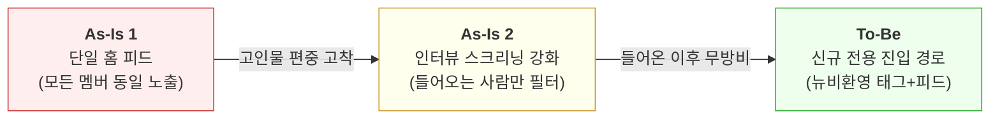
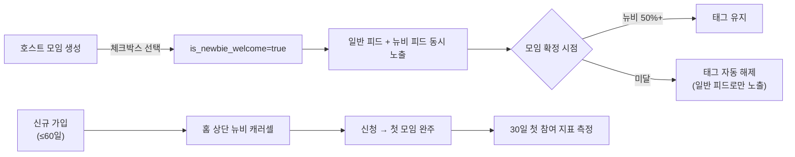
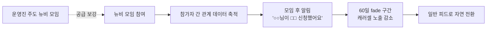

# 동행 신규 멤버 "뉴비환영 트랙" PRD

> 작성일: 2026-04-14 · 상태: Draft · 외부 서비스(동행) 분석 기반
>
> **한 줄 요약**: 고인물 편중으로 신규가 첫 모임에 들어가지 못하는 문제를, `#뉴비환영` 태그와 신규 전용 큐레이션 피드라는 최소 개입으로 풀어 참여 분포를 구조적으로 재조정한다.

**관련 문서:**
- [3주차 공개 데이터 분석 — 동행](../week-3/kimjisub.md)

---

## 0. 동행(同行)은 어떤 서비스인가

동행은 **10분 1:1 화상 인터뷰**를 통과한 사람들끼리 오프라인에서 만나 함께 식사하는 **소셜 다이닝 커뮤니티**다. 서울 을지로·성수·강남·압구정 등 핫플레이스 레스토랑 중심으로 주 200개 이상의 모임(을지로 와인바, 성수 이자카야 등)이 열리고, 멤버는 관심 있는 모임을 자유롭게 신청해 참여한다.

서비스의 핵심 차별점은 **"인터뷰로 검증된 사람들만 모인다"**는 신뢰 구조다. 운영사 세븐픽쳐스(설립 2016년, 직원 9명)는 건전한 목적·매너·커뮤니티 적합성이라는 3가지 기준으로 스크리닝하며, 이 무거운 진입 장벽이 "아무나 들어올 수 없는 프리미엄 커뮤니티"라는 브랜드를 만든다.

수익 모델은 **3개월 15만원의 멤버십 구독**으로, 경쟁사인 소모임(월 2,900원~)이나 문토(모임당 3~4만원)보다 훨씬 무거운 과금 구조다. 채용 페이지 공시 기준 누적 유료 구매 3,795명, 진행된 동행 4,222회, 내부 만족도 4.68/5.0으로 **"작지만 밀도 높은 커뮤니티"** 포지션을 취하고 있다.

타겟은 **외롭지만 혼자서는 아무것도 안 하고 있는 직장인** — 소개팅 기피(72.9%), 1인 가구 증가(804만, 36.1%), "느슨한 연결 선호" 같은 사회적 배경 위에서, "인터뷰 통과한 안전한 사람들과의 가벼운 저녁 약속"이라는 가치를 판다. 실제 경쟁 서비스는 소모임이나 문토가 아니라 **"약속 안 잡는 것"**에 가깝다.

본 PRD는 이 "검증된 사람 중심" 구조가 만든 의도치 않은 부작용 — **들어온 이후의 고인물 편중으로 인한 신규 이탈** — 을 다룬다.

---

## 1. 문제 정의

### 발견된 문제

**동행은 인터뷰로 들어오는 사람을 걸러 신뢰를 만들었지만, 그 신뢰를 첫 경험이 배반한다. 인터뷰를 통과해 유료 멤버십까지 결제한 신규 10명 중 8명(77.9%)이 월 활성 참여자가 되지 못한 채 방치된다.**

3주차 공개 데이터 분석에서 확인된 핵심 수치:
- 월평균 참여 **2.52회** vs **1인 최다 누적 132회** (채용 페이지 자체 공시) — 시간 단위가 다르지만, 전체 진행된 동행 **4,222회** 중 1명이 **132회(약 3.1%)**를 차지하는 극단적 편중
- 내부 만족도 **4.68/5.0** (10,132건) vs 앱스토어 평점 4.2~4.4 — 체감 격차
- App Store 평점 분포의 양극화: 5점 71 / 4점 **0** / 3점 3 / 2점 1 / 1점 16 (n=91) — 경험이 "매우 좋거나 매우 나쁘거나"로 갈림. 단 리뷰 모집단이 1만+ 다운로드 대비 0.9%에 불과해 자기선택 편향 가능성 있음

신규 멤버는 인터뷰까지 통과하고도 기존 코어 그룹에 편입되지 못한 채 "끼기 어렵다"고 느끼며 이탈한다. 3주차 리뷰 분석에서 반복 확인된 사용자의 실제 언어:

> "정기모임이 너무 많고 같은 사람들끼리만 돌아가요"
> "기존 멤버들이 이미 친해 보여서 끼기 어렵다"
> "뉴비 모임 같은 게 있으면 좋겠다" — 신규가 스스로 분리 트랙의 필요성을 언급

**영향받는 사용자 규모 (추정 퍼널)** — N=6 중앙 가정 기준:

| 단계 | 측정 기간 | 규모 | 이전 단계 대비 전환율 | **이탈률** | 출처/근거 |
|------|---------|----:|-------------------:|---------:|----------|
| 인터뷰 신청 | 12개월 플로우 | 17,000 | — | — | 채용 페이지 공시 |
| 유료 전환 | 누적 스톡 | 3,795 | 22.3% | **77.7%** | 채용 페이지 공시. 단 분자(누적)-분모(12개월)의 기간 이질 |
| 월평균 활성 참여자 | 최근 월 플로우 | ~838 | 22.1% | **77.9%** | 진행된 동행 4,222회 ÷ 12개월 × 6명 ÷ 2.52회/월 |
| 고빈도 코어 | 누적 스톡 | 소수 | 추정 ~1% | **~99%** | 1인 최다 132회 누적 (≈ 전체 4,222회의 3.1%) |

**핵심 이탈 구간**: 유료 전환 → 실제 월 활성 참여로 이어지지 못한 **77.9%(~2,957명)**가 본 PRD의 핵심 타겟.

<b>📐 모임당 평균 참가자 수(N) 가정에 따른 감도 분석 (펼쳐보기)</b>

**산출 공식**: 월 활성 참여자 ≈ (진행된 동행 4,222회 ÷ 12개월) × N명 ÷ 2.52회/월

| N 가정 | 월 활성 참여자 | 유료→월활성 전환율 | **유료→월활성 이탈률** | "잠자는 유료자" 규모 |
|-------|-------------:|----------------:|---------------------:|------------------:|
| 4명 | ~559 | 14.7% | **85.3%** | ~3,236명 |
| **6명** (중앙 가정) | **~838** | **22.1%** | **77.9%** | **~2,957명** |
| 8명 | ~1,117 | 29.4% | **70.6%** | ~2,678명 |

**이 퍼널의 해석 (주의해서 읽을 것)**:
- "누적 유료자 3,795명"(스톡)과 "월 활성 참여자 838명"(플로우)은 **시간 단위가 다르다**. 두 수치의 차이(2,957명)를 "잠자는 유료자"로 부르는 건 실제로는 **① 결제 유지 중이지만 이번 달 미참여 + ② 이미 해지/갱신거절로 빠진 과거 유료자**가 섞여 있다는 의미다.
- 즉 이 77.9%는 "타겟 세그먼트 크기의 상한 추정"으로 읽어야 하며, 정확한 핵심 타겟은 **"결제 유지 중이면서 최근 월 미참여인 유료자"**다. 이 정제된 수치는 baseline 확보 시 산출 가능 (Open Questions #1, #7, #8).
- 인터뷰 신청→유료 전환 단계의 22.3%도 주의: 분자는 누적, 분모는 12개월로 **기간이 이질적**이라 "12개월 신청자 중 22%가 유료 전환"이라는 해석은 부정확할 수 있음. 12개월 동기 코호트의 실제 전환율은 내부 데이터 확인 필요.
- 감도표에서 보듯 N=6 가정의 40% 변동 범위(559~1,117)만으로도 이탈률이 70.6%~85.3%로 크게 흔들리므로, MVP 설계 진입 전 **모임당 평균 참가자 수**를 확인하는 것이 선행 필수.

### 그게 왜 문제인가?

**1) 인터뷰 ROI가 손상된다**

동행은 파트타임 인터뷰어를 고용해 신규 1명당 10분의 화상 인터뷰 비용을 지불한다. 하지만 그중 상당수가 첫 모임에도 도달하지 못하고 앱을 방치하거나 삭제한다.

> → 인터뷰 비용은 모든 신규에게 동등하게 발생하지만, Revenue는 "실제 참여자" 일부에게서만 나온다.
>
> → 인터뷰라는 브랜드 자산이 단위 경제성 관점에서 점점 악화된다.

**2) Unit Economics가 악화된다 (단기 매출은 OK, 장기 LTV가 깨짐)**

3개월 15만원 선결제 구조라 첫 결제 자체는 받는다. 문제는 그 다음이다. 3개월 동안 참여 경험이 거의 없는 멤버는 갱신하지 않는다. 실제 매출은 `신규 유입 × 갱신율 × ARPU`로 유지되는데, 갱신율이 낮으면 **같은 매출을 만들기 위해 신규 유입을 계속 펌프질해야 한다**.

> → 갱신율 하락을 신규 유입으로 메우려면 인터뷰 비용이 유입에 비례해 커진다 (파트타임 인터뷰어 ×N).
>
> → 결국 1명을 획득하는 데 드는 비용(CAC)은 고정인데 1명당 회수(LTV)가 떨어져 **CAC/LTV ratio가 악화** — 스케일하려 할수록 단위 경제성이 무너진다.
>
> → 3주차에서 확인된 "채용 포지션 7개 동시 오픈 = 성장 단계 진입"이라는 신호가 오히려 이 구조적 누수를 가속한다. 신규 확보에 돈을 쏟는 타이밍에 bottom이 새면 ROI 근거 자체가 흔들린다.

**3) 부정 입소문이 누적된다**

"인터뷰까지 보고 들어갔는데 끼기 어려웠다"는 실망은 일반 서비스의 "별로였다"보다 훨씬 강한 부정 신호로 각인된다.

> → 앱스토어 1점 리뷰, 블라인드, 트위터 후기로 누적되어 잠재 사용자의 유입을 억제한다.
>
> → 인터뷰 기반 프리미엄 브랜드가 역설적으로 "들어가도 소용없는 커뮤니티"라는 이미지로 전도된다.

**4) 코어 유저에게도 장기적으로 손해다**

한 사람이 누적 132회까지 참여하는 구조는 당장은 커뮤니티가 "살아있어 보이게" 하지만, 같은 사람끼리의 반복 모임은 서서히 피로해진다.

> → 신규가 유입되지 않으면 코어는 결국 "다 아는 사람만 있는 서비스"에 지쳐 이탈한다.
>
> → 현재의 코어 집중은 미래의 코어 이탈을 예약하는 행위다.

### 대안 가설 — 인과 방향에 대한 자기 검열

위 체인은 "**고인물 편중 → 신규 이탈**"의 인과 방향을 전제한다. 하지만 역인과 또는 제3변수 가능성을 열어두어야 한다:

- **역인과**: 신규가 이탈하기 때문에 코어만 남아 편중이 관찰되는 것일 수 있다. 이 경우 편중은 원인이 아니라 결과이며, 뉴비 트랙으로 편중을 해소해도 이탈이 줄지 않을 수 있다.
- **제3변수**: 가격(월 5만원 ARPU) 또는 앱 안정성 문제(D축)가 공통 원인이고, 편중과 이탈은 독립적 현상일 수 있다.

**그럼에도 본 PRD의 개입이 유효한 이유**: 위 두 가지 대안 가설이 참이더라도, "**또래 진입 경로 부재**"는 신규 관점에서 독립적으로 유효한 페인포인트다. 뉴비 모임을 만들면 "편입되고 싶었는데 못 된 신규"도, "이직 결심이 없는데 홀로 온 신규"도 동등하게 혜택을 받는다. 즉 본 PRD는 인과 방향과 독립적으로 정당화되며, 실제 인과 구조는 MVP 데이터로 사후 검증 가능하다.

### 왜 이 문제가 생기는가?

| 원인 | 설명 |
|------|------|
| **맥락 비대칭 구조** | 정기모임 참여자끼리는 "지난주", "저번에", "○○ 누님이"라는 내부 맥락이 쌓여있지만, 신규는 이 맥락에 접근할 수 없다. 결과적으로 같은 모임 안에서 신규만 대화의 외곽에 놓인다. |
| **피드의 단일성** | 홈 피드는 "인기 순/최신 순" 등 단일 기준으로 노출된다. 기존 코어가 반복 신청하는 정기모임이 상단을 차지하므로 신규에게도 같은 피드가 보이지만, 의미는 전혀 다르다. |
| **인터뷰 이후 설계 공백** | 인터뷰 통과까지의 경험은 촘촘하게 설계되어 있지만, "통과 후 첫 모임 신청"을 지원하는 장치는 없다. 신규는 홀로 피드를 탐색해야 한다. |
| **신뢰 장치의 스케일 한계** | 동행은 사전 인터뷰라는 가장 무거운 신뢰 장치를 택했다. 이 무게는 들어오기 전에는 강력한 보증이지만, 들어온 이후에는 더 이상 일하지 않는다. |

### 실제로 어디서 발생하는가?

| 구간 | 추정 규모 | 주요 신호 | 현재 지원 |
|------|----------|---------|---------|
| **가입 직후 ~ 첫 신청 전** | 유료 전환자 중 상당수 | "뭘 신청해야 할지 모르겠다" | 없음 |
| **첫 모임 참여 중** | 정기모임 신청한 신규 전체 | "내부 맥락에 끼지 못함" | 없음 |
| **첫 모임 직후** | 첫 모임 경험자 중 다수 | "다음에 또 오라는 말을 들었지만 불확실" | 없음 |
| **30~90일 방치 구간** | "죽은 유저" 세그먼트 | 로그인만 있고 신청 없음 | 일반 푸시 알림만 |

### 결론: 무엇이 필요한가

**"인터뷰 이후의 첫 경험을 설계하는 장치"가 필요하다.** 단, 기존 코어 생태계를 훼손하지 않고, 브랜드 가치(인터뷰 기반 프리미엄)를 유지하면서, 최소 개발로 가설을 검증할 수 있는 방식이어야 한다.

이 장치가 갖춰지면:
- 신규가 "같은 처지의 또래"와 첫 모임을 완주하는 경로가 생긴다
- 코어 유저의 일반 피드는 변화 없이 유지된다
- 플랫폼은 "어떤 신규가, 어떤 모임에서, 어떤 뉘앙스의 경험을 하는가"를 데이터로 학습한다
- 이 학습 위에서 V1(운영진 주도)과 V2(자동 매칭) 같은 더 무거운 개입을 정교하게 설계할 수 있다

---

## 2. 개선 목표

> **최종 목표**: 인터뷰를 통과한 신규 멤버가 30일 이내에 동등한 또래와 함께 첫 모임을 완주하고, 두 번째 모임을 자발적으로 신청하는 상태를 만든다.

### Before → After

| 구간 | Before (현재) | After (목표) |
|------|-------------|-------------|
| 가입 직후 홈 화면 | 모든 모임이 동일 기준으로 노출 | 신규 전용 "뉴비환영 캐러셀" 우선 노출 |
| 첫 모임 신청 | 정기모임에 뛰어들어 내부 맥락에 끼어야 함 | `#뉴비환영` 모임에서 또래와 자기소개 대화 |
| 첫 모임 중 경험 | "구경꾼" 포지션, 대화 외곽 | "참여자" 포지션, 자기 이야기 공유 |
| 첫 모임 후 | 재신청 유인 없음 | 60일 fade 구간 동안 점진적으로 일반 피드로 확장 |
| 60일 이후 | 방치 또는 이탈 | 뉴비 동기 3-4명과 함께 일반 모임 탐색 |

### 사용자 시나리오

**Before: 박지훈(28세, 서비스 기획자)의 첫 3개월**

박지훈은 10분 화상 인터뷰까지 통과해 동행에 들어왔다. 가입 당일 앱을 열자 정기모임 20여 개가 떠 있다. "을지로 와인바 – 매주 목요일 정기"를 신청한다.

당일 저녁, 5명이 이미 도착해 있다. "지난주 그 레스토랑 진짜 별로였죠"로 시작하는 대화가 이미 굴러가고 있다. 박지훈은 90분 동안 웃고 끄덕이지만 자기 이야기를 꺼낼 틈을 찾지 못한다. 마지막에 "다음에 또 봬요" 인사를 듣지만, 그 "다음"에 자기가 포함된다는 감각은 없다.

3주 뒤 비슷한 시도를 한 번 더 한다. 같은 패턴이다. 이후 앱을 열어도 "신청할 모임이 없는 것처럼" 느껴진다. 앱 알림은 켜뒀지만 열지 않는다.

2개월째, 새 명함을 정리하려고 앱을 연다. 모임 신청은 하지 않는다. 멤버십은 유지되고 있지만 "죽은 유저"다.

3개월째, 갱신 알림이 도착한다. 박지훈은 "굳이"라고 생각하며 해지 버튼을 누른다. 앱스토어에는 리뷰를 남기지 않는다. 조용히 사라진다. **동행 입장에서는 무엇이 문제였는지도 모른 채 15만원의 LTV를 놓친 상태.**

**After: 같은 상황, 개선 후**

박지훈이 가입하자 홈 화면 상단에 "이번 주 뉴비환영 모임" 캐러셀이 일반 피드 위로 뜬다. 태그 설명이 붙어있다: "**새로 인터뷰 통과하신 분들과 함께하는 모임**".

"성수 이자카야 – 뉴비환영"을 신청한다. 참여자 6명 중 4명이 가입 3주차 이내. 자기소개가 자연스러운 주제다. "어떻게 동행 알게 되셨어요?", "처음이라 떨리셨어요?" 같은 대화가 흐른다.

모임이 끝날 때 앱 알림이 온다: "함께 참여한 김○○님이 다음 주 □□ 모임을 신청했어요." 박지훈은 신청한다.

60일이 지나면서 뉴비 캐러셀 노출이 점진적으로 줄어든다(30일 100% → 60일 50% → 90일 0%). 이 시점에는 이미 알고 지내는 동행 멤버가 3~4명 생겨있다. 일반 피드의 모임을 신청해도 "혼자 들어가는" 느낌이 아니다.

90일째, 박지훈은 월 2회 꾸준히 참여하고 있다. 갱신 알림이 오자 고민 없이 결제한다.

### 단계별 목표

| 단계 | 목표 | 해결하는 원인 | 달성 시점 |
|------|------|-------------|---------|
| **Release 1 (MVP)** | 신규가 또래 모임에서 첫 완주를 경험 | 피드의 단일성, 인터뷰 이후 설계 공백 | 2주 개발 + 4주 관측 |
| **Release 2 (V1)** | 뉴비 기간 졸업자가 일반 피드로 자연 전환 | 맥락 비대칭 구조 | 다음 스프린트 |
| **Release 3 (V2)** | 알고리즘이 신규-신규 매칭을 자동 제안 | 신뢰 장치의 스케일 한계 | 그 다음 분기 |

### 성공 지표 (HEART Framework)

**Release 1 지표:**

| HEART | 지표 | 측정 방법 | 현재 | 목표 |
|-------|------|---------|-----|------|
| **Task Success** (North Star) | 신규 30일 첫 모임 참여율 | `COUNT(first_meeting_within_30d) / COUNT(new_signups)` | 미측정 (MVP 전 baseline 확보 필수) | baseline 대비 **+15%p** |
| Happiness | `#뉴비환영` 태그 모임 노쇼율 | 태그 모임의 noshow 비율 | N/A (신규 지표) | **< 10%** |
| Engagement | 참여 분포 지니계수 | 월별 유저당 참여 횟수의 Gini coefficient | 미측정 | V1 누적 관점 **-0.10** |
| Retention | 뉴비 트랙 졸업자 vs 비졸업자 90일 리텐션 격차 | 졸업자(60일차까지 `#뉴비환영` 모임 1회 이상 참여) 90일 리텐션 − 비졸업자(동 기간 뉴비 모임 0회) 90일 리텐션 | 미측정 | V1 이후 **격차 +10%p** |

**핵심 지표: Task Success — 30일 첫 참여율 +15%p**

이 지표가 MVP의 North Star인 이유:
- MVP 기간(6주) 안에 실제 관측 가능
- "신규가 첫 발을 떼는가"라는 가장 직접적 신호
- 뉴비환영 피드의 효과와 인과관계 추적 용이

**주의 — baseline 공백**: 현재 수치는 추정치조차 없다. MVP 설계 진입 전에 내부 데이터로 baseline 확보가 선행 조건이다.

---

## 3. 솔루션 접근법

### 시스템 변천

**As-Is 1: 단일 홈 피드** — 모든 멤버가 동일한 모임 피드를 본다. 코어가 굴러가는 정기모임이 상단을 차지하고, 신규에게도 같은 피드가 보이지만 의미는 전혀 다르다.

**As-Is 2: 인터뷰 스크리닝 강화** — 동행의 현재 전략. 들어오는 사람의 품질은 올렸지만, 들어온 이후의 경험 균일성까지는 보장하지 못한다. 인터뷰라는 장치의 가치가 가입 시점에 소진된다.

**To-Be: 신규 전용 진입 경로** — 인터뷰(들어오기 전)와 일반 피드(코어가 주도) 사이에 "신규가 또래와 함께하는 첫 60일" 구간을 추가한다. 인터뷰 브랜드를 훼손하지 않으면서, 신규에게만 보이는 별도 레이어로 동작한다.

### 경쟁사 벤치마크 — 같은 도메인의 다른 선택들

같은 "오프라인 모임 서비스" 도메인에서 경쟁사들이 어떤 방식으로 신뢰·품질 문제를 풀었는지 대조하면, 동행의 위치와 본 PRD의 역할이 선명해진다.

| 서비스 | 신뢰 장치 | 규모 | 주요 문제 | 트레이드오프 |
|--------|----------|------|---------|------------|
| **소모임** | 없음 | 누적 500만+ 다운로드, DAU 12-14만 (4명 조직 운영) | 고인물, 성비 차별, 노쇼, 종교 포교 | 신뢰 비용 0 → 빠른 스케일, 품질 방치 |
| **문토** | 사후 매너점수 | 누적 회원 80만, 투자 72억 | 환불 분쟁, 스팸 DM, 성비 불균형 | 중간 무게 신뢰 → 중간 규모, 이해관계 충돌 |
| **동행** | 사전 인터뷰 | 유료 구매 3,795명 (9명 조직) | 인터뷰 마찰, 고인물, 가격 저항 | 가장 무거운 신뢰 → 작은 규모, 경험 편차 |
| (해외 참고) **Timeleft** | 성격 테스트 알고리즘 | 52개국 200+ 도시 | - | 가장 가벼운 신뢰 → 글로벌 스케일 |

**이 비교에서 읽히는 것**: 신뢰 장치의 무게와 스케일 사이에 명확한 트레이드오프가 존재한다. 동행은 가장 무거운 끝을 택했기 때문에 이미 들어온 사람의 품질은 높지만, "들어온 이후 경험 편차"라는 다른 경쟁사에는 없는 문제가 생겼다. 본 PRD의 역할은 **이 무게를 유지하면서도 경험 편차를 줄이는 보완 장치**를 설계하는 것이다 — 신뢰 장치를 바꾸는 게 아니라 신뢰 장치 이후 구간을 메우는 것.

### 왜 이 접근법인가

선택 가능한 대안은 세 가지였다:

1. **참여 횟수 상한(쿨다운)**: 코어의 월 참여 횟수를 제한해 슬롯을 강제 확보. → 거절. 누적 132회까지 참여하는 고빈도 코어는 이 서비스의 가장 강한 팬이자 "살아있는 생태계"의 유일한 증거다. 제재는 즉각적 이탈 리스크를 만든다.
2. **운영진 주도 신규 전용 모임**: 운영진이 주기적으로 신규 모임 직접 기획. → V1로 미룸. Impact는 크지만 운영 리소스 의존이 구조적 제약이다. 먼저 "수요가 얼마나 있는지" 데이터로 확인한 뒤 운영 규모를 맞춰야 한다.
3. **코호트 기반 자동 매칭**: 가입 시점 유사한 신규를 알고리즘이 자동으로 묶어 모임 제안. → V2로 미룸. 매칭 품질 담보 전에 자동 생성 모임을 띄우면 "봇이 만든 모임" 인상으로 브랜드 훼손 리스크가 크다.

**선택한 접근: `#뉴비환영` 태그 + 신규 큐레이션 피드** — 호스트 자발적 태그로 공급을 만들고, 가입 60일 이내 멤버에게만 별도 캐러셀로 노출한다. Ease가 압도적으로 높아 가설 검증 속도가 빠르고, 실패 시 롤백 비용이 작다.

### ICE Score (우선순위 근거)

| 후보 접근법 | 설명 | Impact | Confidence | Ease | ICE Score | 판단 |
|-----------|------|-------:|-----------:|-----:|----------:|------|
| **A. 뉴비환영 태그 + 신규 큐레이션 피드** | 호스트 자발적 태그로 신규 전용 진입 경로 생성 | 7 | 8 | 7 | **392** | **채택** |
| B. 운영진 주도 신규 전용 모임 | 운영진이 주 N회 신규 모임 직접 기획·오픈 | 8 | 7 | 5 | 280 | V1 후보 |
| C. 코호트 기반 자동 매칭 | 가입 시점 유사한 신규를 알고리즘이 묶어 자동 생성 | 9 | 5 | 3 | 135 | V2 후보 |
| D. 참여 횟수 상한(쿨다운) | 코어 유저의 월 참여 횟수를 제한해 슬롯 확보 | 7 | 5 | 6 | 210 | 보류 |

<b>📊 각 점수 근거 (펼쳐보기)</b>

- **A-Impact 7**: 호스트 자발성에 의존하므로 공급량의 상한이 있다. 태그가 안 붙으면 피드가 공백. 반면 구현이 가벼워 실험 자체가 성립하는 최소 조건은 확실히 충족.
- **A-Confidence 8**: 3주차 리뷰에서 "뉴비 모임이 있으면 좋겠다"는 신규 본인들의 언급이 이미 존재. 수요 가설의 기반이 강함.
- **A-Ease 7**: 초기 설계 시 Ease 9로 추정했으나, 실제 MVP 기능 세트(F0 온보딩, F1 신청 시점 실시간 뉴비 비율 노출, F2 가입일 기반 코호트 분기 렌더링, F3 자동 해제 + 일괄 안내/환불 플로우, F4 이벤트 정의·적재·대시보드)를 구체화하면서 2주 개발은 타이트한 목표임을 인정. 그래도 B/C 대비 압도적으로 가볍고 롤백 비용도 작다.
- **B-Impact 8**: 운영진 품질 담보로 효과는 크지만, 운영 규모가 수요를 따라가지 못하면 병목이 됨.
- **B-Ease 5**: 운영 프로세스 설계 + 인력 배치 + 지속 공급 루프 구축 필요.
- **C-Impact 9 / Ease 3**: 자동화의 잠재력은 가장 크지만, 매칭 품질 담보 전에는 실패가 브랜드 훼손으로 직결.
- **D-Confidence 5**: "코어를 제재하면 슬롯이 신규에게 간다"는 인과관계 자체가 불확실. 코어 이탈로 공급이 함께 줄 가능성.

**선택 근거**: A안은 Ease 덕분에 "학습용 MVP"로 최적이다. A로 수요·이행률·노쇼율 데이터를 쌓은 뒤, B(운영진 주도)를 겹쳐 공급을 보강하고, 마지막에 C(자동 매칭)로 스케일업한다. **A는 단독 해결책이 아니라 B/C의 설계 근거를 제공하는 학습 플랫폼이다.**

### 목표 워크플로우

**Release 1: MVP 뉴비 트랙**

**Release 2: V1 전환 보조**

---

## 4. 범위 (Scope)

### 기능 요약

| ID | 기능 | 한줄 요약 | 상세 문서 |
|----|------|---------|---------|
| **F0** | **가입 직후 가치 전달 온보딩 화면** (1~2장) | "첫 60일은 뉴비환영 모임이 홈에 우선 추천됨"을 5초 안에 설명 | TBD |
| F1 | `is_newbie_welcome` 필드 + 호스트 체크박스 UI + **신청 시 현재 뉴비 비율 사전 노출** | 모임 생성 시 호스트 약속 + 신청 시점에 "현재 4명 중 3명 뉴비" 실시간 표시 | TBD |
| F2 | 가입 60일 이내 전용 뉴비 캐러셀 | 신규에게만 보이는 별도 홈 상단 컴포넌트 | TBD |
| F3 | 모임 확정 시 뉴비 비율 자동 체크 | 50% 미달 시 태그 자동 해제하는 시스템 규칙 | TBD |
| F4 | 30일 첫 참여율 + 지니계수 + **코어 이탈 감지** + **호스트 자발 태그율** 대시보드 (**이벤트 로그 기반**) | `newbie_carousel_impression` / `newbie_meeting_apply` / `first_meeting_complete` / `second_meeting_apply` 4개 이벤트 집계 | TBD |
| F5 | 모임 후 "다음 모임 추천" 알림 | 뉴비 간 약한 소셜 신호로 재참여 유도 | TBD (V1) |
| F6 | 60일 gradual fade 로직 | hard cutoff 대신 점진적 노출 감소 | TBD (V1) |
| F7 | 운영진 주도 뉴비 모임 직접 기획 | 공급 하한 보강 | TBD (V1) |
| F8 | 코호트 기반 자동 매칭 제안 | 가입 시점 유사 신규 자동 묶음 | TBD (V2) |

### UX 원칙

본 PRD의 기능 설계는 다음 원칙을 따른다:

1. **선택 이전에 정보 제공** — 신규가 뉴비환영 모임을 신청하는 순간 "현재 뉴비 비율"이 사전 노출되어야 한다(F1). 모임 확정 후에 "알고 보니 고인물 모임"이라는 경험을 F3(자동 해제)뿐 아니라 **신청 시점 정보 투명성**으로도 차단한다.
2. **가치 납득 → 행동 유도 → 즉시 맥락** — 가입 직후 F0로 "왜 이 피드가 내게만 보이는지"를 5초 설명한 뒤, F2 캐러셀로 행동 경로를 노출한다. 설명 없이 기능만 띄우면 신규는 "왜 내 앱만 달라 보이지?"라고 혼란스러워한다.
3. **코어 노출 최소화** — 뉴비환영 모임의 존재는 60일 이내 멤버에게만 보여, 코어 유저의 홈과 브랜드 인식에는 영향이 없다(리스크 2 완화 구조).

### 배포 전략

**Release 1: MVP 뉴비 트랙** (2주 개발 + 4주 관측)

> 달성 목표: 신규 30일 첫 모임 참여율 baseline 대비 +15%p

**포함 기능**: F0, F1, F2, F3, F4

**제공 가치**: 신규가 또래 모임에서 첫 완주를 경험할 수 있는 최소 조건 확보. 호스트 자발성 기반 공급 + 시스템 강제 이행으로 "태그 보고 갔는데 고인물이었다"는 최악의 경험 구조적 차단.

**한계**:
- 호스트가 태그를 안 붙이면 피드 공백. 초기 공급은 운영진의 수동 독려에 의존
- 60일 hard cutoff라 61일째 "벼랑"이 생길 수 있음
- 뉴비 모임 간 네트워크 형성 지원 없음

**이 한계를 감수하고 분리 배포하는 이유**: 가설 검증이 최우선이다. "또래 진입 경로가 주어지면 참여율이 오른다"를 6주 안에 숫자로 확인해야, V1의 운영 투자와 V2의 알고리즘 설계가 정당화된다. 지금 V1의 알림 시스템과 fade 로직까지 함께 만들면 검증 전에 최소 4주가 더 든다.

**Release 2: V1 전환 보조** (다음 스프린트)

> 달성 목표: 뉴비 기간 졸업자의 90일 리텐션이 비졸업자 대비 +10%p

**포함 기능**: F5, F6, F7

**제공 가치**: 뉴비 기간의 "임시 관계"를 일반 피드로 이어주는 다리. 60일 경계에서의 이탈 리스크를 gradual fade로 구조적으로 감소.

**한계**: 여전히 호스트-운영진 혼합 공급에 의존. 신규-신규 매칭이 수동적.

**이 한계를 감수하는 이유**: V2(자동 매칭)는 Release 1의 데이터(어떤 신규가 어떤 모임에서 잘 만났는지)가 쌓여야 알고리즘 설계 근거가 생긴다. 데이터 없는 자동화는 랜덤 매칭에 불과.

**Release 3: V2 자동 매칭** (그 다음 분기)

> 달성 목표: 참여 분포 지니계수 baseline 대비 -0.10

**포함 기능**: F8 + 뉴비 멘토링 인센티브

**후반 Release에 대한 전제**: Release 3는 방향만 잡혀있고, 구체 설계는 Release 1/2 데이터를 보고 조정한다.

### 범위 밖 (Non-scope)

| 항목 | 이유 | 영구/확장 |
|------|------|---------|
| **참여 횟수 상한(쿨다운)** | 코어 유저 이탈 리스크가 직접적이고, "코어 제재 → 신규 기회 증가" 인과관계 불확실. 철학적으로 다른 방향 | **영구적 제외** |
| **인터뷰 프로세스 재설계** | 인터뷰는 "들어오는 사람"의 문제, 본 PRD는 "들어온 이후"의 문제. 별도 PRD가 필요 | 후속 확장 (별도 PRD) |
| **가격 정책 변경** | 본 PRD의 KPI(참여율/리텐션)가 개선되면 갱신율이 따라오는 구조이므로 가격은 건드리지 않음 | 후속 확장 |
| **앱 안정성 개선** | 3주차에서 확인된 D축 문제. 본 PRD와 독립적 | 후속 확장 (별도 PRD) |
| **성별 균형 매칭** | B축 하위 문제 중 하나지만, 이번 PRD의 MVP로는 태그만으로는 풀 수 없음 | 후속 확장 (V2 이후) |
| **호스트 교육 프로그램** | 뉴비 모임 품질에 영향을 주지만, MVP에서는 태그 이행률 데이터 확보가 우선 | 후속 확장 (V1 이후) |

---

## 5. 열린 질문 (Open Questions)

| # | 질문 | 왜 중요한가 | 답을 찾는 방법 |
|---|------|----------|-------------|
| 1 | 현재 신규 30일 첫 모임 참여율의 실제 baseline은? | 목표 +15%p가 타당한지, MVP 성공 판단 기준을 만들 수 있는지 좌우. **baseline-조건부 목표 규칙**: baseline ≥ 40%면 +15%p 유지 / 20~40%면 상대 +40% / < 20%면 +20%p 승격(낮은 기저에선 절대값 민감) | MVP 설계 진입 전 내부 데이터 쿼리 (선행 필수) |
| 2 | "60일" 경계가 적절한가? | Aha Moment 기준이 45일인지 90일인지에 따라 fade 커브가 달라짐 | V2 A/B 테스트. MVP는 60일 가설로 고정 |
| 3 | 호스트의 태그 이행률은? | 태그만 붙이고 실제 구성은 다를 수 있음. 낮으면 F3(자동 해제)를 엄격하게, 높으면 관대하게 | MVP 4주 관측 후 실측 |
| 4 | 기존 코어 유저가 뉴비 증가를 어떻게 체감하는가? | 캐러셀은 분리되어 있지만 "모임에 뉴비가 늘었다"는 인식이 생기면 반발 가능 | MVP 기간 중 3-5명 정성 인터뷰 |
| 5 | 인터뷰 통과 ~ 첫 모임 사이 평균 대기일은? | 이 구간이 길면 뉴비 모임 공급 주기를 거기 맞춰야 함 | MVP 설계 전 내부 데이터 쿼리 |
| 6 | 뉴비 기간 졸업자의 리텐션이 비졸업자보다 낮을 가능성은? | 만약 그렇다면 fade 커브를 재조정해야 함. 현재 커브는 가설 | V1 이후 90일 리텐션 비교 분석 |
| 7 | 모임당 평균 참가자 수는 몇 명인가? | 퍼널 4번째 행(월 활성 참여자 838명)의 핵심 가정. 4명/6명/8명 가정에 따라 타겟 세그먼트 크기가 559~1,117로 40% 흔들림 | MVP 설계 전 내부 데이터 쿼리 (선행 필수) |
| 8 | 핵심 타겟 "잠자는 유료자"의 정제된 정의는? | 현재 스톡-플로우 혼합 정의(누적 유료자 − 월 활성)는 해지자까지 포함한 상한치. 정확한 타겟은 "결제 유지 중 + 최근 월 미참여" | 내부 결제·참여 로그 조인 쿼리 |
| 9 | 동일 코호트 A/B 분할이 가능한가? | 캐러셀 노출을 홀드아웃할 수 있어야 시점 전후 비교의 confound(계절성, 마케팅)를 통제 | 프론트 feature flag 인프라 확인 |
| 10 | `is_newbie_welcome` 임계값 50%는 왜 50인가? | 30%면 태그가 남발되고 70%면 피드가 공백. 민감도 분석 필요 | MVP 관측 데이터로 사후 튜닝 |

---

## 6. Premortem — 이 프로젝트가 실패한다면

### 시나리오 1: 호스트가 태그를 거의 안 붙여서 피드가 공백이 됐다

호스트 관점에서 "처음 보는 사람 많은 모임"은 진행 난이도가 높아 기피한다. MVP 4주가 지나도 뉴비 캐러셀이 비어있다. 가설 검증 자체가 불가능해진다.

**대응** (A안의 측정 가능성을 해치지 않는 범위에서):
- **Kill-criterion 설정**: MVP 4주 관측 구간에서 "호스트 자발 태그율"이 목표치 미달이면 A안 가설(호스트 자발 공급 가능)을 **기각 판정**하고 V1(B안, 운영진 주도 공급)로 이행. 운영진을 MVP에 선행 투입하지 않는다 — A효과와 B효과가 뒤섞이면 학습 플랫폼으로서의 MVP 정체성이 무너진다.
- **경량 유인책**: 태그 부착 호스트에게 소극적 인센티브 (호스트 리더보드 가산점). 현금성 보상은 호스트 유인 왜곡을 일으켜 자발 공급 측정을 오염시키므로 MVP에서 제외.
- **측정 강화**: F4 대시보드에 "호스트 자발 태그율", "태그 부착 호스트의 다음 달 재부착률"을 추가. MVP 종료 시 B안 투입 의사결정의 근거로 활용.
- **호스트 사전 커뮤니케이션**: "뉴비 모임 진행 시 자기소개 중심 템플릿 제공" 같은 진행 부담 완화 장치를 사전 공지. 단, 이건 공급을 강제하는 게 아니라 진입 장벽을 낮추는 것.

### 시나리오 2: "아무나 환영"으로 해석되어 인터뷰 기반 브랜드가 훼손됐다

뉴비환영 태그가 "대충 들어가도 되는 모임" 시그널로 읽히고, 코어 유저 일부가 "이 서비스도 소모임처럼 됐다"는 불만을 리뷰에 남긴다.

**대응**:
- 캐러셀 노출을 **60일 이내 멤버로만 구조적 제한** → 코어에게는 이 피드의 존재 자체가 보이지 않음
- 태그 문구를 "뉴비환영"이 아닌 **"새로 인터뷰 통과하신 분들 환영"**으로 프레이밍
- 뉴비 모임도 레스토랑 큐레이션·진행 가이드 동일 적용

### 시나리오 3: 30일 첫 참여율은 올랐지만 90일 리텐션은 오히려 떨어졌다

뉴비 모임은 완주했지만, 60일 이후 일반 피드로 넘어갔을 때 여전히 코어 그룹에 끼지 못해 이탈한다. MVP는 성공으로 보였으나 후행 지표에서 실패.

**대응**:
- Release 2의 F5(다음 모임 추천 알림)와 F6(gradual fade)를 빠르게 붙여 60일 벼랑 제거
- fade 커브를 실데이터 기반으로 재조정 (예: 30일 100% → 90일 30% → 120일 0%처럼 길게)
- 필요시 "뉴비 기간 졸업생 전용 채널"을 임시로 운영

### 시나리오 4: 태그는 붙었지만 50% 미달이 대량 발생해 자동 해제가 빈번했다

호스트가 뉴비 비율을 지키기 어려운 환경(예: 뉴비 공급량 자체 부족)이라 태그를 붙여도 모임 확정 시점에 해제된다. 신규는 "뉴비 모임이라 신청했는데 알고 보니 일반 모임"이라는 더 나쁜 경험을 한다.

**대응**:
- 자동 해제 시점에 신청자 전원에게 **투명한 안내 메시지** 발송 ("이 모임은 뉴비 비율 조건을 충족하지 못해 일반 모임으로 전환되었습니다. 취소·환불 가능합니다.")
- 신청자에게 **무조건 취소권** 제공 (해당 시점까지의 참가비 100% 환불)
- 해제율이 30%를 넘으면 태그 허용 조건을 완화하거나 (예: "30% 이상") 공급 부족을 V1 F7로 긴급 보강

### 시나리오 5: 지표는 개선됐지만 전체 Revenue는 움직이지 않았다

신규 참여율과 리텐션은 올랐지만 갱신율/LTV가 동반 상승하지 않는다. "참여는 늘었지만 결제는 안 한다"는 상황.

**대응**:
- MVP 이후 세그먼트 분석: 뉴비 트랙 참여자의 갱신율 vs 미참여자의 갱신율 비교
- 갱신율 격차가 유의미하지 않으면 가설(참여→결제 연동)이 틀렸다는 신호. 가격 정책이나 결제 경험 PRD로 문제를 재프레이밍
- 유의미하면 V2에서 매칭 정교화로 Impact 증폭

---

## 7. 참고 자료 감상평

**글: [PRD 중심으로 AI 에이전트와 제품 개발하기 — 요즘IT](https://yozm.wishket.com/magazine/detail/3221/)**
> 이 글에서 가장 크게 와닿은 부분은 "PRD를 잘 쓴다는 것이 곧 '내가 무엇을 만들지 알고 있다'는 의미"라는 관점이었다. 이번 PRD를 쓰면서 처음에는 "고인물 문제를 해결하자"라고 막연히 접근했는데, Deep Interview로 "편입시킬 것인가 vs 분리할 것인가", "MVP는 레벨 1 vs 2 vs 3" 같은 이분법적 선택을 강제당하고, 이후 병목 중심 방법론으로 "왜 문제?" 체인을 2-3회 반복하고 나서야 비로소 "이 PRD가 실제로 답하는 질문이 무엇인가"가 보이기 시작했다. 특히 As-Is 1 → As-Is 2 → To-Be의 시스템 변천사를 그리는 과정에서, "인터뷰 스크리닝"이라는 기존 장치가 "좋은 사람은 들였지만 들어온 이후는 무방비"라는 관점으로 재해석되는 순간이 이 PRD의 진짜 출발점이었다. 글이 말하는 "메인 시나리오와 예외 케이스의 구분"이 이 PRD의 Before/After 시나리오와 Premortem 섹션에 그대로 반영됐고, "PRD는 완벽한 문서가 아니라 점진적으로 구체화되는 문서"라는 관점은 Release 1이 V1/V2의 설계 근거를 제공하는 학습 플랫폼이라는 구조로 구현됐다.

---

## (자사 서비스) 실행 관점

> 외부 서비스(동행) 분석이므로 이 섹션은 생략합니다.

---

## 부록: PRD 작성·사고 확장에 쓸 수 있는 도구 모음

이번 PRD를 쓰면서 직접 사용했거나, PRD를 짓는 데 꾸준히 유용할 도구들을 정리. `pm-skills`, `oh-my-claudecode`, `gstack`, 그리고 개인 작성 스킬(`/prd`)에 걸쳐 있다.

### 🏗️ 이 PRD 작성에 실제로 사용한 도구

| 도구 | 역할 | 이 PRD에서 한 일 |
|------|------|----------------|
| `oh-my-claudecode:deep-interview` | Socratic 질의로 요구사항 crystallize (ambiguity gating) | 페인포인트 선정부터 MVP 형태까지 6라운드, 모호성 100% → 14% |
| `/prd` (개인 스킬) | 병목 중심 PRD 방법론 (Why 체인, 시스템 변천사, Premortem) | 전체 섹션 구조 + As-Is 1/2 → To-Be 재프레이밍 |
| `oh-my-claudecode:critic` | 다각도 비판적 재검토 (Opus) | 수치 단위 불일치, 인과 모순, 스톡-플로우 혼합 등 🔴/🟡/🔵 이슈 14건 발견 |

### 🔍 문제 정의 · 근거 수집

| 도구 | 용도 |
|------|------|
| `pm-product-discovery:discover` | 아이디에이션 → 가정 매핑 → 실험 설계까지의 디스커버리 사이클 |
| `pm-product-discovery:interview` | 고객 인터뷰 스크립트 작성 / 인터뷰 결과 요약 |
| `pm-market-research:analyze-feedback` | 리뷰·설문을 대량 분석해 테마·세그먼트 추출 |
| `pm-market-research:sentiment-analysis` | 피드백의 감성·JTBD·만족도 자동 분류 |
| `pm-market-research:user-personas` | 리서치 데이터로부터 페르소나 3개 도출 |
| `pm-market-research:customer-journey-map` | 여정 지도(단계·터치포인트·감정·페인) 작성 |

### 🎯 전략 · 우선순위 · 사고 확장

| 도구 | 용도 |
|------|------|
| `pm-product-discovery:opportunity-solution-tree` | 기회–솔루션 트리로 "무엇을 먼저 할지" 구조화 |
| `pm-product-discovery:identify-assumptions-existing` | Value·Usability·Viability·Feasibility 4축 가정 식별 |
| `pm-product-discovery:prioritize-assumptions` | Impact × Risk 매트릭스 + 실험 제안 |
| `pm-execution:prioritization-frameworks` | RICE/ICE/Kano/MoSCoW 9가지 프레임 비교 레퍼런스 |
| `pm-marketing-growth:north-star-metric` | North Star 정의 + 입력 지표 별자리 (Attention/Transaction/Productivity 게임 분류) |
| `pm-product-strategy:swot-analysis` · `porters-five-forces` · `pestle-analysis` | 거시 환경 분석 툴킷 |
| `pm-product-discovery:brainstorm` | PM/디자이너/엔지니어 3가지 관점에서 아이디어 확장 |

### 🧪 실행 · 측정

| 도구 | 용도 |
|------|------|
| `pm-execution:write-prd` · `create-prd` | 8섹션 기본 PRD 템플릿 (본 PRD는 병목 방법론 채택했지만 비교 참고) |
| `pm-execution:pre-mortem` | "프로젝트가 실패한다면" 시나리오 분석 (Tigers/Paper Tigers 분류) |
| `pm-execution:job-stories` · `user-stories` · `wwas` | Release 내 백로그 아이템 작성 |
| `pm-product-discovery:metrics-dashboard` | North Star · 입력 · 헬스 · 알람 임계값 대시보드 설계 |
| `pm-data-analytics:ab-test-analysis` | A/B 테스트 통계적 유의성 · 샘플 사이즈 · Ship/Extend/Stop 의사결정 |
| `pm-data-analytics:cohort-analysis` | 리텐션 곡선 · 기능 채택 · 세그먼트별 인사이트 |

### 🧠 OMC 방법론 계열 (사고 확장)

| 도구 | 용도 |
|------|------|
| `oh-my-claudecode:trace` | 경쟁 가설 간 근거 기반 tracing (원인 추적) |
| `oh-my-claudecode:ralplan` | Planner-Architect-Critic 합의 기반 계획 refinement |
| `oh-my-claudecode:deep-dive` | trace → deep-interview 2단계 파이프라인 (원인 규명 → 요구사항 정제) |
| `oh-my-claudecode:sciomc` | 병렬 scientist 에이전트로 다각도 분석 |

### 📎 참고

- **pm-skills**는 `pm-product-strategy`, `pm-product-discovery`, `pm-market-research`, `pm-data-analytics`, `pm-go-to-market`, `pm-execution`, `pm-marketing-growth`, `pm-toolkit` 8개 묶음으로 구성되어 있어 PRD 전후 단계까지 체계적으로 커버한다.
- **oh-my-claudecode**는 PRD 자체보다 **사고의 질(ambiguity gating, 비판적 리뷰, 합의 기반 계획)**에 강점.
- **/prd 개인 스킬**은 "왜 문제?" 체인 + Release=병목 매핑 + Premortem의 조합이 핵심. 이번 PRD의 뼈대.

이 도구들은 독립적으로 쓰기보다 **조합**이 강력하다 (예: `deep-interview → /prd → critic → ralplan`).

