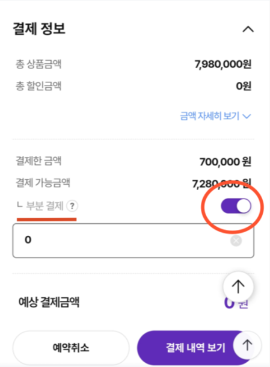
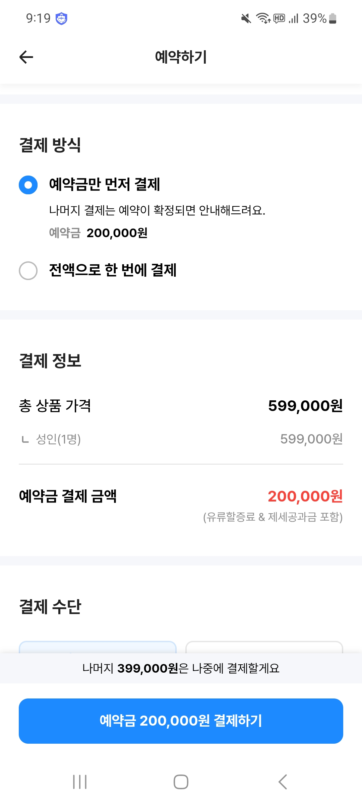

# 5주차: PRD v2 — 여행 상품 예약금/잔금 앱카드 간편결제 도입

> **한 줄 요약**: 무통장 입금·ARS 중심의 불편한 결제 방식을 앱카드 간편결제로 전환하여, 고객이 카카오 알림톡에서 손쉽게 결제를 완료할 수 있도록 결제 진입 경로를 단순화한다.

## 분석 대상

- **서비스**: 참좋은여행 고객 예약금/잔금 결제 프로세스
- **선정한 페인포인트** : 여행 상품 결제 시 무통장 입금·ARS 방식 의존으로 결제 과정이 복잡하고, 특히 고령 고객은 은행 방문·본사 방문·전화 ARS를 감수해야 한다.

---

## 1. 배경 및 문제 정의 (Why)

### 문제 상황

참좋은여행 고객은 여행 상품을 예약한 후 두 차례 결제(예약금 행사가의 10% 이상 → 발권 후 잔금 90%)를 진행해야 한다. 영업팀은 각 결제 시점마다 카카오 알림톡으로 안내를 보내고, 현재 결제 수단의 중심은 **무통장 입금(가상계좌)** 과 **ARS 전화 결제**이다.

결과적으로 고객은 아래 중 하나를 선택해야 한다:

- **무통장 입금**: 알림톡에 적힌 가상계좌를 직접 은행 앱 또는 창구에서 이체
- **ARS 결제**: 전화 연결 후 카드 번호 16자리·유효기간·CVC·비밀번호를 음성으로 입력
- **홈페이지 직접 결제**: 신용카드, 네이버페이 등 — 그러나 이용률이 현저히 낮음

->  홈페이지 직접 결제(1년 기준): 약 20%, 무통장 입금/ARS 결제 : 약 80%

**추가 문제 1 — 예약금 납부가 영업팀 수동 안내에 의존**

현재 예약금 결제는 고객이 자율적으로 진행할 수 없고, 영업팀이 예약 내역을 확인한 후 납부해야 할 금액을 별도로 안내해야 결제가 시작된다. 반면 하나투어·여기어때는 예약 완료 후 결제 페이지에서 고객이 직접 "예약금만 결제" 또는 "전액 결제"를 선택해 즉시 납부할 수 있다. 영업팀의 수동 확인·안내 단계가 없어도 고객 스스로 결제를 완결지을 수 있는 구조다.

**추가 문제 2 — 카드사 유입 할인 혜택이 결제 화면에 미노출**

신한카드 등 일부 카드사는 자사 고객을 `shinhan.verygoodtour.com` 같은 카드사 전용 URL로 유입시키고 결제 시 3% 할인 혜택을 제공한다. 그러나 정작 참좋은여행 결제 페이지에는 해당 카드로 결제하면 할인이 적용된다는 안내가 전혀 노출되지 않는다. 혜택을 인지하지 못한 고객은 할인을 놓치거나, 뒤늦게 CS로 문의하는 상황이 발생한다.

### 영향받는 사용자

- **전체 예약 고객**: 예약금·잔금 결제가 발생하는 모든 고객 (사실상 전 고객)
- **특히 고령 고객(60대 이상)**: 디지털 결제에 익숙하지 않아 은행 직접 방문(월 1회 이상), 영업팀 직통 전화 결제에 의존. 1회 방문 시 약 10분 소요.

### 근거

- **영업팀 내부 인터뷰**: "알림톡 발송 방식으로는 무통장 입금과 ARS 결제 방식으로 전달해서 두 사용량이 많음. 홈페이지를 통해서 결제하는 방식은 많지 않음."
- "나이가 많은 고객은 영업팀의 전화로도 힘들어함. 간혹 은행에 직접 찾아가거나 직접 방문하는 것임. 보통 한 달에 한 번은 직접 방문을 함."
- **앱카드 이용 현황 (핏콜라보, 2024년 3분기)**: 앱카드 MAU 5,059만 명. 스마트폰+체크/신용카드 사용자의 **95%가 앱카드를 사용 중**.
- **신세계라이브쇼핑 벤치마크 (핏콜라보 소개서)**: 앱카드 빠른결제 도입 후 결제 이탈율 **23% 감소**, 재구매율 **19.5% 상승**. 2025년 3월 기준 전체 결제의 **58.1%** 가 빠른결제.
- **경쟁사 벤치마크 (하나투어·여기어때)**: 예약 완료 후 결제 페이지에서 예약금/전액 결제를 고객이 직접 선택·납부할 수 있는 UI 제공. 영업팀의 수동 안내 없이 결제가 즉시 완결되는 구조로, 고객 자율성과 영업 효율 모두 높음.

### 방치하면 생기는 비즈니스 영향

- **콜센터/영업팀 업무 과부하**: ARS 안내·무통장 확인 등 결제 관련 전화 업무가 지속되어 실제 영업 활동 시간이 줄어든다.
- **고객 이탈 리스크**: 결제 불편을 경험한 고객이 예약 취소·타사 이탈로 이어질 수 있다.
- **디지털 전환 지연**: 온라인 결제 전환율이 낮으면 홈페이지·앱 개선 투자 효과가 반감된다.
- **고령 고객 방문 비용**: 고객이 직접 방문하는 케이스에서 영업 인력 소모와 응대 시간이 발생한다.

---

## 2. 목표와 성공 지표 (What + KPI)

### 목표 (Goal)

> 고객이 카카오 알림톡을 받은 후 3분 이내에 앱카드 간편결제로 결제를 완료할 수 있도록, 결제 진입 경로를 알림톡 → 결제 완료로 단순화한다.

### 성공 지표 (KPI)

| 지표                                                             | 카테고리     | 현재(추정)     | 목표                   |
| ---------------------------------------------------------------- | ------------ |------------| ---------------------- |
| 온라인 결제 전환율 (고객이 홈페이지에서 직접 결제 완료하는 비율) | Task Success | ~20% 이하    | 50% 이상               |
| 결제 관련 CS 인입 건수 (ARS 안내, 무통장 확인 문의 등)           | Happiness    | 하루 평균 40건  | 하루 평균 20건 이하    |
| 앱카드 간편결제 사용 비율                                        | Adoption     | 0% (신규 도입) | 도입 3개월 후 20% 이상 |

**핵심 지표**: 온라인 결제 전환율 — 이 지표가 오르면 콜센터 부하 감소와 고객 만족도 개선이 동시에 달성된다. 앱카드 사용 비율은 이를 이끄는 선행 지표이다.

---

## 3. 사용자 경험 변화 (Before → After)

### Before (현재)

이순자(68세) 고객은 참좋은여행에서 유럽 패키지 여행을 예약했다. 며칠 후 카카오 알림톡으로 예약금 납부 안내가 왔다. 알림톡에는 가상계좌 번호와 납부 기한만 적혀 있었다. 은행 앱 사용이 불편해 결국 가까운 은행 지점을 직접 방문해 이체를 했다. 약 10분을 기다린 후 처리를 마쳤다. 한 달 뒤 잔금 안내가 왔을 때도 같은 과정을 반복했다. 매번 은행에 가야 하는 게 불편했고, 이체를 제대로 한 건지 불안해서 영업 담당자에게 전화로 확인까지 했다.

### After (개선 후)

이순자(68세) 고객은 참좋은여행에서 유럽 패키지 여행을 예약했다. 며칠 후 카카오 알림톡으로 예약금 납부 안내가 왔고, 알림톡 하단에 **[앱카드로 바로 결제하기]** 버튼이 함께 노출되었다. 버튼을 누르자 결제 화면이 열렸고, 평소 쓰던 신한카드 앱을 통해 지문 인증 하나로 결제가 완료됐다. 잔금 납부 알림톡이 왔을 때도 같은 버튼을 눌러 동일하게 처리했다. 등록된 카드가 자동으로 불러와져 따로 입력할 내용이 없었다. 은행에 갈 필요도, 계좌번호를 옮겨 적을 필요도 없었다.

---

## 4. 솔루션 접근법 (How - 개괄)

### 접근 방식

> **"알림톡 → 결제 완료"를 한 번의 탭으로 연결** — 고객이 결제 진입점으로 가장 많이 사용하는 카카오 알림톡에 앱카드 결제 딥링크를 삽입하여, 별도의 탐색 없이 해당 예약의 결제 화면으로 직접 진입하게 한다.

### 핵심 아이디어

1. **알림톡에 앱카드 결제 딥링크 버튼 추가**  
   예약금/잔금 알림톡 템플릿에 [앱카드로 바로 결제하기] 버튼을 추가하여, 고객이 홈페이지를 따로 탐색하지 않고 해당 예약의 결제 화면으로 직행할 수 있게 한다.

2. **홈페이지 결제 화면에서 앱카드를 기본(최상위) 결제 수단으로 노출**  
   현재 결제 화면(앱카드·신용카드·무통장·ARS·네이버페이 순)에서 앱카드를 가장 상단에 배치하고 "간편결제 추천" 배지를 붙여 선택률을 높인다. (2026-04-15 앱카드 서비스 도입과 병행)

3. **최초 앱카드 결제 완료 후 카드 자동 저장 확인 메시지 노출**  
   첫 결제 완료 시점에 "카드가 저장되었습니다. 다음 결제는 밀어서 바로 완료!" 안내를 노출하여 재방문 시 원클릭 결제를 유도한다.

4. **예약금 고객 직접 선택 결제 (하나투어·여기어때 방식 도입)**  
   예약 완료 후 바로 연결되는 결제 화면에 "예약금만 결제" / "전액 결제" 선택지를 제공하여, 고객이 영업팀 안내를 기다리지 않고 즉시 납부를 완료할 수 있게 한다. 영업팀의 예약 확인 → 금액 안내 → 결제 요청 단계를 제거해 처리 속도와 고객 자율성을 동시에 높인다.

5. **카드사 유입 할인 혜택 결제 화면 노출**  
   카드사 전용 URL(예: `shinhan.verygoodtour.com`)로 접속한 고객 또는 해당 카드를 결제 수단으로 선택한 고객에게, 결제 화면에서 적용 가능한 카드사 할인(예: 신한카드 3% 할인)을 명시적으로 안내한다. 혜택 인지율을 높여 결제 전환율을 끌어올리고 CS 문의를 줄인다.

### 기술적/디자인적 고려사항

- 카카오 알림톡 템플릿 수정 필요 (버튼형 템플릿, URL에 예약 ID 파라미터 포함)
- 앱카드 서비스는 모바일, PC 지원 → 알림톡 딥링크는 모바일 환경 전제
- 실시간 항공/호텔 예약 건은 앱카드 결제 불가 → 해당 상품군 버튼 미노출 처리 필요
- 결제 인증 한도 2,000만 원 초과 시 추가 인증 필요 → 고액 여행 상품 대상 UX 별도 고려
- 기존 무통장·ARS 결제 수단은 병행 유지 (고객 선택권 보장)

---

## 5. ICE Score

| 후보 아이디어                             | 설명                                     | Impact | Confidence | Ease | ICE Score | 판단      |
| ----------------------------------------- |----------------------------------------| -----: | ---------: | ---: | --------: |---------|
| A. 알림톡 앱카드 딥링크 버튼 삽입         | 예약금/잔금 알림톡에 결제 직행 버튼 추가                |      9 |          8 |    6 |       432 | 채택      |
| B. 결제 화면 앱카드 최상위 노출           | 결제 수단 순서 변경 + 추천 배지                    |      7 |          9 |    9 |       567 | 채택      |
| C. 고령 고객 앱카드 사용 가이드 제공      | 결제 안내 이미지 가이드를 알림톡에 첨부                 |      5 |          7 |    7 |       245 | V1 후보 |
| D. ARS 상담 시 앱카드 전환 유도 멘트 추가 | 전화 수신 고객에게 앱카드 안내 스크립트 추가              |      5 |          6 |    8 |       240 | 보류      |
| E. 예약금 고객 직접 선택 결제             | 결제 화면에 예약금/전액 결제 선택지 제공 (하나투어·여기어때 방식) |      8 |          7 |    5 |       280 | V2 후보   |
| F. 카드사 유입 할인 혜택 결제 화면 노출   | 카드사 전용 URL 유입 고객에게 해당 카드 할인 안내 노출      |      6 |          8 |    7 |       336 | V1~V2 검토 |

### 선택한 아이디어

> **A. 알림톡 앱카드 딥링크 버튼 삽입** — 고객이 결제 안내를 받는 가장 핵심 경로인 카카오 알림톡에 직접 작용하므로 임팩트가 크다. 현재 알림톡에 결제 링크가 없어 탐색 마찰이 발생하는 구조이므로, 이 변경만으로도 결제 전환율 상승 효과가 즉각적으로 나타날 것으로 예상된다.
> 또한 결제 화면에 앱카드 최상위 노출하여 먼저 선택할 수 있도록 유도하여 홈페이지 직접 결제 시에도 앱카드 간편결제를 사용할 수 있도록 한다.

### 선택하지 않은 아이디어

- **C (가이드 제공)**: 고령 고객 교육 효과가 있을지 잘 모르겠지만 고령 고객도 앱카드 접근법을 높이도록 하여 V1 후보로 판단
- **D (ARS 전환 유도 멘트)**: 영업팀 스크립트 변경은 쉽지만, 이미 전화를 건 고객을 다시 디지털로 전환하는 효과가 불확실하다.
- **E (예약금 직접 선택 결제)**: 영업팀 결제 안내 프로세스 및 백엔드 예약 상태 연동 변경이 필요해 개발 공수가 크다. 알림톡 딥링크(A) 안착 후 V2에서 연계 검토.
- **F (카드사 할인 노출)**: 카드사별 할인 조건·유효 기간 관리가 필요하지만 결제 화면 UI 수정만으로 구현 가능하고 혜택 인지 CS를 줄이는 효과가 명확하다. V1~V2 범위로 검토.

---

## 6. 범위와 우선순위 (Scope)

| 범위                     | 내용                                                                                                                                              |
| ------------------------ |-------------------------------------------------------------------------------------------------------------------------------------------------|
| **MVP** (이번에 만들 것) | 예약금/잔금 알림톡 템플릿에 [앱카드로 바로 결제하기] 딥링크 버튼 추가 (카카오 버튼형 템플릿 활용, 결제 화면 직행 URL)                                                                         |
| **V1** (다음 스프린트)   | 알림톡 내 앱 카드 사용 가드 제공 / 카드사 유입 할인 혜택 결제 화면 노출 (카드사별 할인 조건 연동)                                                                                     |
| **V2** (나중에)          | 예약금·잔금 고객 직접 선택 결제 UI (하나투어·여기어때 방식, 영업팀 수동 안내 단계 제거) |
| **Out of Scope**         | 실시간 항공/호텔 예약 건 앱카드 적용 (서비스 제약) / 무통장·ARS 결제 수단 폐지 (고객 선택권 유지)                                                                                   |

---

## 7. 리스크와 대안 (Risks)

### 리스크 1: 고령 고객의 앱카드 미설치/미이용

- **시나리오**: 60대 이상 고객이 카드사 앱을 설치하지 않아 앱카드 결제를 못 하고, 기존 방식(무통장·ARS)으로 돌아가거나 "버튼을 눌렀는데 결제가 안 된다"는 CS 문의가 오히려 증가한다.
- **완화**: 알림톡에 앱카드 버튼과 함께 기존 결제 수단(무통장·ARS) 안내를 병행 유지한다. 앱카드 결제 실패 시 기존 결제 흐름으로 자동 대체 안내 문구를 노출한다.

### 리스크 2: 알림톡 딥링크 기술 구현 복잡도

- **시나리오**: 카카오 비즈메시지 버튼 URL에 예약 ID 등 파라미터를 동적으로 삽입하는 과정에서 기존 알림톡 발송 시스템(영업팀 수동 발송 등)과 연동이 복잡해 개발 일정이 지연된다.
- **완화**: 1단계로 마이페이지 결제 화면 URL로 연결하는 단순 버튼부터 배포하고, 2단계에서 예약 ID가 포함된 직행 딥링크로 고도화한다.

### 리스크 3: 앱카드 서비스 초기 오류로 인한 고객 신뢰 하락

- **시나리오**: 서비스 도입 초기에 인증 오류·결제 실패가 발생해 고객 불만이 급증하거나, 앱카드 결제에 대한 불신이 생겨 이후 전환이 더 어려워진다.
- **완화**: 공지 내용에 명시된 대로 오류 발생 시 즉시 재무회계팀/IT기획팀에 공유하는 프로세스를 준수한다. 초기 2주간 결제 오류율 집중 모니터링. 결제 실패 시 고객에게 즉각 대체 결제 수단 안내 문자 자동 발송.

---

## 8. 열린 질문 (Open Questions)

- 현재 알림톡 발송 시스템이 카카오 비즈메시지 버튼형 템플릿을 지원하는가? 영업팀이 수동으로 발송하는 알림톡의 비중은 얼마나 되는가?
- 알림톡 딥링크에 예약 ID와 결제 금액을 URL 파라미터로 전달하는 방식이 현재 홈페이지 결제 API 구조와 호환되는가?
- 앱카드 결제 전환율을 측정할 수 있는 analytics 체계가 현재 갖춰져 있는가? (GA, 자체 로그 등)
- 실시간 항공/호텔 이외에 앱카드 결제가 불가한 상품 유형이 추가로 있는가?
- 앱카드 서비스 계약상 알림톡 연동(딥링크)을 핏콜라보 측에서 별도 지원하는가?
- 예약금 고객 직접 결제 방식 도입 시, 현재 영업팀의 예약 확인·금액 안내 프로세스 중 시스템으로 대체 가능한 단계는 어디까지인가? 실시간 항공·호텔 이외 상품에 일괄 적용 가능한가?
- 카드사 전용 URL(`shinhan.verygoodtour.com` 등)로 유입된 고객 정보가 현재 세션·쿠키 등으로 결제 페이지까지 전달되는가? 카드사별 할인 조건(기간, 한도 등)을 어떤 채널로 수신·관리할 것인가?

---

## 참고 자료 감상평

**글: (references.md에서 최소 1개 선택 후 직접 작성)**

> [Product Spec 문서와 PRD 작성하기 — 모비인사이드](https://www.mobiinside.co.kr/2021/09/06/product-spec-prd/)

> 결국 Product Spec과 PRD를 작성하는 이유는 왜? 라는 질문을 통해서 만들어진다고 생각이 들었습니다. 회사에서 개발을 하다보면 단순히 요구사항에 대한 구현만 하면 되므로 "왜?" 라는 질문을 
> 잘 안하게 되는 것 같아요. 누가 무엇을 위해 이 기능이 필요한지 이해하고 개발하면 개발 과정 자체도 더 즐겁고 결과 또한 성취감이 배로 느낄 수 있다는걸 알게 되었습니다. 

---

## (자사 서비스) 실행 관점

### 현재 리소스 상황

- **IT 개발팀**: 알림톡 템플릿 수정, 딥링크 연동 백엔드 개발 담당 (본 PRD 작성자 소속)
- **재무회계팀**: 앱카드 서비스 도입 주관, 핏콜라보와의 계약 당사자, 공지 발행 주체
- **영업팀**: 알림톡 발송 프로세스 운영 주체, 고객 CS 1차 대응
- **외부**: 핏콜라보(앱카드 서비스 제공사 / 승인·PG 중계), 나이스정보통신(기존 PG사)

### 이해관계자

| 역할          | 예상 반응                                                         | 대응 전략                                            |
| ------------- | ----------------------------------------------------------------- | ---------------------------------------------------- |
| 재무회계팀    | 긍정적 — 이미 앱카드 도입 추진 중, 결제 편의성 목표 공유          | MVP 범위를 일정에 맞춰 조율, 빠른 협의      |
| 영업팀        | 긍정~중립 — CS 전화 감소 기대 / 알림톡 템플릿 변경 업무 부담 우려 | 템플릿 변경을 IT팀이 주도하고 영업팀 변경 부담 최소화 |
| IT 기획팀     | 긍정적 — 디지털 전환 목표와 일치                                  | 개발 공수 산정 및 우선순위 조율 협의                 |
| 고객 (고령층) | 학습 곡선 우려, 기존 방식 선호 가능성                             | 기존 무통장·ARS 병행 유지, 앱카드는 선택지로 제공    |

### 실제 제안 계획

- 앱카드 서비스 도입 이후 2주간 결제 수단별 사용 현황 모니터링
- 데이터 확인 후 알림톡 딥링크 버튼 추가 개발 착수 제안 (재무회계팀·영업팀·IT기획팀 협의)
- MVP 개발 공수 예상: 카카오 비즈메시지 버튼형 템플릿 등록 + 딥링크 URL 생성 백엔드 작업 (약 1~2 스프린트 추정)

---

## 벤치마킹 (5주차 추가)

### 참고 서비스 1: 하나투어·여기어때 — 예약금/전액 결제 고객 직접 선택 UI

- **어떻게 풀었는지**: 예약 완료 후 즉시 연결되는 결제 화면에서 고객이 "예약금만 결제" 또는 "전액 결제"를 직접 선택해 납부를 완결지을 수 있는 UI를 제공한다. 영업팀의 예약 확인 → 금액 안내 → 결제 요청 단계가 없고, 고객 스스로 결제 흐름을 완성한다.
- **내 PRD에 반영할 점**: v2에 솔루션 아이디어 E(예약금 고객 직접 선택 결제)로 추가했으며, 영업팀 수동 안내 단계를 없애는 방향성을 ICE Score와 Scope에 명시했다. 해당 방식이 경쟁사에서 검증된 패턴임을 근거로 Confidence를 7점으로 산정했다.
- **차별화할 점**: 하나투어·여기어때는 예약 시점에 실시간으로 결제 금액이 확정되는 구조인 반면, 참좋은여행은 패키지 상품 특성상 행사가 확정·영업팀 검토 후 금액이 안내되는 경우가 있다. 따라서 영업팀의 예약 확인 프로세스와 시스템 예약 상태 연동이 선행되어야 하며, 이를 MVP가 아닌 V2로 분류한 이유이기도 하다.

### 참고 서비스 2: 신세계라이브쇼핑 — 앱카드 빠른결제 도입 성과 (핏콜라보 소개서)

- **어떻게 풀었는지**: 기존 카드 번호 직접 입력 방식을 앱카드 빠른결제로 전환하여 결제 흐름을 단순화했다. 결제 화면에서 앱카드를 최상위 결제 수단으로 배치하고 원클릭 결제를 유도하는 UX를 적용했다.
- **내 PRD에 반영할 점**: 앱카드 도입 후 결제 이탈율 23% 감소, 재구매율 19.5% 상승, 전체 결제의 58.1%가 빠른결제로 전환된 수치는 온라인 결제 전환율 50% 목표 KPI의 실현 가능성을 뒷받침한다. 신세계라이브쇼핑의 결과가 ICE Score에서 Impact 9점, Confidence 8점의 근거로 활용되었다.
- **차별화할 점**: 신세계라이브쇼핑은 쇼핑 도중 즉각 결제가 이루어지는 라이브커머스 맥락이라 결제 마찰 제거의 효과가 크다. 참좋은여행은 예약 후 수일~수주 뒤 알림톡으로 결제 안내를 받는 비동기 결제 흐름이므로, 딥링크를 통한 "알림톡 → 결제 직행" 경로 단축이 추가로 필요하다.

---

## v1 → v2 변경 사항 (5주차 추가)

### 셀프 리뷰에서 발견한 구멍

1. **문제 정의가 단일 페인포인트에 머물렀음** — v1은 "결제 수단이 불편하다"는 한 가지 문제만 다뤘으나, 실제로는 예약금 납부가 영업팀 수동 안내에 의존하는 구조적 문제와 카드사 유입 할인 혜택이 결제 화면에 노출되지 않는 문제가 별도로 존재했다. v2에서 두 추가 문제를 명시하고 경쟁사(하나투어·여기어때) 사례로 근거를 보강했다.
2. **KPI 현재 수치가 짧은 기간으로 추정됨** — v1의 온라인 결제 전환율 현재값을 1달 정도의 기간으로 "~17% 이하"로 작성했으나, 이후 약 1년 기간으로 "~20% 이하"로 수정했다.
3. **ICE Score 후보가 너무 적었음** — v1은 아이디어 4개(A~D)만 검토했으나, 문제 정의 확장에 따라 E(예약금 고객 직접 선택 결제)와 F(카드사 유입 할인 혜택 노출)를 추가하여 6개로 확대했다. B(결제 화면 앱카드 최상위 노출)도 v1에서 "V1 후보"로 분류했으나 v2에서 이미 앱카드 서비스 도입과 병행 진행 중임을 확인하여 "채택"으로 재분류했다.

### 피드백 반영 (받은 경우)

| 피드백 | 분류 | 반영 내용 |
|--------|------|----------|
| 경쟁사 대비 차별점이 보이지 않는다 | 반영 | 하나투어·여기어때 벤치마킹 추가 및 참좋은여행과의 차별화 포인트(비동기 결제 흐름, 영업팀 프로세스 의존) 명시 |
| 열린 질문이 너무 적다 | 반영 | 예약금 직접 결제 도입 시 영업팀 프로세스 대체 가능 범위, 카드사 전용 URL 세션 전달 여부 등 2개 질문 추가 |

### 벤치마킹으로 강화한 부분

- 신세계라이브쇼핑 앱카드 빠른결제 도입 성과(이탈율 23% 감소, 재구매율 19.5% 상승)를 근거로 A안 Confidence 점수 유지(8점) 및 KPI 목표 50% 설정의 현실성 확보
- 하나투어·여기어때의 예약금 직접 결제 UI를 벤치마킹하여 E안 아이디어를 신규 추가, 영업팀 수동 안내 단계 제거를 V2 목표로 설정하는 근거로 활용
